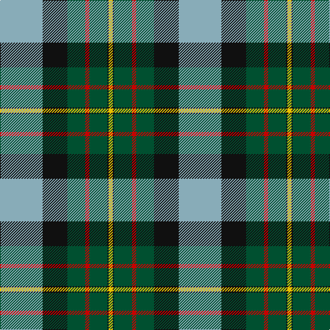

In pattern [YKGRGKY](/patterns/ykgrgky/).

This was sourced from register-of-tartans.  It is a [7 stripes tartan](/stripes/stripes7/).

Original link https://www.tartanregister.gov.uk/tartanDetails.aspx?ref=5514

## Thread count
B/62 K36 G26 R6 G26 K2 Y/6

## Palette
Each colour and its ΔE from the base-6 reference it is a variant of.

| Colour | Shade | Base | ΔE (OKLab) |
|---|---|---|---|
| B | <code style="background-color:#88ACB8;">#88ACB8</code> `#88ACB8` | Y <code style="background-color:#E8C000;">#E8C000</code> | 0.22 |
| G | <code style="background-color:#005030;">#005030</code> `#005030` | G <code style="background-color:#006400;">#006400</code> | 0.09 |
| K | <code style="background-color:#101010;">#101010</code> `#101010` | K <code style="background-color:#000000;">#000000</code> | 0.17 |
| R | <code style="background-color:#C80000;">#C80000</code> `#C80000` | R <code style="background-color:#C80000;">#C80000</code> | 0.00 |
| Y | <code style="background-color:#E8C000;">#E8C000</code> `#E8C000` | Y <code style="background-color:#E8C000;">#E8C000</code> | 0.00 |

# Sample pattern

ID: /setts/s7/y62k36g26r6g26k2ya6-g005030-k101010-rc80000-y88acb8-yae8c000/
