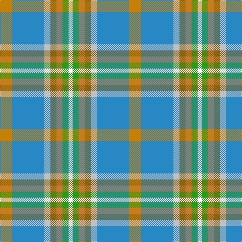

In pattern [WGRGWBY](/patterns/wgrgwby/).

This was sourced from tartans-authority.  It is a [7 stripes tartan](/stripes/stripes7/).

Original link http://www.tartansauthority.com/tartan-ferret/display/2596/

## Thread count
DY/24 B64 N12 T12 DO12 G12 W/8

## Palette
Each colour and its ΔE from the base-6 reference it is a variant of.

| Colour | Shade | Base | ΔE (OKLab) |
|---|---|---|---|
| B | <code style="background-color:#2888C4;">#2888C4</code> `#2888C4` | B <code style="background-color:#2A418A;">#2A418A</code> | 0.21 |
| DO | <code style="background-color:#C47C2C;">#C47C2C</code> `#C47C2C` | R <code style="background-color:#CC0000;">#CC0000</code> | 0.18 |
| DY | <code style="background-color:#C48008;">#C48008</code> `#C48008` | Y <code style="background-color:#F2BF00;">#F2BF00</code> | 0.18 |
| G | <code style="background-color:#289C18;">#289C18</code> `#289C18` | G <code style="background-color:#006100;">#006100</code> | 0.19 |
| N | <code style="background-color:#C0C0C0;">#C0C0C0</code> `#C0C0C0` | W <code style="background-color:#F7F7F7;">#F7F7F7</code> | 0.17 |
| T | <code style="background-color:#886414;">#886414</code> `#886414` | G <code style="background-color:#006100;">#006100</code> | 0.16 |
| W | <code style="background-color:#FCFCFC;">#FCFCFC</code> `#FCFCFC` | W <code style="background-color:#F7F7F7;">#F7F7F7</code> | 0.01 |

# Sample pattern

## Nearest tartans

The nearest existing variants by ΔTartan distance.

1. [Atikokan](/setts/s7/y6b16w3r3ra3g3wa2x4~b0596fa-g309c18-rdc0000-rabe7832-wc0c0c0-wae0e0e0-ye8c000/) — ΔT 1.14
1. [Atikokan](/setts/s7/y6b16w3r3ra3g3wa2x4~b8080d0-g30a010-rc00000-ra906030-wc0c0c0-wae0e0e0-yf0c000/) — ΔT 1.15
1. [Deeside](/setts/s7/w1g1b2g7ga1gb5y1x4~b800080-g808080-ga008000-gb30a010-we0e0e0-yf0c000/) — ΔT 1.29
1. [Curd (2013)](/setts/s8/b1y9w3ya3b9ya1g1r1x4~b5f749c-g649848-rc82828-we0e0e0-yafb8bb-yaf8e38c/) — ΔT 1.38
1. [Washington DC (Fashion)](/setts/s8/w5b32r5g6r5ra16r39y5x2~b1474b4-g006818-r888888-ra880000-we8ccb8-ybc8c00/) — ΔT 1.40
1. [MacLeroy & Troine](/setts/s10/k2y3w2y3b4y19r6b23ra3ya2x2~b5c5c5c-k101010-r888888-rac80000-we0e0e0-y48a4c0-yafccc00/) — ΔT 1.41
1. [Montessori School of Denver (School)](/setts/s6/g25r9b3y7w3ba11x3~b6898b0-ba587484-g288444-rcc3c34-we0e0e0-ye8c000/) — ΔT 1.51
1. [Australian Heavy Horse (Corporate)](/setts/s10/y4g2y18k2b5r16w2b2ra2y4x2~b5c5c5c-g006818-k101010-r944810-rab08070-we0e0e0-yb0b0b0/) — ΔT 1.60
1. [Manx National](/setts/s7/b5g9r2y2ba6bb14w3x4~b88609c-ba303094-bb608ca4-g005814-ra86c1c-we0e0e0-ye8c000/) — ΔT 1.61
1. [Seaside (Fashion)](/setts/s7/w3wa2b4wa14ba2bb14y2x4~b9058d8-ba346488-bb2888c4-wfcfcfc-wac8c8c8-yc88c00/) — ΔT 1.62

## Neighbour map

Every grey dot is one of 15726 variants placed by the first two principal components of the ΔTartan feature space (44% of its variance). Red is this tartan; blue dots are its nearest — click one to open its page.

<svg viewBox="0 0 640 380" role="img" style="max-width:100%;height:auto;border:1px solid #e0e0e0;border-radius:4px;display:block" xmlns="http://www.w3.org/2000/svg"><image href="/nn/cloud.v1.png" width="640" height="380"/><a href="/setts/s7/y6b16w3r3ra3g3wa2x4~b0596fa-g309c18-rdc0000-rabe7832-wc0c0c0-wae0e0e0-ye8c000/"><circle cx="137.5" cy="146.4" r="4" fill="#3465a4"><title>Atikokan</title></circle></a><a href="/setts/s7/y6b16w3r3ra3g3wa2x4~b8080d0-g30a010-rc00000-ra906030-wc0c0c0-wae0e0e0-yf0c000/"><circle cx="154.2" cy="147.1" r="4" fill="#3465a4"><title>Atikokan</title></circle></a><a href="/setts/s7/w1g1b2g7ga1gb5y1x4~b800080-g808080-ga008000-gb30a010-we0e0e0-yf0c000/"><circle cx="188.1" cy="182.9" r="4" fill="#3465a4"><title>Deeside</title></circle></a><a href="/setts/s8/b1y9w3ya3b9ya1g1r1x4~b5f749c-g649848-rc82828-we0e0e0-yafb8bb-yaf8e38c/"><circle cx="163.0" cy="156.4" r="4" fill="#3465a4"><title>Curd (2013)</title></circle></a><a href="/setts/s8/w5b32r5g6r5ra16r39y5x2~b1474b4-g006818-r888888-ra880000-we8ccb8-ybc8c00/"><circle cx="214.2" cy="179.6" r="4" fill="#3465a4"><title>Washington DC (Fashion)</title></circle></a><a href="/setts/s10/k2y3w2y3b4y19r6b23ra3ya2x2~b5c5c5c-k101010-r888888-rac80000-we0e0e0-y48a4c0-yafccc00/"><circle cx="202.1" cy="126.2" r="4" fill="#3465a4"><title>MacLeroy &amp; Troine</title></circle></a><a href="/setts/s6/g25r9b3y7w3ba11x3~b6898b0-ba587484-g288444-rcc3c34-we0e0e0-ye8c000/"><circle cx="181.0" cy="194.2" r="4" fill="#3465a4"><title>Montessori School of Denver (School)</title></circle></a><a href="/setts/s10/y4g2y18k2b5r16w2b2ra2y4x2~b5c5c5c-g006818-k101010-r944810-rab08070-we0e0e0-yb0b0b0/"><circle cx="190.1" cy="125.3" r="4" fill="#3465a4"><title>Australian Heavy Horse (Corporate)</title></circle></a><a href="/setts/s7/b5g9r2y2ba6bb14w3x4~b88609c-ba303094-bb608ca4-g005814-ra86c1c-we0e0e0-ye8c000/"><circle cx="77.3" cy="177.6" r="4" fill="#3465a4"><title>Manx National</title></circle></a><a href="/setts/s7/w3wa2b4wa14ba2bb14y2x4~b9058d8-ba346488-bb2888c4-wfcfcfc-wac8c8c8-yc88c00/"><circle cx="164.4" cy="175.7" r="4" fill="#3465a4"><title>Seaside (Fashion)</title></circle></a><circle cx="165.9" cy="160.5" r="5" fill="#c00000"/></svg>

ID: /setts/s7/y6b16w3g3r3ga3wa2x4~b2888c4-g886414-ga289c18-rc47c2c-wc0c0c0-wafcfcfc-yc48008/
