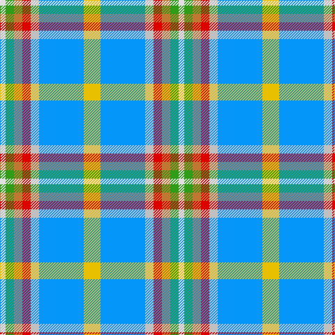

In pattern [WGRRWBY](/patterns/wgrrwby/).

This was sourced from register-of-tartans.  It is a [7 stripes tartan](/stripes/stripes7/).

Original link https://www.tartanregister.gov.uk/tartanDetails.aspx?ref=126

## Thread count
LN/8 G12 DO12 R12 N12 B64 Y/24

## Palette
Each colour and its ΔE from the base-6 reference it is a variant of.

| Colour | Shade | Base | ΔE (OKLab) |
|---|---|---|---|
| B | <code style="background-color:#0596FA;">#0596FA</code> `#0596FA` | B <code style="background-color:#2A418A;">#2A418A</code> | 0.27 |
| DO | <code style="background-color:#BE7832;">#BE7832</code> `#BE7832` | R <code style="background-color:#CC0000;">#CC0000</code> | 0.17 |
| G | <code style="background-color:#309C18;">#309C18</code> `#309C18` | G <code style="background-color:#006100;">#006100</code> | 0.19 |
| LN | <code style="background-color:#E0E0E0;">#E0E0E0</code> `#E0E0E0` | W <code style="background-color:#F7F7F7;">#F7F7F7</code> | 0.07 |
| N | <code style="background-color:#C0C0C0;">#C0C0C0</code> `#C0C0C0` | W <code style="background-color:#F7F7F7;">#F7F7F7</code> | 0.17 |
| R | <code style="background-color:#DC0000;">#DC0000</code> `#DC0000` | R <code style="background-color:#CC0000;">#CC0000</code> | 0.03 |
| Y | <code style="background-color:#E8C000;">#E8C000</code> `#E8C000` | Y <code style="background-color:#F2BF00;">#F2BF00</code> | 0.02 |

# Sample pattern

## Nearest tartans

The nearest existing variants by ΔTartan distance.

1. [Atikokan](/setts/s7/y6b16w3r3ra3g3wa2x4~b8080d0-g30a010-rc00000-ra906030-wc0c0c0-wae0e0e0-yf0c000/) — ΔT 1.00
1. [Atikokan (District)](/setts/s7/y6b16w3g3r3ga3wa2x4~b2888c4-g886414-ga289c18-rc47c2c-wc0c0c0-wafcfcfc-yc48008/) — ΔT 1.14
1. [Seaside (Fashion)](/setts/s7/w3wa2b4wa14ba2bb14y2x4~b9058d8-ba346488-bb2888c4-wfcfcfc-wac8c8c8-yc88c00/) — ΔT 1.43
1. [Edmonton, City of](/setts/s9/b8y2g4y2ba4y2b8w15ya2x4~b2888c4-ba780078-g289c18-wf0f0d8-ye8c000-yabc8c00/) — ΔT 1.53
1. [Curd (2013)](/setts/s8/b1y9w3ya3b9ya1g1r1x4~b5f749c-g649848-rc82828-we0e0e0-yafb8bb-yaf8e38c/) — ΔT 1.57
1. [Manx National District Tartan Tartan Number: 185. Earliest known date: pre 2003 These are the specifications supplied by the designer. See products available Copyright © Blair Urquhart, Comrie, 2015](/setts/s7/b2g6r1y1ba3bb10w1x2~b780078-ba202060-bb2888c4-g006818-rc80000-we0e0e0-ye8c000/) — ΔT 1.57
1. [Alexander of Menstry Hunting](/setts/s8/r5g2r2g26k9y9w13wa5x2~g408060-k101010-rb468ac-w98c8e8-waf8f8f8-ya0a0a0/) — ΔT 1.57
1. [Manx National](/setts/s7/b2g6r1ga1ba3bb10w1x2~b800080-ba000050-bb8080d0-g008000-ga908000-rc00000-we0e0e0/) — ΔT 1.59
1. [Montessori School of Denver](/setts/s6/g25r9b3y7w3ba11~b6495ed-ba4b0082-g008b8b-rff6347-wffffff-yffff00/) — ΔT 1.61
1. [SCH '67 Class](/setts/s6/b3r2y15w10k2ya3x2~b000064-k101010-re87878-wffffff-yb0b0b0-yae0a126/) — ΔT 1.66

## Neighbour map

Every grey dot is one of 15726 variants placed by the first two principal components of the ΔTartan feature space (44% of its variance). Red is this tartan; blue dots are its nearest — click one to open its page.

<svg viewBox="0 0 640 380" role="img" style="max-width:100%;height:auto;border:1px solid #e0e0e0;border-radius:4px;display:block" xmlns="http://www.w3.org/2000/svg"><image href="/nn/cloud.v1.png" width="640" height="380"/><a href="/setts/s7/y6b16w3r3ra3g3wa2x4~b8080d0-g30a010-rc00000-ra906030-wc0c0c0-wae0e0e0-yf0c000/"><circle cx="154.2" cy="147.1" r="4" fill="#3465a4"><title>Atikokan</title></circle></a><a href="/setts/s7/y6b16w3g3r3ga3wa2x4~b2888c4-g886414-ga289c18-rc47c2c-wc0c0c0-wafcfcfc-yc48008/"><circle cx="165.9" cy="160.5" r="4" fill="#3465a4"><title>Atikokan (District)</title></circle></a><a href="/setts/s7/w3wa2b4wa14ba2bb14y2x4~b9058d8-ba346488-bb2888c4-wfcfcfc-wac8c8c8-yc88c00/"><circle cx="164.4" cy="175.7" r="4" fill="#3465a4"><title>Seaside (Fashion)</title></circle></a><a href="/setts/s9/b8y2g4y2ba4y2b8w15ya2x4~b2888c4-ba780078-g289c18-wf0f0d8-ye8c000-yabc8c00/"><circle cx="85.8" cy="151.8" r="4" fill="#3465a4"><title>Edmonton, City of</title></circle></a><a href="/setts/s8/b1y9w3ya3b9ya1g1r1x4~b5f749c-g649848-rc82828-we0e0e0-yafb8bb-yaf8e38c/"><circle cx="163.0" cy="156.4" r="4" fill="#3465a4"><title>Curd (2013)</title></circle></a><a href="/setts/s7/b2g6r1y1ba3bb10w1x2~b780078-ba202060-bb2888c4-g006818-rc80000-we0e0e0-ye8c000/"><circle cx="142.5" cy="146.5" r="4" fill="#3465a4"><title>Manx National District Tartan Tartan Number: 185. Earliest known date: pre 2003 These are the specifications supplied by the designer. See products available Copyright © Blair Urquhart, Comrie, 2015</title></circle></a><a href="/setts/s8/r5g2r2g26k9y9w13wa5x2~g408060-k101010-rb468ac-w98c8e8-waf8f8f8-ya0a0a0/"><circle cx="129.5" cy="143.1" r="4" fill="#3465a4"><title>Alexander of Menstry Hunting</title></circle></a><a href="/setts/s7/b2g6r1ga1ba3bb10w1x2~b800080-ba000050-bb8080d0-g008000-ga908000-rc00000-we0e0e0/"><circle cx="135.3" cy="138.9" r="4" fill="#3465a4"><title>Manx National</title></circle></a><a href="/setts/s6/g25r9b3y7w3ba11~b6495ed-ba4b0082-g008b8b-rff6347-wffffff-yffff00/"><circle cx="124.4" cy="168.5" r="4" fill="#3465a4"><title>Montessori School of Denver</title></circle></a><a href="/setts/s6/b3r2y15w10k2ya3x2~b000064-k101010-re87878-wffffff-yb0b0b0-yae0a126/"><circle cx="131.2" cy="157.7" r="4" fill="#3465a4"><title>SCH '67 Class</title></circle></a><circle cx="137.5" cy="146.4" r="5" fill="#c00000"/></svg>

ID: /setts/s7/y6b16w3r3ra3g3wa2x4~b0596fa-g309c18-rdc0000-rabe7832-wc0c0c0-wae0e0e0-ye8c000/
