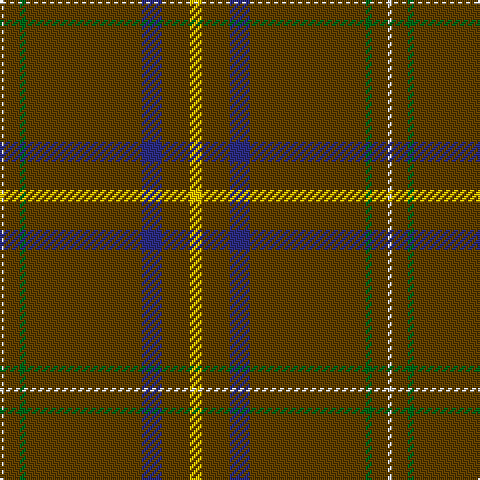

In pattern [WGGGBGY](/patterns/wgggbgy/).

This was sourced from tartans-authority.  It is a [7 stripes tartan](/stripes/stripes7/).

Original link http://www.tartansauthority.com/tartan-ferret/display/7948/

## Thread count
LN/2 T8 G3 T58 DB10 T14 Y/6

## Palette
Each colour and its ΔE from the base-6 reference it is a variant of.

| Colour | Shade | Base | ΔE (OKLab) |
|---|---|---|---|
| DB | <code style="background-color:#2C2C80;">#2C2C80</code> `#2C2C80` | B <code style="background-color:#2A418A;">#2A418A</code> | 0.06 |
| G | <code style="background-color:#006818;">#006818</code> `#006818` | G <code style="background-color:#006100;">#006100</code> | 0.02 |
| LN | <code style="background-color:#E0E0E0;">#E0E0E0</code> `#E0E0E0` | W <code style="background-color:#F7F7F7;">#F7F7F7</code> | 0.07 |
| T | <code style="background-color:#604000;">#604000</code> `#604000` | G <code style="background-color:#006100;">#006100</code> | 0.14 |
| Y | <code style="background-color:#E8C000;">#E8C000</code> `#E8C000` | Y <code style="background-color:#F2BF00;">#F2BF00</code> | 0.02 |

# Sample pattern

## Nearest tartans

The nearest existing variants by ΔTartan distance.

1. [Inches of Perth (District or Clan)](/setts/s9/g88y4k8b4g30r12k6ba6y4-b780078-ba5c8ca8-g604000-k101010-ra00048-ye8c000/) — ΔT 1.61
1. [KIltwalk, The (Corporate)](/setts/s9/g4w4y8g10y10g92y14g2wa4-g604000-w98c8e8-wafcfcfc-ya08858/) — ΔT 1.66
1. [Leiato of American Samoa (Personal)](/setts/s7/r90k10r56k10ra10w4b12-b441800-k101010-r98481c-rab03000-we0e0e0/) — ΔT 1.67
1. [Highland Autumn (Fashion)](/setts/s8/r4b4k4b56k16b18k2y4-b5c5c5c-k101010-r880000-ybc8c00/) — ΔT 1.74
1. [Puxty-Dunne](/setts/s7/b36w4k2w8g26b80r4-b3f4441-g052f14-k120a01-r89051b-wddd5af/) — ΔT 1.76
1. [Leiato of American Samoa (Personal)](/setts/s7/g90k10g56k10r10w4b12-b441800-g604000-k101010-rb03000-we0e0e0/) — ΔT 1.76
1. [Puxty-Dunne (Personal)](/setts/s7/b36w4k2w8g26b80r4-b5c5c5c-g006818-k101010-rc80000-we0e0e0/) — ΔT 1.84
1. [MTV](/setts/s7/r5k3r9g56b4g2w3-b5f749c-g003c14-k101010-r960028-wffffff/) — ΔT 1.89
1. [Mead Hunting (Personal)](/setts/s10/g72k6r12k6g20r10g6y8k2g4-g604000-k101010-re86000-ydc943c/) — ΔT 1.91
1. [Windy Meadows (Fashion)](/setts/s6/g180w8r16y4ra8b8-b5c5c5c-g604000-ra00000-raa480a8-w98c8e8-ye8c000/) — ΔT 1.91

## Neighbour map

Every grey dot is one of 15726 variants placed by the first two principal components of the ΔTartan feature space (44% of its variance). Red is this tartan; blue dots are its nearest — click one to open its page.

<svg viewBox="0 0 640 380" role="img" style="max-width:100%;height:auto;border:1px solid #e0e0e0;border-radius:4px;display:block" xmlns="http://www.w3.org/2000/svg"><image href="/nn/cloud.v1.png" width="640" height="380"/><a href="/setts/s9/g88y4k8b4g30r12k6ba6y4-b780078-ba5c8ca8-g604000-k101010-ra00048-ye8c000/"><circle cx="477.4" cy="118.9" r="4" fill="#3465a4"><title>Inches of Perth (District or Clan)</title></circle></a><a href="/setts/s9/g4w4y8g10y10g92y14g2wa4-g604000-w98c8e8-wafcfcfc-ya08858/"><circle cx="549.7" cy="110.7" r="4" fill="#3465a4"><title>KIltwalk, The (Corporate)</title></circle></a><a href="/setts/s7/r90k10r56k10ra10w4b12-b441800-k101010-r98481c-rab03000-we0e0e0/"><circle cx="526.1" cy="160.6" r="4" fill="#3465a4"><title>Leiato of American Samoa (Personal)</title></circle></a><a href="/setts/s8/r4b4k4b56k16b18k2y4-b5c5c5c-k101010-r880000-ybc8c00/"><circle cx="516.4" cy="160.1" r="4" fill="#3465a4"><title>Highland Autumn (Fashion)</title></circle></a><a href="/setts/s7/b36w4k2w8g26b80r4-b3f4441-g052f14-k120a01-r89051b-wddd5af/"><circle cx="501.5" cy="147.6" r="4" fill="#3465a4"><title>Puxty-Dunne</title></circle></a><a href="/setts/s7/g90k10g56k10r10w4b12-b441800-g604000-k101010-rb03000-we0e0e0/"><circle cx="546.3" cy="182.0" r="4" fill="#3465a4"><title>Leiato of American Samoa (Personal)</title></circle></a><a href="/setts/s7/b36w4k2w8g26b80r4-b5c5c5c-g006818-k101010-rc80000-we0e0e0/"><circle cx="505.9" cy="145.0" r="4" fill="#3465a4"><title>Puxty-Dunne (Personal)</title></circle></a><a href="/setts/s7/r5k3r9g56b4g2w3-b5f749c-g003c14-k101010-r960028-wffffff/"><circle cx="467.8" cy="128.5" r="4" fill="#3465a4"><title>MTV</title></circle></a><a href="/setts/s10/g72k6r12k6g20r10g6y8k2g4-g604000-k101010-re86000-ydc943c/"><circle cx="496.7" cy="124.9" r="4" fill="#3465a4"><title>Mead Hunting (Personal)</title></circle></a><a href="/setts/s6/g180w8r16y4ra8b8-b5c5c5c-g604000-ra00000-raa480a8-w98c8e8-ye8c000/"><circle cx="616.2" cy="114.7" r="4" fill="#3465a4"><title>Windy Meadows (Fashion)</title></circle></a><circle cx="548.3" cy="145.2" r="5" fill="#c00000"/></svg>

ID: /setts/s7/y6g14b10g58ga3g8w2-b2c2c80-g604000-ga006818-we0e0e0-ye8c000/
