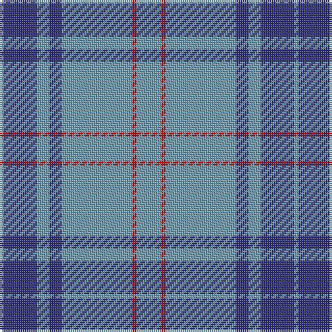

In pattern [YBYBYRY](/patterns/ybybyry/).

This was sourced from tartans-authority.  It is a [7 stripes tartan](/stripes/stripes7/).

Original link http://www.tartansauthority.com/tartan-ferret/display/8138/

## Thread count
B/2 DB16 B6 DB6 B34 R2 B/12

## Palette
Each colour and its ΔE from the base-6 reference it is a variant of.

| Colour | Shade | Base | ΔE (OKLab) |
|---|---|---|---|
| B | <code style="background-color:#6C9CB4;">#6C9CB4</code> `#6C9CB4` | Y <code style="background-color:#F2BF00;">#F2BF00</code> | 0.27 |
| DB | <code style="background-color:#2C2C80;">#2C2C80</code> `#2C2C80` | B <code style="background-color:#2A418A;">#2A418A</code> | 0.06 |
| R | <code style="background-color:#C80000;">#C80000</code> `#C80000` | R <code style="background-color:#CC0000;">#CC0000</code> | 0.01 |

# Sample pattern

## Nearest tartans

The nearest existing variants by ΔTartan distance.

1. [Carlisle Ancient](/setts/s5/b11y2r1y2r1~b2474e8-r880000-yd09800~x4/) — ΔT 1.54
1. [Hepburn #2](/setts/s6/b13ba1b3ba6y1ba1~b2c4084-ba0596fa-ye8c000~x4/) — ΔT 1.54
1. [Tokyo Bluebells (Corporate)](/setts/s8/b18r1b1r1b1k7b13w2~b1474b4-k101010-rc80000-we0e0e0~x4/) — ΔT 1.55
1. [Royal Conservatoire of Scotland](/setts/s8/b11ba13g11ba7b11g3b90ba11~b3c82af-ba440044-g604000/) — ΔT 1.55
1. [Hepburn](/setts/s6/b13ba1b3ba6y1ba1~b304080-ba8080d0-yf0c000~x4/) — ΔT 1.58
1. [Wheadon (Name)](/setts/s6/b40g7y3g7b15r5~b34349c-g008c20-rc80000-ye8c000~x2/) — ΔT 1.62
1. [Loch Lomond](/setts/s5/b37w9b3ba9w3~b5480b0-ba000050-we0e0e0~x2/) — ΔT 1.64
1. [Starr](/setts/s7/w1b20wa3ba3b4w4wa1~b1474b4-ba2c2c80-w98c8e8-waf8f8f8~x4/) — ΔT 1.65
1. [Sligo](/setts/s6/b50ba4b12ba23y4ba4~b5480b0-ba401000-yf0c000~x2/) — ΔT 1.65
1. [Dram! (Corporate)](/setts/s6/b5ba1b15ba25b1ba5~b2c2c80-ba5c8ca8~x4/) — ΔT 1.68

## Neighbour map

Every grey dot is one of 15726 variants placed by the first two principal components of the ΔTartan feature space (44% of its variance). Red is this tartan; blue dots are its nearest — click one to open its page.

<svg viewBox="0 0 640 380" role="img" style="max-width:100%;height:auto;border:1px solid #e0e0e0;border-radius:4px;display:block" xmlns="http://www.w3.org/2000/svg"><image href="/nn/cloud.v1.png" width="640" height="380"/><a href="/setts/s5/b11y2r1y2r1~b2474e8-r880000-yd09800~x4/"><circle cx="394.3" cy="212.3" r="4" fill="#3465a4"><title>Carlisle Ancient</title></circle></a><a href="/setts/s6/b13ba1b3ba6y1ba1~b2c4084-ba0596fa-ye8c000~x4/"><circle cx="421.6" cy="223.3" r="4" fill="#3465a4"><title>Hepburn #2</title></circle></a><a href="/setts/s8/b18r1b1r1b1k7b13w2~b1474b4-k101010-rc80000-we0e0e0~x4/"><circle cx="458.8" cy="172.8" r="4" fill="#3465a4"><title>Tokyo Bluebells (Corporate)</title></circle></a><a href="/setts/s8/b11ba13g11ba7b11g3b90ba11~b3c82af-ba440044-g604000/"><circle cx="512.5" cy="163.8" r="4" fill="#3465a4"><title>Royal Conservatoire of Scotland</title></circle></a><a href="/setts/s6/b13ba1b3ba6y1ba1~b304080-ba8080d0-yf0c000~x4/"><circle cx="442.4" cy="226.3" r="4" fill="#3465a4"><title>Hepburn</title></circle></a><a href="/setts/s6/b40g7y3g7b15r5~b34349c-g008c20-rc80000-ye8c000~x2/"><circle cx="425.8" cy="203.7" r="4" fill="#3465a4"><title>Wheadon (Name)</title></circle></a><a href="/setts/s5/b37w9b3ba9w3~b5480b0-ba000050-we0e0e0~x2/"><circle cx="380.0" cy="210.1" r="4" fill="#3465a4"><title>Loch Lomond</title></circle></a><a href="/setts/s7/w1b20wa3ba3b4w4wa1~b1474b4-ba2c2c80-w98c8e8-waf8f8f8~x4/"><circle cx="401.0" cy="162.4" r="4" fill="#3465a4"><title>Starr</title></circle></a><a href="/setts/s6/b50ba4b12ba23y4ba4~b5480b0-ba401000-yf0c000~x2/"><circle cx="398.5" cy="210.2" r="4" fill="#3465a4"><title>Sligo</title></circle></a><a href="/setts/s6/b5ba1b15ba25b1ba5~b2c2c80-ba5c8ca8~x4/"><circle cx="465.4" cy="222.9" r="4" fill="#3465a4"><title>Dram! (Corporate)</title></circle></a><circle cx="451.9" cy="208.7" r="5" fill="#c00000"/></svg>

ID: /setts/s7/y6r1y17b3y3b8y1~b2c2c80-rc80000-y6c9cb4~x2/
