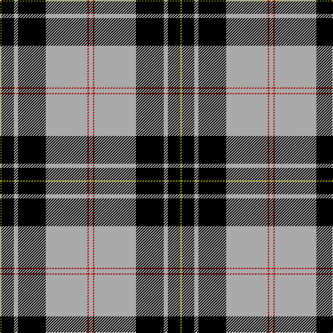

In pattern [YKYKYRY](/patterns/ykykyry/).

This was sourced from weddslist.  It is a [7 stripes tartan](/stripes/stripes7/).

Original link http://www.weddslist.com/cgi-bin/tartans/pg.pl?source=tinsel

## Attestations

This cloth appears in 2 source records; the oldest owns this page.

- undated — MacPherson Dress (weddslist, [record](http://www.weddslist.com/cgi-bin/tartans/pg.pl?source=tinsel))
- undated — MacPherson Dress (weddslist, [record](http://www.weddslist.com/cgi-bin/tartans/pg.pl?source=x))

## Thread count
LG/2 K18 N6 K40 N60 DR2 N/6

## Palette
Each colour and its ΔE from the base-6 reference it is a variant of.

| Colour | Shade | Base | ΔE (OKLab) |
|---|---|---|---|
| DR | <code style="background-color:#AA0000;">#AA0000</code> `#AA0000` | R <code style="background-color:#C80000;">#C80000</code> | 0.06 |
| K | <code style="background-color:#000000;">#000000</code> `#000000` | K <code style="background-color:#000000;">#000000</code> | 0.00 |
| LG | <code style="background-color:#AAAA00;">#AAAA00</code> `#AAAA00` | Y <code style="background-color:#E8C000;">#E8C000</code> | 0.11 |
| N | <code style="background-color:#AAAAAA;">#AAAAAA</code> `#AAAAAA` | Y <code style="background-color:#E8C000;">#E8C000</code> | 0.19 |

# Sample pattern

## Nearest tartans

The nearest existing variants by ΔTartan distance.

1. [MacPherson Dress](/setts/s7/w3r1w30k20w3k9y1-k000000-rc80000-wd0d0d0-yffc800/) — ΔT 0.58
1. [MacPherson 6](/setts/s7/w6r2w60k40w6k18y2-k000000-rc00000-we0e0e0-yf0c000/) — ΔT 0.80
1. [Richecourt, Baron of (Personal)](/setts/s7/w8k60r2k2r6w24y6-k101010-rc80000-wfcfcfc-ye8c000/) — ΔT 0.95
1. [Newcastle](/setts/s10/w16k2b4k8y4k4y4k48w16k4-b2c2c80-k101010-we0e0e0-ye8c000/) — ΔT 1.04
1. [George Heriots](/setts/s5/w6k70r48k2y6-k101010-r888888-we0e0e0-ye8c000/) — ΔT 1.05
1. [Colbert Check (Fashion)](/setts/s8/k62w10y10k4w18k4ya3w4-k101010-wf0e4cc-ye8c000-yaa08858/) — ΔT 1.13
1. [St Piran, Cornish dress](/setts/s8/r8w38g4w16g4w16k76w8-g003000-k000000-rc00000-we0e0e0/) — ΔT 1.18
1. [Gleneagles, Hotel](/setts/s7/k8g8w70g2k72g8k4-g908000-k000000-we0e0e0/) — ΔT 1.19
1. [Entrepreneurial Spark](/setts/s8/k28y6w16y8k12w18k62g2-g006818-k101010-wfcfcfc-yd87c00/) — ΔT 1.22
1. [Phantom](/setts/s7/w6r20k76wa22r12k4w6-k101010-r945067-wf7feee-waeeeeec/) — ΔT 1.24

## Neighbour map

Every grey dot is one of 15726 variants placed by the first two principal components of the ΔTartan feature space (44% of its variance). Red is this tartan; blue dots are its nearest — click one to open its page.

<svg viewBox="0 0 640 380" role="img" style="max-width:100%;height:auto;border:1px solid #e0e0e0;border-radius:4px;display:block" xmlns="http://www.w3.org/2000/svg"><image href="/nn/cloud.v1.png" width="640" height="380"/><a href="/setts/s7/w3r1w30k20w3k9y1-k000000-rc80000-wd0d0d0-yffc800/"><circle cx="320.3" cy="127.6" r="4" fill="#3465a4"><title>MacPherson Dress</title></circle></a><a href="/setts/s7/w6r2w60k40w6k18y2-k000000-rc00000-we0e0e0-yf0c000/"><circle cx="318.2" cy="125.7" r="4" fill="#3465a4"><title>MacPherson 6</title></circle></a><a href="/setts/s7/w8k60r2k2r6w24y6-k101010-rc80000-wfcfcfc-ye8c000/"><circle cx="327.4" cy="114.8" r="4" fill="#3465a4"><title>Richecourt, Baron of (Personal)</title></circle></a><a href="/setts/s10/w16k2b4k8y4k4y4k48w16k4-b2c2c80-k101010-we0e0e0-ye8c000/"><circle cx="328.7" cy="117.0" r="4" fill="#3465a4"><title>Newcastle</title></circle></a><a href="/setts/s5/w6k70r48k2y6-k101010-r888888-we0e0e0-ye8c000/"><circle cx="340.6" cy="150.9" r="4" fill="#3465a4"><title>George Heriots</title></circle></a><a href="/setts/s8/k62w10y10k4w18k4ya3w4-k101010-wf0e4cc-ye8c000-yaa08858/"><circle cx="337.3" cy="125.4" r="4" fill="#3465a4"><title>Colbert Check (Fashion)</title></circle></a><a href="/setts/s8/r8w38g4w16g4w16k76w8-g003000-k000000-rc00000-we0e0e0/"><circle cx="252.8" cy="136.5" r="4" fill="#3465a4"><title>St Piran, Cornish dress</title></circle></a><a href="/setts/s7/k8g8w70g2k72g8k4-g908000-k000000-we0e0e0/"><circle cx="312.2" cy="130.1" r="4" fill="#3465a4"><title>Gleneagles, Hotel</title></circle></a><a href="/setts/s8/k28y6w16y8k12w18k62g2-g006818-k101010-wfcfcfc-yd87c00/"><circle cx="373.6" cy="138.2" r="4" fill="#3465a4"><title>Entrepreneurial Spark</title></circle></a><a href="/setts/s7/w6r20k76wa22r12k4w6-k101010-r945067-wf7feee-waeeeeec/"><circle cx="284.2" cy="141.7" r="4" fill="#3465a4"><title>Phantom</title></circle></a><circle cx="326.6" cy="133.1" r="5" fill="#c00000"/></svg>

ID: /setts/s7/y6r2y60k40y6k18ya2-k000000-raa0000-yaaaaaa-yaaaaa00/
