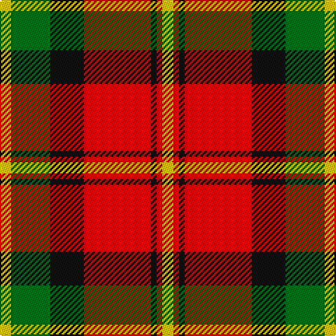

In pattern [YGKRKRY](/patterns/ygkrkry/).

This was sourced from house-of-tartan.  It is a [7 stripes tartan](/stripes/stripes7/).

Original link http://www.house-of-tartan.scotland.net/house/TartanViewjs.asp?colr=Def&tnam=1881

## Thread count
Y/8 G28 K24 R48 K4 R4 Y/8

## Palette
Each colour and its ΔE from the base-6 reference it is a variant of.

| Colour | Shade | Base | ΔE (OKLab) |
|---|---|---|---|
| G | <code style="background-color:#006818;">#006818</code> `#006818` | G <code style="background-color:#006100;">#006100</code> | 0.02 |
| K | <code style="background-color:#101010;">#101010</code> `#101010` | K <code style="background-color:#000000;">#000000</code> | 0.17 |
| R | <code style="background-color:#C80000;">#C80000</code> `#C80000` | R <code style="background-color:#CC0000;">#CC0000</code> | 0.01 |
| Y | <code style="background-color:#E8C000;">#E8C000</code> `#E8C000` | Y <code style="background-color:#F2BF00;">#F2BF00</code> | 0.02 |

# Sample pattern

## Nearest tartans

The nearest existing variants by ΔTartan distance.

1. [Blackstock, dress](/setts/s7/y8g28k24r48k4r4y8-g008000-k000000-rc00000-yf0c000/) — ΔT 0.66
1. [Blackstock Red (Dress)](/setts/s7/y8g28k24r44k4r4y8-g285800-k000000-rb00000-yc89800/) — ΔT 0.81
1. [Strathspey, Check](/setts/s6/g6r44b10g20k20g4-b5480b0-g008000-k000000-rc00000/) — ΔT 0.84
1. [Island of Innis, The](/setts/s8/k60g4k12r36g4r12y44k4-g285800-k101010-ra00000-yd09800/) — ΔT 0.94
1. [MacMillan Varient (Unidentified)](/setts/s6/g6k62r34g12y36k6-g005020-k101010-rdc0000-ye8c000/) — ΔT 0.95
1. [Bannockbane Brown #1](/setts/s8/b4r4b30r2w20g30r4g4-b441800-g604000-rc80000-we0e0e0/) — ΔT 0.96
1. [Montrose](/setts/s9/b2k2r24g24k12b10r24k2b2-b304080-g008000-k000000-rc00000/) — ΔT 0.97
1. [MacDuff](/setts/s7/r8k4r48k12b12g32r6-b304080-g008000-k000000-rc00000/) — ΔT 0.99
1. [MacNaughton (Logan) #2](/setts/s9/k4b4r52g50k26b26r52b4k4-b2c2c80-g285800-k101010-rfc3800/) — ΔT 1.00
1. [Graham Red](/setts/s9/y4k4r40g40k20y20r40k4y4-g388458-k000000-rc80000-y94a4b8/) — ΔT 1.01

## Neighbour map

Every grey dot is one of 15726 variants placed by the first two principal components of the ΔTartan feature space (44% of its variance). Red is this tartan; blue dots are its nearest — click one to open its page.

<svg viewBox="0 0 640 380" role="img" style="max-width:100%;height:auto;border:1px solid #e0e0e0;border-radius:4px;display:block" xmlns="http://www.w3.org/2000/svg"><image href="/nn/cloud.v1.png" width="640" height="380"/><a href="/setts/s7/y8g28k24r48k4r4y8-g008000-k000000-rc00000-yf0c000/"><circle cx="189.3" cy="170.7" r="4" fill="#3465a4"><title>Blackstock, dress</title></circle></a><a href="/setts/s7/y8g28k24r44k4r4y8-g285800-k000000-rb00000-yc89800/"><circle cx="187.0" cy="184.1" r="4" fill="#3465a4"><title>Blackstock Red (Dress)</title></circle></a><a href="/setts/s6/g6r44b10g20k20g4-b5480b0-g008000-k000000-rc00000/"><circle cx="196.8" cy="194.8" r="4" fill="#3465a4"><title>Strathspey, Check</title></circle></a><a href="/setts/s8/k60g4k12r36g4r12y44k4-g285800-k101010-ra00000-yd09800/"><circle cx="231.7" cy="163.5" r="4" fill="#3465a4"><title>Island of Innis, The</title></circle></a><a href="/setts/s6/g6k62r34g12y36k6-g005020-k101010-rdc0000-ye8c000/"><circle cx="188.5" cy="192.9" r="4" fill="#3465a4"><title>MacMillan Varient (Unidentified)</title></circle></a><a href="/setts/s8/b4r4b30r2w20g30r4g4-b441800-g604000-rc80000-we0e0e0/"><circle cx="191.7" cy="157.7" r="4" fill="#3465a4"><title>Bannockbane Brown #1</title></circle></a><a href="/setts/s9/b2k2r24g24k12b10r24k2b2-b304080-g008000-k000000-rc00000/"><circle cx="225.6" cy="169.9" r="4" fill="#3465a4"><title>Montrose</title></circle></a><a href="/setts/s7/r8k4r48k12b12g32r6-b304080-g008000-k000000-rc00000/"><circle cx="260.6" cy="179.6" r="4" fill="#3465a4"><title>MacDuff</title></circle></a><a href="/setts/s9/k4b4r52g50k26b26r52b4k4-b2c2c80-g285800-k101010-rfc3800/"><circle cx="229.3" cy="163.0" r="4" fill="#3465a4"><title>MacNaughton (Logan) #2</title></circle></a><a href="/setts/s9/y4k4r40g40k20y20r40k4y4-g388458-k000000-rc80000-y94a4b8/"><circle cx="200.2" cy="173.4" r="4" fill="#3465a4"><title>Graham Red</title></circle></a><circle cx="206.4" cy="175.9" r="5" fill="#c00000"/></svg>

ID: /setts/s7/y8g28k24r48k4r4y8-g006818-k101010-rc80000-ye8c000/
