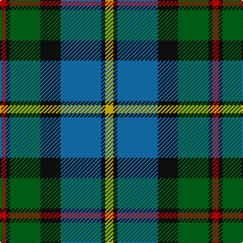

In pattern [RKGKBKY](/patterns/rkgkbky/).

This was sourced from register-of-tartans.  It is a [7 stripes tartan](/stripes/stripes7/).

Original link https://www.tartanregister.gov.uk/tartanDetails.aspx?ref=2629

## Attestations

This cloth appears in 2 source records; the oldest owns this page.

- 01/01/1831 — Green MacLeod (register-of-tartans, [record](https://www.tartanregister.gov.uk/tartanDetails.aspx?ref=2629))
- 1831 — MacLeod (Clan) (tartans-authority, [record](http://www.tartansauthority.com/tartan-ferret/display/1583/))

## Thread count
R/6 K4 G30 K20 B40 K4 Y/8

## Palette
Each colour and its ΔE from the base-6 reference it is a variant of.

| Colour | Shade | Base | ΔE (OKLab) |
|---|---|---|---|
| B | <code style="background-color:#1474B4;">#1474B4</code> `#1474B4` | B <code style="background-color:#2C4084;">#2C4084</code> | 0.15 |
| G | <code style="background-color:#006818;">#006818</code> `#006818` | G <code style="background-color:#006400;">#006400</code> | 0.02 |
| K | <code style="background-color:#101010;">#101010</code> `#101010` | K <code style="background-color:#000000;">#000000</code> | 0.17 |
| R | <code style="background-color:#C80000;">#C80000</code> `#C80000` | R <code style="background-color:#C80000;">#C80000</code> | 0.00 |
| Y | <code style="background-color:#E8C000;">#E8C000</code> `#E8C000` | Y <code style="background-color:#E8C000;">#E8C000</code> | 0.00 |

# Sample pattern

## Nearest tartans

The nearest existing variants by ΔTartan distance.

1. [Colquhoun #2](/setts/s7/r12g48w6k48b48k6b6-b1474b4-g006818-k101010-rc80000-wfcfcfc/) — ΔT 0.58
1. [MacLeod of Assynt](/setts/s6/r6k4g40k20b40y4-b1474b4-g006818-k101010-rc80000-ye8c000/) — ΔT 0.59
1. [Dick (Personal)](/setts/s7/k10g60y6b30k30b14w6-b1474b4-g28802c-k101010-we0e0e0-ye8c000/) — ΔT 0.61
1. [Royal Ashburn Golf Club](/setts/s6/g4b44r4k42g46y4-b1474b4-g006818-k101010-rc80000-ye8c000/) — ΔT 0.69
1. [MacTaggert](/setts/s7/g18b4g2k12ba12r2ba2-b5480b0-ba304080-g008000-k000000-rc00000/) — ΔT 0.87
1. [Royal College of Physicians (Corp)](/setts/s6/b36r6k18r6g46y6-b2c2c80-g006818-k101010-rc80000-ye8c000/) — ΔT 0.88
1. [Ogilvie Hunting Clan/Family Tartan Tartan Number: 6082. Earliest known date: pre 2000 Samples in STA Dalgety Collection labelled "Restricted, Hunting Ogilvie, Family Only". However, the major weavers have this in their swatch books so the restriction mentioned above seems to have been lifted at some stage. See products available Copyright © Blair Urquhart, Comrie, 2015](/setts/s8/b60y6b8k50g52k6g6r8-b5c8ca8-g789484-k101010-re87878-ye8c000/) — ΔT 0.89
1. [Wilson's No.111](/setts/s8/b38w4g24ba6k8ba6g24w4-b440044-ba5c8ca8-g006818-k101010-we0e0e0/) — ΔT 0.89
1. [Skene](/setts/s7/b48k8r6k8g48k8y8-b304080-g008000-k000000-rc00000-yff8500/) — ΔT 0.90
1. [Nelson Mandela (Personal)](/setts/s7/b54g10y16k40y6g30r6-b202060-g006818-k101010-rc80000-yd8b000/) — ΔT 0.91

## Neighbour map

Every grey dot is one of 15726 variants placed by the first two principal components of the ΔTartan feature space (44% of its variance). Red is this tartan; blue dots are its nearest — click one to open its page.

<svg viewBox="0 0 640 380" role="img" style="max-width:100%;height:auto;border:1px solid #e0e0e0;border-radius:4px;display:block" xmlns="http://www.w3.org/2000/svg"><image href="/nn/cloud.v1.png" width="640" height="380"/><a href="/setts/s7/r12g48w6k48b48k6b6-b1474b4-g006818-k101010-rc80000-wfcfcfc/"><circle cx="120.6" cy="196.3" r="4" fill="#3465a4"><title>Colquhoun #2</title></circle></a><a href="/setts/s6/r6k4g40k20b40y4-b1474b4-g006818-k101010-rc80000-ye8c000/"><circle cx="165.1" cy="199.7" r="4" fill="#3465a4"><title>MacLeod of Assynt</title></circle></a><a href="/setts/s7/k10g60y6b30k30b14w6-b1474b4-g28802c-k101010-we0e0e0-ye8c000/"><circle cx="155.9" cy="188.5" r="4" fill="#3465a4"><title>Dick (Personal)</title></circle></a><a href="/setts/s6/g4b44r4k42g46y4-b1474b4-g006818-k101010-rc80000-ye8c000/"><circle cx="171.0" cy="196.0" r="4" fill="#3465a4"><title>Royal Ashburn Golf Club</title></circle></a><a href="/setts/s7/g18b4g2k12ba12r2ba2-b5480b0-ba304080-g008000-k000000-rc00000/"><circle cx="140.5" cy="191.0" r="4" fill="#3465a4"><title>MacTaggert</title></circle></a><a href="/setts/s6/b36r6k18r6g46y6-b2c2c80-g006818-k101010-rc80000-ye8c000/"><circle cx="165.1" cy="208.4" r="4" fill="#3465a4"><title>Royal College of Physicians (Corp)</title></circle></a><a href="/setts/s8/b60y6b8k50g52k6g6r8-b5c8ca8-g789484-k101010-re87878-ye8c000/"><circle cx="154.7" cy="167.4" r="4" fill="#3465a4"><title>Ogilvie Hunting Clan/Family Tartan Tartan Number: 6082. Earliest known date: pre 2000 Samples in STA Dalgety Collection labelled &quot;Restricted, Hunting Ogilvie, Family Only&quot;. However, the major weavers have this in their swatch books so the restriction mentioned above seems to have been lifted at some stage. See products available Copyright © Blair Urquhart, Comrie, 2015</title></circle></a><a href="/setts/s8/b38w4g24ba6k8ba6g24w4-b440044-ba5c8ca8-g006818-k101010-we0e0e0/"><circle cx="179.6" cy="181.7" r="4" fill="#3465a4"><title>Wilson's No.111</title></circle></a><a href="/setts/s7/b48k8r6k8g48k8y8-b304080-g008000-k000000-rc00000-yff8500/"><circle cx="145.2" cy="181.4" r="4" fill="#3465a4"><title>Skene</title></circle></a><a href="/setts/s7/b54g10y16k40y6g30r6-b202060-g006818-k101010-rc80000-yd8b000/"><circle cx="123.2" cy="197.2" r="4" fill="#3465a4"><title>Nelson Mandela (Personal)</title></circle></a><circle cx="144.0" cy="186.1" r="5" fill="#c00000"/></svg>

ID: /setts/s7/y8k4b40k20g30k4r6-b1474b4-g006818-k101010-rc80000-ye8c000/
