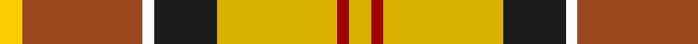

In pattern [YRWBYRY](/patterns/yrwbyry/).

This was sourced from tartans-authority.  It is a [7 stripes tartan](/stripes/stripes7/).

Original link http://www.tartansauthority.com/tartan-ferret/display/8735/

## Thread count
Y/8 T42 W4 K22 Ya42 DR4 Ya/8

## Palette
Each colour and its ΔE from the base-6 reference it is a variant of.

| Colour | Shade | Base | ΔE (OKLab) |
|---|---|---|---|
| DR | <code style="background-color:#A00000;">#A00000</code> `#A00000` | R <code style="background-color:#C80000;">#C80000</code> | 0.09 |
| K | <code style="background-color:#1C1C1C;">#1C1C1C</code> `#1C1C1C` | B <code style="background-color:#2C4084;">#2C4084</code> | 0.20 |
| T | <code style="background-color:#98481C;">#98481C</code> `#98481C` | R <code style="background-color:#C80000;">#C80000</code> | 0.11 |
| W | <code style="background-color:#FCFCFC;">#FCFCFC</code> `#FCFCFC` | W <code style="background-color:#F4F4F0;">#F4F4F0</code> | 0.03 |
| Y | <code style="background-color:#FCCC00;">#FCCC00</code> `#FCCC00` | Y <code style="background-color:#E8C000;">#E8C000</code> | 0.04 |
| Ya | <code style="background-color:#D8B000;">#D8B000</code> `#D8B000` | Y <code style="background-color:#E8C000;">#E8C000</code> | 0.05 |

# Sample pattern

## Nearest tartans

The nearest existing variants by ΔTartan distance.

1. [Prince Charles Edward](/setts/s9/r48g12y16k8y16g48y8r12w4-g008000-k000000-rc00000-we0e0e0-yf0c000/) — ΔT 1.14
1. [Elystan Glodrydd (Name)](/setts/s7/w6g48r26ga8y22r16b4-b1c0070-g006818-ga048888-rc80000-we0e0e0-ybc8c00/) — ΔT 1.20
1. [Bruce of Kinnaird (Fashion)](/setts/s10/y44ya44b4w12b4yb4b32yc10y16w4-b501400-wc0c0c0-ybc8c00-yac4bc68-ybd09800-yc00c4bc/) — ΔT 1.28
1. [MacLachlan, dress](/setts/s7/r68w6g8ga46w48k6g8-g006030-ga008000-k000000-rd03030-we0e0e0/) — ΔT 1.28
1. [Red Rum Commemorative Tartan Tartan Number: 1217. Earliest known date: 1982 Red Remony See products available Copyright © Blair Urquhart, Comrie, 2015](/setts/s7/k4y60g8w4g28r26y4-g006818-k101010-r880000-we0e0e0-ye8c000/) — ΔT 1.29
1. [Unidentified from Winnipeg](/setts/s8/w48r16b4r16b4r16g30ga4-b2a2303-g503c14-ga005020-rfa4b00-wf5dca0/) — ΔT 1.30
1. [Brittany Hunting French Fancy Tartan Tartan Number: 5977. Earliest known date: 2003 For Richard and Anne-Marie Duclos of Le Coudray-Montceaux, France. Based on the Breton National at 3902. The term Randonnée (Walking) is used in the sense of the Scottish category, Hunting. See products available Copyright © Blair Urquhart, Comrie, 2015](/setts/s9/b8g54y16k8y16k8y16r22ya6-b4898c4-g60441c-k101010-rb03000-yc8b898-yae8c000/) — ΔT 1.31
1. [Unidentified Silk Plaid #2](/setts/s7/y14ya24g60r24ra28rb22ya4-g005020-rec7440-rae13200-rbc82828-yc89600-yafadc00/) — ΔT 1.31
1. [Satchidananda (Personal)](/setts/s9/g36y8b20w4r40y10r4w4g12-b2888c4-g604000-rfc5000-we0e0e0-ye8c000/) — ΔT 1.33
1. [Jacobite, Silk sash](/setts/s10/w2r8ra5y6w5g21w6r8rb4w2-g008000-rc00000-ra806050-rbd03030-we0e0e0-yf0c000/) — ΔT 1.33

## Neighbour map

Every grey dot is one of 15726 variants placed by the first two principal components of the ΔTartan feature space (44% of its variance). Red is this tartan; blue dots are its nearest — click one to open its page.

<svg viewBox="0 0 640 380" role="img" style="max-width:100%;height:auto;border:1px solid #e0e0e0;border-radius:4px;display:block" xmlns="http://www.w3.org/2000/svg"><image href="/nn/cloud.v1.png" width="640" height="380"/><a href="/setts/s9/r48g12y16k8y16g48y8r12w4-g008000-k000000-rc00000-we0e0e0-yf0c000/"><circle cx="152.0" cy="149.7" r="4" fill="#3465a4"><title>Prince Charles Edward</title></circle></a><a href="/setts/s7/w6g48r26ga8y22r16b4-b1c0070-g006818-ga048888-rc80000-we0e0e0-ybc8c00/"><circle cx="160.1" cy="164.9" r="4" fill="#3465a4"><title>Elystan Glodrydd (Name)</title></circle></a><a href="/setts/s10/y44ya44b4w12b4yb4b32yc10y16w4-b501400-wc0c0c0-ybc8c00-yac4bc68-ybd09800-yc00c4bc/"><circle cx="129.5" cy="133.5" r="4" fill="#3465a4"><title>Bruce of Kinnaird (Fashion)</title></circle></a><a href="/setts/s7/r68w6g8ga46w48k6g8-g006030-ga008000-k000000-rd03030-we0e0e0/"><circle cx="146.7" cy="152.6" r="4" fill="#3465a4"><title>MacLachlan, dress</title></circle></a><a href="/setts/s7/k4y60g8w4g28r26y4-g006818-k101010-r880000-we0e0e0-ye8c000/"><circle cx="192.6" cy="123.4" r="4" fill="#3465a4"><title>Red Rum Commemorative Tartan Tartan Number: 1217. Earliest known date: 1982 Red Remony See products available Copyright © Blair Urquhart, Comrie, 2015</title></circle></a><a href="/setts/s8/w48r16b4r16b4r16g30ga4-b2a2303-g503c14-ga005020-rfa4b00-wf5dca0/"><circle cx="152.6" cy="144.6" r="4" fill="#3465a4"><title>Unidentified from Winnipeg</title></circle></a><a href="/setts/s9/b8g54y16k8y16k8y16r22ya6-b4898c4-g60441c-k101010-rb03000-yc8b898-yae8c000/"><circle cx="116.4" cy="150.4" r="4" fill="#3465a4"><title>Brittany Hunting French Fancy Tartan Tartan Number: 5977. Earliest known date: 2003 For Richard and Anne-Marie Duclos of Le Coudray-Montceaux, France. Based on the Breton National at 3902. The term Randonnée (Walking) is used in the sense of the Scottish category, Hunting. See products available Copyright © Blair Urquhart, Comrie, 2015</title></circle></a><a href="/setts/s7/y14ya24g60r24ra28rb22ya4-g005020-rec7440-rae13200-rbc82828-yc89600-yafadc00/"><circle cx="105.5" cy="154.4" r="4" fill="#3465a4"><title>Unidentified Silk Plaid #2</title></circle></a><a href="/setts/s9/g36y8b20w4r40y10r4w4g12-b2888c4-g604000-rfc5000-we0e0e0-ye8c000/"><circle cx="150.6" cy="154.7" r="4" fill="#3465a4"><title>Satchidananda (Personal)</title></circle></a><a href="/setts/s10/w2r8ra5y6w5g21w6r8rb4w2-g008000-rc00000-ra806050-rbd03030-we0e0e0-yf0c000/"><circle cx="86.4" cy="138.5" r="4" fill="#3465a4"><title>Jacobite, Silk sash</title></circle></a><circle cx="146.9" cy="146.1" r="5" fill="#c00000"/></svg>

ID: /setts/s7/y8r4y42b22w4ra42ya8-b1c1c1c-ra00000-ra98481c-wfcfcfc-yd8b000-yafccc00/
