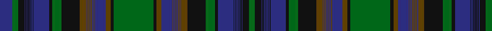

In pattern [BGKBKBKBKBKBKBKBKGKGBGBGBGBGBGBGBGKGKGBGBGBGBGBGBGBGKGKBKBKBKBKBKBKBKG](/patterns/bgkbkbkbkbkbkbkbkgkgbgbgbgbgbgbgbgkgkgbgbgbgbgbgbgbgkgkbkbkbkbkbkbkbkg/).

This was sourced from register-of-tartans.  It is a [70 stripes tartan](/stripes/stripes70/).

Original link https://www.tartanregister.gov.uk/tartanDetails.aspx?ref=544

## Thread count
DB/32 G16 K16 DB2 K2 DB2 K2 DB2 K2 DB2 K2 DB2 K2 DB2 K2 DB40 K8 G24 K48 T16 DB2 T2 DB2 T2 DB2 T2 DB2 T2 DB2 T2 DB2 T2 DB28 T12 K8 G104 K8 T12 DB28 T2 DB2 T2 DB2 T2 DB2 T2 DB2 T2 DB2 T2 DB2 T16 K48 G24 K8 DB40 K2 DB2 K2 DB2 K2 DB2 K2 DB2 K2 DB2 K2 DB2 K16 G/16

## Palette
Each colour and its ΔE from the base-6 reference it is a variant of.

| Colour | Shade | Base | ΔE (OKLab) |
|---|---|---|---|
| DB | <code style="background-color:#2C2C80;">#2C2C80</code> `#2C2C80` | B <code style="background-color:#2A418A;">#2A418A</code> | 0.06 |
| G | <code style="background-color:#006818;">#006818</code> `#006818` | G <code style="background-color:#006100;">#006100</code> | 0.02 |
| K | <code style="background-color:#101010;">#101010</code> `#101010` | K <code style="background-color:#000000;">#000000</code> | 0.17 |
| T | <code style="background-color:#604000;">#604000</code> `#604000` | G <code style="background-color:#006100;">#006100</code> | 0.14 |

## Nearest tartans

The nearest existing variants by ΔTartan distance.

1. [Alberta Trade Tartan Tartan Number: 1945. Earliest known date: pre 2003 From a Canadian pattern book. See products available Copyright © Blair Urquhart, Comrie, 2015](/setts/s36/g50k4ga6b28ga1b1ga1b1ga1b1ga1b1ga1b1ga1b1ga8k24g12k4b20k1b1k1b1k1b1k1b1k1b1k1b1k8g8b16~b2c2c80-g006818-ga604000-k101010/) — ΔT 1.40
1. [Manitoba (CIDD 28104)](/setts/s36/g50b16g8k8b1k1b1k1b1k1b1k1b1k1b1k1b20k40g12k24y8b1y1b1y1b1y1b1y1b1y1b1y1b28y6k4~b2c2c80-g006818-k101010-ybc8c00/) — ΔT 1.70
1. [Nova, Scotia](/setts/s36/b50g4ga6r28ga1r1ga1r1ga1r1ga1r1ga1r1ga1r1ga8g24b12g4r20g1r1g1r1g1r1g1r1g1r1g1r1g8b8r16~b304080-g003000-ga008000-r806050/) — ΔT 1.72
1. [Alberta](/setts/s36/g50k4ga6b28ga1b1ga1b1ga1b1ga1b1ga1b1ga1b1ga8k24g12k4b20k1b1k1b1k1b1k1b1k1b1k1b1k8g8b16~b2c4084-g005020-ga503c14-k101010/) — ΔT 1.99
1. [New Brunswick (Commemorative)](/setts/s36/k50g16k8ka8g1ka1g1ka1g1ka1g1ka1g1ka1g1ka1g20ka40k12ka24r8g1r1g1r1g1r1g1r1g1r1g1r1g28r6ka4~g003820-k000000-ka101010-rc80000~x2/) — ΔT 1.99
1. [Quebec (Commemorative)](/setts/s36/k50b16k8ka8b1ka1b1ka1b1ka1b1ka1b1ka1b1ka1b20ka40k12ka24r8b1r1b1r1b1r1b1r1b1r1b1r1b28r6ka4~b2c2c80-k000000-ka101010-rc80000~x2/) — ΔT 2.27
1. [Highland Mist](/setts/s45/b2g3ba1g2y1g2bb2ba1y2ba3g1ba2r1ba2b2g3ba1g2y1g2bb2r1b2r1b30g3ba1g2y1g2bb1ba2g1ba2r1ba2b2bb28ba1y2ba3g1ba2r1ba2~b003c64-ba780078-bb1c1c1c-g006818-r800028-ybc8c00~x2/) — ΔT 2.28
1. [Manitoba (Commemorative)](/setts/s36/k50b16k8ka8b1ka1b1ka1b1ka1b1ka1b1ka1b1ka1b20ka40k12ka24y8b1y1b1y1b1y1b1y1b1y1b1y1b28y6ka4~b2c2c80-k000000-ka101010-ybc8c00~x2/) — ΔT 2.33
1. [Nova Scotia (CIDD 20899)](/setts/s36/b50y16b8g8y1g1y1g1y1g1y1g1y1g1y1g1y20g40b12g24ga8y1ga1y1ga1y1ga1y1ga1y1ga1y1ga1y28ga6g4~b2c2c80-g003820-ga289c18-ybc8c00/) — ΔT 2.35
1. [Whitworth (2003)](/setts/s34/b60k2b2k2b5ka15b5g20r2ka3r2g20b5ka15g5b20k2g4k2b20g5ka15b5g20r2ka3r2g20b5ka15b5k2b2k2~b2c2c80-g006818-k000000-ka101010-rc80000~x2/) — ΔT 2.40

## Neighbour map

Every grey dot is one of 15726 variants placed by the first two principal components of the ΔTartan feature space (44% of its variance). Red is this tartan; blue dots are its nearest — click one to open its page.

<svg viewBox="0 0 640 380" role="img" style="max-width:100%;height:auto;border:1px solid #e0e0e0;border-radius:4px;display:block" xmlns="http://www.w3.org/2000/svg"><image href="/nn/cloud.v1.png" width="640" height="380"/><a href="/setts/s36/g50k4ga6b28ga1b1ga1b1ga1b1ga1b1ga1b1ga1b1ga8k24g12k4b20k1b1k1b1k1b1k1b1k1b1k1b1k8g8b16~b2c2c80-g006818-ga604000-k101010/"><circle cx="298.4" cy="49.9" r="4" fill="#3465a4"><title>Alberta Trade Tartan Tartan Number: 1945. Earliest known date: pre 2003 From a Canadian pattern book. See products available Copyright © Blair Urquhart, Comrie, 2015</title></circle></a><a href="/setts/s36/g50b16g8k8b1k1b1k1b1k1b1k1b1k1b1k1b20k40g12k24y8b1y1b1y1b1y1b1y1b1y1b1y1b28y6k4~b2c2c80-g006818-k101010-ybc8c00/"><circle cx="260.0" cy="39.6" r="4" fill="#3465a4"><title>Manitoba (CIDD 28104)</title></circle></a><a href="/setts/s36/b50g4ga6r28ga1r1ga1r1ga1r1ga1r1ga1r1ga1r1ga8g24b12g4r20g1r1g1r1g1r1g1r1g1r1g1r1g8b8r16~b304080-g003000-ga008000-r806050/"><circle cx="316.2" cy="51.5" r="4" fill="#3465a4"><title>Nova, Scotia</title></circle></a><a href="/setts/s36/g50k4ga6b28ga1b1ga1b1ga1b1ga1b1ga1b1ga1b1ga8k24g12k4b20k1b1k1b1k1b1k1b1k1b1k1b1k8g8b16~b2c4084-g005020-ga503c14-k101010/"><circle cx="337.7" cy="67.2" r="4" fill="#3465a4"><title>Alberta</title></circle></a><a href="/setts/s36/k50g16k8ka8g1ka1g1ka1g1ka1g1ka1g1ka1g1ka1g20ka40k12ka24r8g1r1g1r1g1r1g1r1g1r1g1r1g28r6ka4~g003820-k000000-ka101010-rc80000~x2/"><circle cx="288.1" cy="53.9" r="4" fill="#3465a4"><title>New Brunswick (Commemorative)</title></circle></a><a href="/setts/s36/k50b16k8ka8b1ka1b1ka1b1ka1b1ka1b1ka1b1ka1b20ka40k12ka24r8b1r1b1r1b1r1b1r1b1r1b1r1b28r6ka4~b2c2c80-k000000-ka101010-rc80000~x2/"><circle cx="270.7" cy="43.6" r="4" fill="#3465a4"><title>Quebec (Commemorative)</title></circle></a><a href="/setts/s45/b2g3ba1g2y1g2bb2ba1y2ba3g1ba2r1ba2b2g3ba1g2y1g2bb2r1b2r1b30g3ba1g2y1g2bb1ba2g1ba2r1ba2b2bb28ba1y2ba3g1ba2r1ba2~b003c64-ba780078-bb1c1c1c-g006818-r800028-ybc8c00~x2/"><circle cx="199.8" cy="14.0" r="4" fill="#3465a4"><title>Highland Mist</title></circle></a><a href="/setts/s36/k50b16k8ka8b1ka1b1ka1b1ka1b1ka1b1ka1b1ka1b20ka40k12ka24y8b1y1b1y1b1y1b1y1b1y1b1y1b28y6ka4~b2c2c80-k000000-ka101010-ybc8c00~x2/"><circle cx="256.6" cy="39.7" r="4" fill="#3465a4"><title>Manitoba (Commemorative)</title></circle></a><a href="/setts/s36/b50y16b8g8y1g1y1g1y1g1y1g1y1g1y1g1y20g40b12g24ga8y1ga1y1ga1y1ga1y1ga1y1ga1y1ga1y28ga6g4~b2c2c80-g003820-ga289c18-ybc8c00/"><circle cx="243.5" cy="26.8" r="4" fill="#3465a4"><title>Nova Scotia (CIDD 20899)</title></circle></a><a href="/setts/s34/b60k2b2k2b5ka15b5g20r2ka3r2g20b5ka15g5b20k2g4k2b20g5ka15b5g20r2ka3r2g20b5ka15b5k2b2k2~b2c2c80-g006818-k000000-ka101010-rc80000~x2/"><circle cx="256.0" cy="72.9" r="4" fill="#3465a4"><title>Whitworth (2003)</title></circle></a><circle cx="268.5" cy="21.4" r="5" fill="#c00000"/></svg>

ID: /setts/s70/b16g8k8b1k1b1k1b1k1b1k1b1k1b1k1b20k4g12k24ga8b1ga1b1ga1b1ga1b1ga1b1ga1b1ga1b14ga6k4g52k4ga6b14ga1b1ga1b1ga1b1ga1b1ga1b1ga1b1ga8k24g12k4b20k1b1k1b1k1b1k1b1k1b1k1b1k8g8~b2c2c80-g006818-ga604000-k101010~-hef459683eec3b017/
