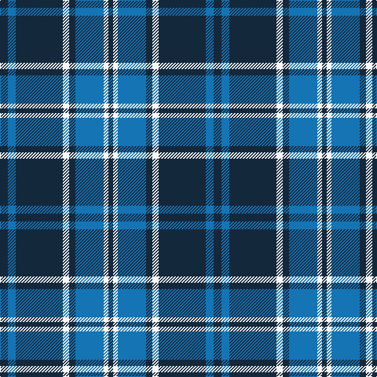

In pattern [BBBWBBWB](/patterns/bbbwbbwb/).

This was sourced from tartans-authority.  It is a [8 stripes tartan](/stripes/stripes8/).

Original link http://www.tartansauthority.com/tartan-ferret/display/4136/

## Thread count
DN/10 B10 DN60 W8 DN8 B36 W6 DN/6

## Palette
Each colour and its ΔE from the base-6 reference it is a variant of.

| Colour | Shade | Base | ΔE (OKLab) |
|---|---|---|---|
| B | <code style="background-color:#1474B4;">#1474B4</code> `#1474B4` | B <code style="background-color:#2C4084;">#2C4084</code> | 0.15 |
| DN | <code style="background-color:#14283C;">#14283C</code> `#14283C` | B <code style="background-color:#2C4084;">#2C4084</code> | 0.14 |
| W | <code style="background-color:#F8F8F8;">#F8F8F8</code> `#F8F8F8` | W <code style="background-color:#F4F4F0;">#F4F4F0</code> | 0.01 |

# Sample pattern

ID: /setts/s8/b10ba10b60w8b8ba36w6b6-b14283c-ba1474b4-wf8f8f8/
