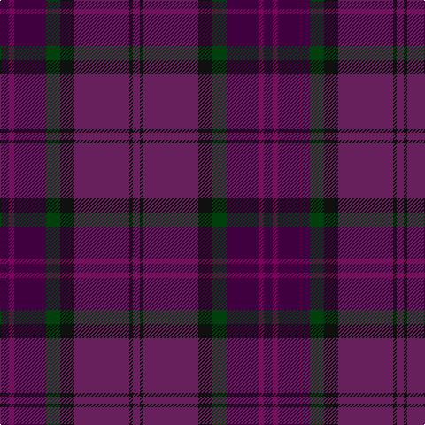

In pattern [BBBGKBKB](/patterns/bbbgkbkb/).

This was sourced from tartans-authority.  It is a [8 stripes tartan](/stripes/stripes8/).

Original link http://www.tartansauthority.com/tartan-ferret/display/7687/

## Thread count
DP/10 Pa6 DP36 DG16 K16 P62 K4 P/8

## Palette
Each colour and its ΔE from the base-6 reference it is a variant of.

| Colour | Shade | Base | ΔE (OKLab) |
|---|---|---|---|
| DG | <code style="background-color:#00400C;">#00400C</code> `#00400C` | G <code style="background-color:#006400;">#006400</code> | 0.12 |
| DP | <code style="background-color:#400040;">#400040</code> `#400040` | B <code style="background-color:#2C4084;">#2C4084</code> | 0.18 |
| K | <code style="background-color:#101010;">#101010</code> `#101010` | K <code style="background-color:#000000;">#000000</code> | 0.17 |
| P | <code style="background-color:#68205C;">#68205C</code> `#68205C` | B <code style="background-color:#2C4084;">#2C4084</code> | 0.14 |
| Pa | <code style="background-color:#7C045C;">#7C045C</code> `#7C045C` | B <code style="background-color:#2C4084;">#2C4084</code> | 0.18 |

# Sample pattern

ID: /setts/s8/b10ba6b36g16k16bb62k4bb8-b400040-ba7c045c-bb68205c-g00400c-k101010/
