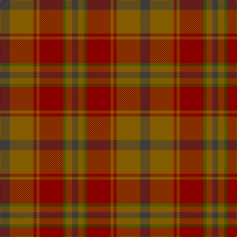

In pattern [BGGRGRGB](/patterns/bggrgrgb/).

This was sourced from tartans-authority.  It is a [8 stripes tartan](/stripes/stripes8/).

Original link http://www.tartansauthority.com/tartan-ferret/display/4779/

## Thread count
N/20 T48 DR6 T6 DR48 G6 T12 N/12

## Palette
Each colour and its ΔE from the base-6 reference it is a variant of.

| Colour | Shade | Base | ΔE (OKLab) |
|---|---|---|---|
| DR | <code style="background-color:#880000;">#880000</code> `#880000` | R <code style="background-color:#CC0000;">#CC0000</code> | 0.15 |
| G | <code style="background-color:#285800;">#285800</code> `#285800` | G <code style="background-color:#006100;">#006100</code> | 0.03 |
| N | <code style="background-color:#3C3C3C;">#3C3C3C</code> `#3C3C3C` | B <code style="background-color:#2A418A;">#2A418A</code> | 0.13 |
| T | <code style="background-color:#845C00;">#845C00</code> `#845C00` | G <code style="background-color:#006100;">#006100</code> | 0.16 |

# Sample pattern

## Nearest tartans

The nearest existing variants by ΔTartan distance.

1. [Devarr (Fashion)](/setts/s8/g31b3g3b3g3b22ga26r4x2~b441800-g604000-ga5c6428-r880000/) — ΔT 1.53
1. [Jardine of Castlemilk Family Tartan Tartan Number: 1432. Earliest known date: c.1978 The chiefly house is Jardine of Applegirth, a baronetcy created in 1672. The Jardines of Castlemilk in Dumfriesshire settled there in the early fourteenth century. The tartan is approved by Col Jardine. The darker brown is recorded as "J.Br", and the lighter as "Olive Br" in the Lyon Books. See products available Copyright © Blair Urquhart, Comrie, 2015](/setts/s8/r9ra9g9rb1b1ra9b1rb1x4~b5494bc-g686868-r88582c-rab87c00-rb7c0000/) — ΔT 1.57
1. [Cetoloni Family Tartan Tartan Number: 2049. Earliest known date: November 1991 The Cetoloni tartan was designed with the colours of the Border Hills, 'the sky at its best, the rooftop skyline of Siena and the golden sun of Tuscany'. Franco Cetoloni of Liddlevale was born in Badia Roti Bucine in Arezzo, Italy. Jayne was a designer at Pringle's knitwear in Hawick. Red is Sienna red. See products available Copyright © Blair Urquhart, Comrie, 2015](/setts/s6/b2r22g11y2g11b2x2~b2c2c80-g604000-ra03400-ye8c000/) — ΔT 1.59
1. [Hyland Day (Personal)](/setts/s8/r3g2r26g4b6g29b2y3x2~b441800-g604000-rb03000-ydc943c/) — ΔT 1.62
1. [Devarr](/setts/s14/b22g26r4g26b22ga3b3ga3b3ga31b3ga3b3ga3x2~b441800-g5c6428-ga604000-r880000/) — ΔT 1.69
1. [Redwoods](/setts/s9/g4r18ga2r2ga5k2ga15r1g4x2~g746450-ga604000-k101010-r880000/) — ΔT 1.72
1. [Jardine, of Castlemilk](/setts/s8/b9r9ba9ra1bb1r9bb1ra1x4~b401000-ba505050-bb304080-r806050-rac00000/) — ΔT 1.74
1. [Rowardennan](/setts/s6/k3r22g5ga10b10ga2x2~b441800-g344c14-ga002c18-k101010-r880000/) — ΔT 1.80
1. [Annan (Fashion)](/setts/s10/g16r2g2ra2g2r2g2b6ba10g3x2~b441800-ba5c5c5c-g8c7038-r888888-rab84c00/) — ΔT 1.82
1. [Pubcrawlers (Corporate)](/setts/s7/g3ga4g2ga22b5r16y3x2~b5c5c5c-g006818-ga604000-r901c38-ye8c000/) — ΔT 1.82

## Neighbour map

Every grey dot is one of 15726 variants placed by the first two principal components of the ΔTartan feature space (44% of its variance). Red is this tartan; blue dots are its nearest — click one to open its page.

<svg viewBox="0 0 640 380" role="img" style="max-width:100%;height:auto;border:1px solid #e0e0e0;border-radius:4px;display:block" xmlns="http://www.w3.org/2000/svg"><image href="/nn/cloud.v1.png" width="640" height="380"/><a href="/setts/s8/g31b3g3b3g3b22ga26r4x2~b441800-g604000-ga5c6428-r880000/"><circle cx="364.4" cy="247.4" r="4" fill="#3465a4"><title>Devarr (Fashion)</title></circle></a><a href="/setts/s8/r9ra9g9rb1b1ra9b1rb1x4~b5494bc-g686868-r88582c-rab87c00-rb7c0000/"><circle cx="316.3" cy="226.5" r="4" fill="#3465a4"><title>Jardine of Castlemilk Family Tartan Tartan Number: 1432. Earliest known date: c.1978 The chiefly house is Jardine of Applegirth, a baronetcy created in 1672. The Jardines of Castlemilk in Dumfriesshire settled there in the early fourteenth century. The tartan is approved by Col Jardine. The darker brown is recorded as &quot;J.Br&quot;, and the lighter as &quot;Olive Br&quot; in the Lyon Books. See products available Copyright © Blair Urquhart, Comrie, 2015</title></circle></a><a href="/setts/s6/b2r22g11y2g11b2x2~b2c2c80-g604000-ra03400-ye8c000/"><circle cx="358.1" cy="234.4" r="4" fill="#3465a4"><title>Cetoloni Family Tartan Tartan Number: 2049. Earliest known date: November 1991 The Cetoloni tartan was designed with the colours of the Border Hills, 'the sky at its best, the rooftop skyline of Siena and the golden sun of Tuscany'. Franco Cetoloni of Liddlevale was born in Badia Roti Bucine in Arezzo, Italy. Jayne was a designer at Pringle's knitwear in Hawick. Red is Sienna red. See products available Copyright © Blair Urquhart, Comrie, 2015</title></circle></a><a href="/setts/s8/r3g2r26g4b6g29b2y3x2~b441800-g604000-rb03000-ydc943c/"><circle cx="342.6" cy="185.3" r="4" fill="#3465a4"><title>Hyland Day (Personal)</title></circle></a><a href="/setts/s14/b22g26r4g26b22ga3b3ga3b3ga31b3ga3b3ga3x2~b441800-g5c6428-ga604000-r880000/"><circle cx="329.6" cy="214.9" r="4" fill="#3465a4"><title>Devarr</title></circle></a><a href="/setts/s9/g4r18ga2r2ga5k2ga15r1g4x2~g746450-ga604000-k101010-r880000/"><circle cx="413.1" cy="216.4" r="4" fill="#3465a4"><title>Redwoods</title></circle></a><a href="/setts/s8/b9r9ba9ra1bb1r9bb1ra1x4~b401000-ba505050-bb304080-r806050-rac00000/"><circle cx="291.3" cy="222.0" r="4" fill="#3465a4"><title>Jardine, of Castlemilk</title></circle></a><a href="/setts/s6/k3r22g5ga10b10ga2x2~b441800-g344c14-ga002c18-k101010-r880000/"><circle cx="296.8" cy="234.7" r="4" fill="#3465a4"><title>Rowardennan</title></circle></a><a href="/setts/s10/g16r2g2ra2g2r2g2b6ba10g3x2~b441800-ba5c5c5c-g8c7038-r888888-rab84c00/"><circle cx="348.3" cy="209.6" r="4" fill="#3465a4"><title>Annan (Fashion)</title></circle></a><a href="/setts/s7/g3ga4g2ga22b5r16y3x2~b5c5c5c-g006818-ga604000-r901c38-ye8c000/"><circle cx="317.0" cy="205.7" r="4" fill="#3465a4"><title>Pubcrawlers (Corporate)</title></circle></a><circle cx="342.1" cy="247.8" r="5" fill="#c00000"/></svg>

ID: /setts/s8/b10g24r3g3r24ga3g6b6x2~b3c3c3c-g845c00-ga285800-r880000/
