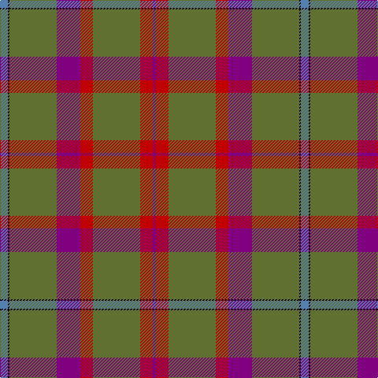

In pattern [BKGBRGRB](/patterns/bkgbrgrb/).

This was sourced from weddslist.  It is a [8 stripes tartan](/stripes/stripes8/).

Original link http://www.weddslist.com/cgi-bin/tartans/pg.pl?source=sts

## Thread count
B/10 K2 G60 P30 R16 G60 R16 P/4

## Palette
Each colour and its ΔE from the base-6 reference it is a variant of.

| Colour | Shade | Base | ΔE (OKLab) |
|---|---|---|---|
| B | <code style="background-color:#5480B0;">#5480B0</code> `#5480B0` | B <code style="background-color:#2C4084;">#2C4084</code> | 0.20 |
| G | <code style="background-color:#607030;">#607030</code> `#607030` | G <code style="background-color:#006400;">#006400</code> | 0.11 |
| K | <code style="background-color:#000000;">#000000</code> `#000000` | K <code style="background-color:#000000;">#000000</code> | 0.00 |
| P | <code style="background-color:#800080;">#800080</code> `#800080` | B <code style="background-color:#2C4084;">#2C4084</code> | 0.17 |
| R | <code style="background-color:#C00000;">#C00000</code> `#C00000` | R <code style="background-color:#C80000;">#C80000</code> | 0.02 |

# Sample pattern

## Nearest tartans

The nearest existing variants by ΔTartan distance.

1. [Shaw of Tordarroch Hunting Clan Tartan Tartan Number: 318. Earliest known date: 1969 Also known as 'Green Shaw of Tordarroch'. Green is 'Sage Green' Proportionally reduced for display. (50%) See products available Copyright © Blair Urquhart, Comrie, 2015](/setts/s8/b5k1g30ba15r8g30r8ba2-b5c8ca8-ba780078-g5c6428-k101010-rc80000/) — ΔT 0.39
1. [MacWilliam Htg](/setts/s7/g4ga64ga24k20r2b32r4-b2c2c80-g285800-ga604000-k101010-rc80000/) — ΔT 1.49
1. [McAlifyfe (Personal)](/setts/s11/g6k6r12g12ra24g6k4g60y4g6k6-g696b3a-k101010-rb966ae-raa01d69-ycb8000/) — ΔT 1.52
1. [Shannon (?)](/setts/s7/g96b22ga32y32g22r6g22-b780078-g604000-ga006818-rc80000-ye8c000/) — ΔT 1.57
1. [Shaw of Tordarroch Green (Htg) (Clan](/setts/s8/b10k2g60ba30r16g60r16ba4-b5c8ca8-ba2c2c80-g006818-k101010-rc80000/) — ΔT 1.60
1. [Bute Heather, Grey (Fashion)](/setts/s11/y13ya2b38k13b8k8b17k2b17k4r11-b5c5c5c-k101010-r888888-ya0a0a0-yab8b8b8/) — ΔT 1.61
1. [Fulton](/setts/s9/b6k2g32r10g12r10g28r32y4-b6c0070-g006818-k101010-r880000-yd09800/) — ΔT 1.63
1. [Toyokawa Check](/setts/s11/b72ba20y4ba10g4ba10y20b10y4b20w4-b5c5c5c-ba680028-g408060-we0e0e0-ya08858/) — ΔT 1.65
1. [Duminiak (Trevose, Pennsylvania)](/setts/s6/g94w12r48w6b10y6-b433a5a-g6a5e47-rb62531-we5e0d2-ye0a126/) — ΔT 1.66
1. [Redpath, Robert A (Personal)](/setts/s8/r52b8r2ba4g2b8g28w4-b505050-ba9058d8-g005020-r880000-we0e0e0/) — ΔT 1.70

## Neighbour map

Every grey dot is one of 15726 variants placed by the first two principal components of the ΔTartan feature space (44% of its variance). Red is this tartan; blue dots are its nearest — click one to open its page.

<svg viewBox="0 0 640 380" role="img" style="max-width:100%;height:auto;border:1px solid #e0e0e0;border-radius:4px;display:block" xmlns="http://www.w3.org/2000/svg"><image href="/nn/cloud.v1.png" width="640" height="380"/><a href="/setts/s8/b5k1g30ba15r8g30r8ba2-b5c8ca8-ba780078-g5c6428-k101010-rc80000/"><circle cx="397.9" cy="159.5" r="4" fill="#3465a4"><title>Shaw of Tordarroch Hunting Clan Tartan Tartan Number: 318. Earliest known date: 1969 Also known as 'Green Shaw of Tordarroch'. Green is 'Sage Green' Proportionally reduced for display. (50%) See products available Copyright © Blair Urquhart, Comrie, 2015</title></circle></a><a href="/setts/s7/g4ga64ga24k20r2b32r4-b2c2c80-g285800-ga604000-k101010-rc80000/"><circle cx="409.7" cy="171.5" r="4" fill="#3465a4"><title>MacWilliam Htg</title></circle></a><a href="/setts/s11/g6k6r12g12ra24g6k4g60y4g6k6-g696b3a-k101010-rb966ae-raa01d69-ycb8000/"><circle cx="371.5" cy="143.1" r="4" fill="#3465a4"><title>McAlifyfe (Personal)</title></circle></a><a href="/setts/s7/g96b22ga32y32g22r6g22-b780078-g604000-ga006818-rc80000-ye8c000/"><circle cx="330.2" cy="179.5" r="4" fill="#3465a4"><title>Shannon (?)</title></circle></a><a href="/setts/s8/b10k2g60ba30r16g60r16ba4-b5c8ca8-ba2c2c80-g006818-k101010-rc80000/"><circle cx="362.4" cy="157.1" r="4" fill="#3465a4"><title>Shaw of Tordarroch Green (Htg) (Clan</title></circle></a><a href="/setts/s11/y13ya2b38k13b8k8b17k2b17k4r11-b5c5c5c-k101010-r888888-ya0a0a0-yab8b8b8/"><circle cx="330.5" cy="163.1" r="4" fill="#3465a4"><title>Bute Heather, Grey (Fashion)</title></circle></a><a href="/setts/s9/b6k2g32r10g12r10g28r32y4-b6c0070-g006818-k101010-r880000-yd09800/"><circle cx="323.1" cy="186.9" r="4" fill="#3465a4"><title>Fulton</title></circle></a><a href="/setts/s11/b72ba20y4ba10g4ba10y20b10y4b20w4-b5c5c5c-ba680028-g408060-we0e0e0-ya08858/"><circle cx="381.4" cy="151.3" r="4" fill="#3465a4"><title>Toyokawa Check</title></circle></a><a href="/setts/s6/g94w12r48w6b10y6-b433a5a-g6a5e47-rb62531-we5e0d2-ye0a126/"><circle cx="333.8" cy="164.1" r="4" fill="#3465a4"><title>Duminiak (Trevose, Pennsylvania)</title></circle></a><a href="/setts/s8/r52b8r2ba4g2b8g28w4-b505050-ba9058d8-g005020-r880000-we0e0e0/"><circle cx="344.1" cy="135.4" r="4" fill="#3465a4"><title>Redpath, Robert A (Personal)</title></circle></a><circle cx="386.7" cy="154.8" r="5" fill="#c00000"/></svg>

ID: /setts/s8/b10k2g60ba30r16g60r16ba4-b5480b0-ba800080-g607030-k000000-rc00000/
