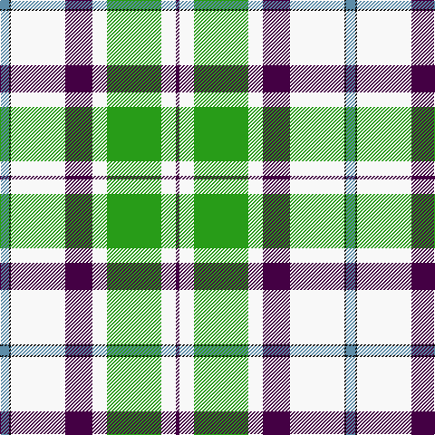

In pattern [BKWBWGWB](/patterns/bkwbwgwb/).

This was sourced from tartans-authority.  It is a [8 stripes tartan](/stripes/stripes8/).

Original link http://www.tartansauthority.com/tartan-ferret/display/6380/

## Thread count
B/10 K2 W60 DP30 W16 G60 W16 DP/4

## Palette
Each colour and its ΔE from the base-6 reference it is a variant of.

| Colour | Shade | Base | ΔE (OKLab) |
|---|---|---|---|
| B | <code style="background-color:#5C8CA8;">#5C8CA8</code> `#5C8CA8` | B <code style="background-color:#2C4084;">#2C4084</code> | 0.23 |
| DP | <code style="background-color:#440044;">#440044</code> `#440044` | B <code style="background-color:#2C4084;">#2C4084</code> | 0.17 |
| G | <code style="background-color:#289C18;">#289C18</code> `#289C18` | G <code style="background-color:#006400;">#006400</code> | 0.18 |
| K | <code style="background-color:#101010;">#101010</code> `#101010` | K <code style="background-color:#000000;">#000000</code> | 0.17 |
| W | <code style="background-color:#F8F8F8;">#F8F8F8</code> `#F8F8F8` | W <code style="background-color:#F4F4F0;">#F4F4F0</code> | 0.01 |

# Sample pattern

## Nearest tartans

The nearest existing variants by ΔTartan distance.

1. [MacNappy Tartan](/setts/s6/w72b24w2r24g32y4-b00008b-g008000-r800000-wffffff-yffff00/) — ΔT 0.89
1. [Michigan State University](/setts/s7/g18w55r19g20w2g20k5-g006818-k101010-r888888-wffffff/) — ΔT 1.16
1. [Michigan State University (Corporate](/setts/s7/g18w55r19g20w2g20k5-g006818-k101010-r888888-wfcfcfc/) — ΔT 1.17
1. [Nimah, Carissa & Bassem (Personal)](/setts/s7/w100g30b20r4b20ga16y6-b202060-g048888-ga146400-rdc0000-wf8f4d0-yffff00/) — ΔT 1.18
1. [Kintail Dress](/setts/s8/g6ga64g72r24k4w136ga6k4-g487044-ga006818-k101010-ra07c58-wf8e8d8/) — ΔT 1.19
1. [Henderson Dress (Clan?)](/setts/s9/w2b12w8b2w32k2g8k12y2-b2888c4-g006818-k101010-wfcfcfc-ye8c000/) — ΔT 1.33
1. [British Columbia #2](/setts/s8/g8b28g28ga12b2w60g4b2-b541c0c-g004c00-ga9c8000-wffffff/) — ΔT 1.40
1. [Shiel, Purple V2 (Dance)](/setts/s7/w16g10b20ba48w60g4wa4-b440044-ba5c8ca8-g006818-wf0e0c8-wac49cd8/) — ΔT 1.43
1. [Henderson Dress](/setts/s9/w2b12w8b2w32k2g8k12y2-b8080d0-g008000-k000000-we0e0e0-yf0c000/) — ΔT 1.47
1. [Manx Laxey, dress green](/setts/s6/b4w28ba8y2g16b4-b304080-ba800080-g008000-we0e0e0-yf0c000/) — ΔT 1.49

## Neighbour map

Every grey dot is one of 15726 variants placed by the first two principal components of the ΔTartan feature space (44% of its variance). Red is this tartan; blue dots are its nearest — click one to open its page.

<svg viewBox="0 0 640 380" role="img" style="max-width:100%;height:auto;border:1px solid #e0e0e0;border-radius:4px;display:block" xmlns="http://www.w3.org/2000/svg"><image href="/nn/cloud.v1.png" width="640" height="380"/><a href="/setts/s6/w72b24w2r24g32y4-b00008b-g008000-r800000-wffffff-yffff00/"><circle cx="208.1" cy="112.2" r="4" fill="#3465a4"><title>MacNappy Tartan</title></circle></a><a href="/setts/s7/g18w55r19g20w2g20k5-g006818-k101010-r888888-wffffff/"><circle cx="216.3" cy="146.7" r="4" fill="#3465a4"><title>Michigan State University</title></circle></a><a href="/setts/s7/g18w55r19g20w2g20k5-g006818-k101010-r888888-wfcfcfc/"><circle cx="217.5" cy="147.3" r="4" fill="#3465a4"><title>Michigan State University (Corporate</title></circle></a><a href="/setts/s7/w100g30b20r4b20ga16y6-b202060-g048888-ga146400-rdc0000-wf8f4d0-yffff00/"><circle cx="215.8" cy="91.7" r="4" fill="#3465a4"><title>Nimah, Carissa &amp; Bassem (Personal)</title></circle></a><a href="/setts/s8/g6ga64g72r24k4w136ga6k4-g487044-ga006818-k101010-ra07c58-wf8e8d8/"><circle cx="223.6" cy="96.3" r="4" fill="#3465a4"><title>Kintail Dress</title></circle></a><a href="/setts/s9/w2b12w8b2w32k2g8k12y2-b2888c4-g006818-k101010-wfcfcfc-ye8c000/"><circle cx="211.8" cy="115.1" r="4" fill="#3465a4"><title>Henderson Dress (Clan?)</title></circle></a><a href="/setts/s8/g8b28g28ga12b2w60g4b2-b541c0c-g004c00-ga9c8000-wffffff/"><circle cx="212.5" cy="113.1" r="4" fill="#3465a4"><title>British Columbia #2</title></circle></a><a href="/setts/s7/w16g10b20ba48w60g4wa4-b440044-ba5c8ca8-g006818-wf0e0c8-wac49cd8/"><circle cx="206.2" cy="145.6" r="4" fill="#3465a4"><title>Shiel, Purple V2 (Dance)</title></circle></a><a href="/setts/s9/w2b12w8b2w32k2g8k12y2-b8080d0-g008000-k000000-we0e0e0-yf0c000/"><circle cx="214.2" cy="116.5" r="4" fill="#3465a4"><title>Henderson Dress</title></circle></a><a href="/setts/s6/b4w28ba8y2g16b4-b304080-ba800080-g008000-we0e0e0-yf0c000/"><circle cx="184.9" cy="153.6" r="4" fill="#3465a4"><title>Manx Laxey, dress green</title></circle></a><circle cx="210.8" cy="110.4" r="5" fill="#c00000"/></svg>

ID: /setts/s8/b10k2w60ba30w16g60w16ba4-b5c8ca8-ba440044-g289c18-k101010-wf8f8f8/
