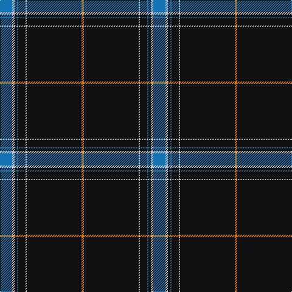

This page is one **sett** — a single exact thread-count. It belongs to the [tartan](/tartans/b10lb2k2b1k6lb1k45lo2/)
(the same proportion at any scale), whose colour order is pattern [BWKBKWKY](/stripes/bwkbkwky/).

Sourced from tartans-authority.  It is a [8 stripe tartan](/stripes/stripes8/).

Original link http://www.tartansauthority.com/tartan-ferret/display/10382/

## Register references

External register numbers recorded for this tartan.

- Scottish Register of Tartans: [10382](https://www.tartanregister.gov.uk/tartanDetails?ref=10382)
- Scottish Tartans Authority (ITI): 10382

## Thread count
B/20 N4 K4 B2 K12 N2 K90 O/4

## Palette

Palette: <strong>Tartan Register</strong>
<table><thead><tr><th>Colour</th><th>Threads</th><th>Shade</th><th>Base</th><th>OKLCh</th></tr></thead><tbody><tr><td>B/</td><td style="text-align:right;font-variant-numeric:tabular-nums">20</td><td><code style="background-color:#1474B4;">#1474B4</code> <small style="color:#888">#1474B4</small></td><td>B <code style="background-color:#2A418A;">#2A418A</code></td><td><small style="color:#888">oklch(54.0% 0.129 245.1)</small></td></tr><tr><td>N</td><td style="text-align:right;font-variant-numeric:tabular-nums">4</td><td><code style="background-color:#C0C0C0;">#C0C0C0</code> <small style="color:#888">#C0C0C0</small></td><td>W <code style="background-color:#F7F7F7;">#F7F7F7</code></td><td><small style="color:#888">oklch(80.8% 0.000 89.9)</small></td></tr><tr><td>K</td><td style="text-align:right;font-variant-numeric:tabular-nums">4</td><td><code style="background-color:#101010;">#101010</code> <small style="color:#888">#101010</small></td><td>K <code style="background-color:#000000;">#000000</code></td><td><small style="color:#888">oklch(17.3% 0.000 89.9)</small></td></tr><tr><td>B</td><td style="text-align:right;font-variant-numeric:tabular-nums">2</td><td><code style="background-color:#1474B4;">#1474B4</code> <small style="color:#888">#1474B4</small></td><td>B <code style="background-color:#2A418A;">#2A418A</code></td><td><small style="color:#888">oklch(54.0% 0.129 245.1)</small></td></tr><tr><td>K</td><td style="text-align:right;font-variant-numeric:tabular-nums">12</td><td><code style="background-color:#101010;">#101010</code> <small style="color:#888">#101010</small></td><td>K <code style="background-color:#000000;">#000000</code></td><td><small style="color:#888">oklch(17.3% 0.000 89.9)</small></td></tr><tr><td>N</td><td style="text-align:right;font-variant-numeric:tabular-nums">2</td><td><code style="background-color:#C0C0C0;">#C0C0C0</code> <small style="color:#888">#C0C0C0</small></td><td>W <code style="background-color:#F7F7F7;">#F7F7F7</code></td><td><small style="color:#888">oklch(80.8% 0.000 89.9)</small></td></tr><tr><td>K</td><td style="text-align:right;font-variant-numeric:tabular-nums">90</td><td><code style="background-color:#101010;">#101010</code> <small style="color:#888">#101010</small></td><td>K <code style="background-color:#000000;">#000000</code></td><td><small style="color:#888">oklch(17.3% 0.000 89.9)</small></td></tr><tr><td>O/</td><td style="text-align:right;font-variant-numeric:tabular-nums">4</td><td><code style="background-color:#D87C00;">#D87C00</code> <small style="color:#888">#D87C00</small></td><td>Y <code style="background-color:#F2BF00;">#F2BF00</code></td><td><small style="color:#888">oklch(67.3% 0.155 61.8)</small></td></tr></tbody></table>

# Sample pattern

## Nearest tartans

The nearest existing variants by ΔTartan distance, with this tartan at the top so the swatches line up against it.

ΔTartan

Tartan

Sett

—

<a href="/ttd/edit/#slug=b10lb2k2b1k6lb1k45lo2~x2">Marine Harvest Scotland (Corporate)</a> <a class="nn-out" href="/setts/s8/b10lb2k2b1k6lb1k45lo2~x2/" title="open its dictionary page">↗</a>

0.67

<a href="/ttd/edit/#slug=db10t2k2db1k6t1k45lo2~x2">Marine Harvest (Scotland)</a> <a class="nn-out" href="/setts/s8/db10t2k2db1k6t1k45lo2~x2/" title="open its dictionary page">↗</a>

0.88

<a href="/ttd/edit/#slug=db8r1k6r1lo8r1k45lo1~x2">degli Uberti, Baron of Cartsburn (Personal)</a> <a class="nn-out" href="/setts/s8/db8r1k6r1lo8r1k45lo1~x2/" title="open its dictionary page">↗</a>

1.02

<a href="/ttd/edit/#slug=w2k2dp8k10dp8k64w2k8ly1k1~x2">Payne of Wallins Creek (Personal)</a> <a class="nn-out" href="/setts/s10/w2k2dp8k10dp8k64w2k8ly1k1~x2/" title="open its dictionary page">↗</a>

1.06

<a href="/ttd/edit/#slug=k83g4r4g10k1w3~x2">Perratt (Personal)</a> <a class="nn-out" href="/setts/s6/k83g4r4g10k1w3~x2/" title="open its dictionary page">↗</a>

1.08

<a href="/ttd/edit/#slug=k5lo1dg7r1k45r5lo3k4lo3~x2">Brooks Brothers Signature (Corporate</a> <a class="nn-out" href="/setts/s9/k5lo1dg7r1k45r5lo3k4lo3~x2/" title="open its dictionary page">↗</a>

1.10

<a href="/ttd/edit/#slug=k31w1k2w2dt3k2t4w2~x4">Capco</a> <a class="nn-out" href="/setts/s8/k31w1k2w2dt3k2t4w2~x4/" title="open its dictionary page">↗</a>

1.12

<a href="/ttd/edit/#slug=k80r6g3r12k2w2~x2">Dellen</a> <a class="nn-out" href="/setts/s6/k80r6g3r12k2w2~x2/" title="open its dictionary page">↗</a>

1.17

<a href="/ttd/edit/#slug=db5ly1g7r1db45r5ly3db4ly3~x2">Brooks Brothers Signature</a> <a class="nn-out" href="/setts/s9/db5ly1g7r1db45r5ly3db4ly3~x2/" title="open its dictionary page">↗</a>

1.27

<a href="/ttd/edit/#slug=k60r3k15r3lb2r5b3r2~x2">Whitaker (2014)</a> <a class="nn-out" href="/setts/s8/k60r3k15r3lb2r5b3r2~x2/" title="open its dictionary page">↗</a>

1.27

<a href="/ttd/edit/#slug=k64r1k4r1k6r7w2r7k6t2~x2">Noordermeer (Personal)</a> <a class="nn-out" href="/setts/s10/k64r1k4r1k6r7w2r7k6t2~x2/" title="open its dictionary page">↗</a>

## Neighbour map

Every grey dot is one of 14359 variants placed by the first two principal components of the ΔTartan feature space (44% of its variance). Red is this tartan; blue dots are its nearest — click one to open its page.

<svg viewBox="0 0 640 380" role="img" style="max-width:100%;height:auto;border:1px solid #e0e0e0;border-radius:4px;display:block" xmlns="http://www.w3.org/2000/svg"><image href="/nn/cloud.v1.png" width="640" height="380"/><a href="/setts/s8/db10t2k2db1k6t1k45lo2~x2/"><circle cx="550.4" cy="125.8" r="4" fill="#3465a4"><title>Marine Harvest (Scotland)</title></circle></a><a href="/setts/s8/db8r1k6r1lo8r1k45lo1~x2/"><circle cx="498.9" cy="118.6" r="4" fill="#3465a4"><title>degli Uberti, Baron of Cartsburn (Personal)</title></circle></a><a href="/setts/s10/w2k2dp8k10dp8k64w2k8ly1k1~x2/"><circle cx="580.8" cy="104.6" r="4" fill="#3465a4"><title>Payne of Wallins Creek (Personal)</title></circle></a><a href="/setts/s6/k83g4r4g10k1w3~x2/"><circle cx="588.2" cy="131.7" r="4" fill="#3465a4"><title>Perratt (Personal)</title></circle></a><a href="/setts/s9/k5lo1dg7r1k45r5lo3k4lo3~x2/"><circle cx="509.0" cy="120.2" r="4" fill="#3465a4"><title>Brooks Brothers Signature (Corporate</title></circle></a><a href="/setts/s8/k31w1k2w2dt3k2t4w2~x4/"><circle cx="483.1" cy="117.3" r="4" fill="#3465a4"><title>Capco</title></circle></a><a href="/setts/s6/k80r6g3r12k2w2~x2/"><circle cx="556.5" cy="131.5" r="4" fill="#3465a4"><title>Dellen</title></circle></a><a href="/setts/s9/db5ly1g7r1db45r5ly3db4ly3~x2/"><circle cx="481.0" cy="103.8" r="4" fill="#3465a4"><title>Brooks Brothers Signature</title></circle></a><a href="/setts/s8/k60r3k15r3lb2r5b3r2~x2/"><circle cx="567.0" cy="133.7" r="4" fill="#3465a4"><title>Whitaker (2014)</title></circle></a><a href="/setts/s10/k64r1k4r1k6r7w2r7k6t2~x2/"><circle cx="585.6" cy="98.4" r="4" fill="#3465a4"><title>Noordermeer (Personal)</title></circle></a><circle cx="538.7" cy="118.2" r="5" fill="#c00000"/></svg>

ID: /setts/s8/b10lb2k2b1k6lb1k45lo2~x2/
