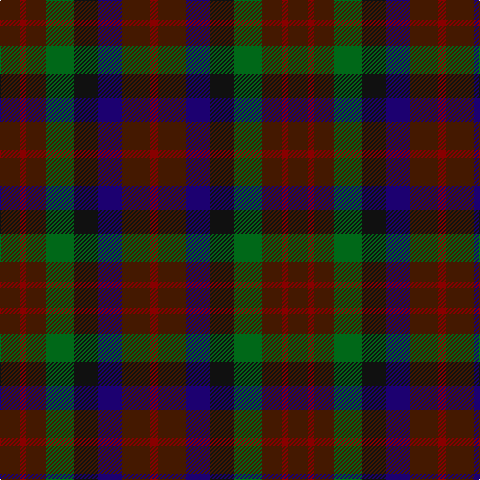

In pattern [BRBGKBBR](/patterns/brbgkbbr/).

This was sourced from register-of-tartans.  It is a [8 stripes tartan](/stripes/stripes8/).

Original link https://www.tartanregister.gov.uk/tartanDetails.aspx?ref=4520

## Register references

External register numbers recorded for this tartan.

- Scottish Register of Tartans: [4520](https://www.tartanregister.gov.uk/tartanDetails.aspx?ref=4520)
- Scottish Tartans Authority (ITI): 4311

## Thread count
DR/20 DRa6 DR20 G28 K24 DB24 DR28 DRa/8

## Palette
Each colour and its ΔE from the base-6 reference it is a variant of.

| Colour | Shade | Base | ΔE (OKLab) |
|---|---|---|---|
| DB | <code style="background-color:#1C0070;">#1C0070</code> `#1C0070` | B <code style="background-color:#2A418A;">#2A418A</code> | 0.14 |
| DR | <code style="background-color:#441800;">#441800</code> `#441800` | B <code style="background-color:#2A418A;">#2A418A</code> | 0.23 |
| DRa | <code style="background-color:#880000;">#880000</code> `#880000` | R <code style="background-color:#CC0000;">#CC0000</code> | 0.15 |
| G | <code style="background-color:#006818;">#006818</code> `#006818` | G <code style="background-color:#006100;">#006100</code> | 0.02 |
| K | <code style="background-color:#101010;">#101010</code> `#101010` | K <code style="background-color:#000000;">#000000</code> | 0.17 |

# Sample pattern

## Nearest tartans

The nearest existing variants by ΔTartan distance.

1. [MacDuff Hunting Clan Tartan Tartan Number: 1654. Earliest known date: 1906 STS records (sic) 'Sett may be quite wrong. (S.S. May 86)' See products available Copyright © Blair Urquhart, Comrie, 2015](/setts/s8/g8r1g8ga8k8b8g8r2~b2c2c80-g604000-ga006818-k101010-rc80000~x2/) — ΔT 1.21
1. [Huntly #3](/setts/s10/g2y1g5k4b5r1b5k4g5y1~b4c3428-g604000-k101010-rb84c00-yb8b8b8~x4/) — ΔT 1.25
1. [MacDuff Hunting](/setts/s8/b10r2b10g17k12ba9b9r2~b441800-ba2c2c80-g006818-k101010-rc80000~x2/) — ΔT 1.29
1. [Tennant Family Tartan Tartan Number: 1653. Earliest known date: 1930 MacGregor-Hastie made few notes about his sample collection. In December 1967, Captain Tennant wrote to the Scottish Tartans Society, saying, ".. and I have no objection to other Tennants wearing it (Tennant tartan) but their problem will be to get hold of it ... I don't know of any other Tennant tartan and that is why I think my father designed this one." The head of the Tennant family is Lord Glenconner, descended from John Tennant of Blairston, Ayr. (1635). See products available Copyright © Blair Urquhart, Comrie, 2015](/setts/s7/r1g7b7k7ga7g7r1~b2c2c80-g604000-ga006818-k101010-rc80000~x4/) — ΔT 1.29
1. [University Plaid](/setts/s11/g4r1g3ga1b3ga1b3ga1r4g3r4~b202060-g003820-ga8c7038-r880000~x2/) — ΔT 1.43
1. [Blackdown Hills (Corporate)](/setts/s7/k4b4g1b4r4ba4y1~b14283c-ba202060-g604000-k101010-r880000-yb8b8b8~x8/) — ΔT 1.45
1. [Price-Powell (Personal)](/setts/s12/b14ba5b4ba5b14k14g14k4y4k8g14k14~b373875-ba88227e-g1e492b-k1c1714-ye0a126~x2/) — ΔT 1.52
1. [Heather MacRae](/setts/s7/g2b12ba11y6ga6b12g2~b680028-ba1c1c50-g285800-ga604000-ya08858~x2/) — ΔT 1.54
1. [Longford, County](/setts/s10/b5k3b18g6k6g6ga12r5ga12r3~b202060-g003820-ga604000-k101010-rc80000~x2/) — ΔT 1.58
1. [Gleneagles Group Corporate Tartan Tartan Number: 2107. Earliest known date: 1989 Designed for a range of tartan goods called the Gleneagles Collection. See products available Copyright © Blair Urquhart, Comrie, 2015](/setts/s7/b5g6ga1g6b5ba6b1~b680028-ba2c2c80-g006818-ga604000~x2/) — ΔT 1.62

## Neighbour map

Every grey dot is one of 15726 variants placed by the first two principal components of the ΔTartan feature space (44% of its variance). Red is this tartan; blue dots are its nearest — click one to open its page.

<svg viewBox="0 0 640 380" role="img" style="max-width:100%;height:auto;border:1px solid #e0e0e0;border-radius:4px;display:block" xmlns="http://www.w3.org/2000/svg"><image href="/nn/cloud.v1.png" width="640" height="380"/><a href="/setts/s8/g8r1g8ga8k8b8g8r2~b2c2c80-g604000-ga006818-k101010-rc80000~x2/"><circle cx="214.3" cy="255.7" r="4" fill="#3465a4"><title>MacDuff Hunting Clan Tartan Tartan Number: 1654. Earliest known date: 1906 STS records (sic) 'Sett may be quite wrong. (S.S. May 86)' See products available Copyright © Blair Urquhart, Comrie, 2015</title></circle></a><a href="/setts/s10/g2y1g5k4b5r1b5k4g5y1~b4c3428-g604000-k101010-rb84c00-yb8b8b8~x4/"><circle cx="165.6" cy="251.0" r="4" fill="#3465a4"><title>Huntly #3</title></circle></a><a href="/setts/s8/b10r2b10g17k12ba9b9r2~b441800-ba2c2c80-g006818-k101010-rc80000~x2/"><circle cx="189.6" cy="240.8" r="4" fill="#3465a4"><title>MacDuff Hunting</title></circle></a><a href="/setts/s7/r1g7b7k7ga7g7r1~b2c2c80-g604000-ga006818-k101010-rc80000~x4/"><circle cx="165.5" cy="252.8" r="4" fill="#3465a4"><title>Tennant Family Tartan Tartan Number: 1653. Earliest known date: 1930 MacGregor-Hastie made few notes about his sample collection. In December 1967, Captain Tennant wrote to the Scottish Tartans Society, saying, &quot;.. and I have no objection to other Tennants wearing it (Tennant tartan) but their problem will be to get hold of it ... I don't know of any other Tennant tartan and that is why I think my father designed this one.&quot; The head of the Tennant family is Lord Glenconner, descended from John Tennant of Blairston, Ayr. (1635). See products available Copyright © Blair Urquhart, Comrie, 2015</title></circle></a><a href="/setts/s11/g4r1g3ga1b3ga1b3ga1r4g3r4~b202060-g003820-ga8c7038-r880000~x2/"><circle cx="168.6" cy="275.1" r="4" fill="#3465a4"><title>University Plaid</title></circle></a><a href="/setts/s7/k4b4g1b4r4ba4y1~b14283c-ba202060-g604000-k101010-r880000-yb8b8b8~x8/"><circle cx="116.4" cy="272.2" r="4" fill="#3465a4"><title>Blackdown Hills (Corporate)</title></circle></a><a href="/setts/s12/b14ba5b4ba5b14k14g14k4y4k8g14k14~b373875-ba88227e-g1e492b-k1c1714-ye0a126~x2/"><circle cx="133.3" cy="264.5" r="4" fill="#3465a4"><title>Price-Powell (Personal)</title></circle></a><a href="/setts/s7/g2b12ba11y6ga6b12g2~b680028-ba1c1c50-g285800-ga604000-ya08858~x2/"><circle cx="227.3" cy="251.0" r="4" fill="#3465a4"><title>Heather MacRae</title></circle></a><a href="/setts/s10/b5k3b18g6k6g6ga12r5ga12r3~b202060-g003820-ga604000-k101010-rc80000~x2/"><circle cx="152.7" cy="236.3" r="4" fill="#3465a4"><title>Longford, County</title></circle></a><a href="/setts/s7/b5g6ga1g6b5ba6b1~b680028-ba2c2c80-g006818-ga604000~x2/"><circle cx="211.0" cy="277.3" r="4" fill="#3465a4"><title>Gleneagles Group Corporate Tartan Tartan Number: 2107. Earliest known date: 1989 Designed for a range of tartan goods called the Gleneagles Collection. See products available Copyright © Blair Urquhart, Comrie, 2015</title></circle></a><circle cx="173.1" cy="284.2" r="5" fill="#c00000"/></svg>

ID: /setts/s8/b10r3b10g14k12ba12b14r4~b441800-ba1c0070-g006818-k101010-r880000~x2/
