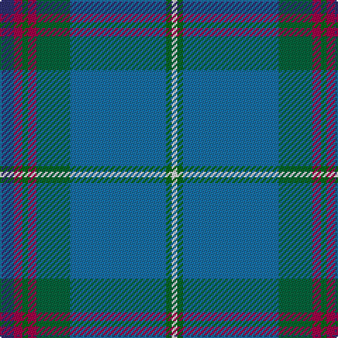

In pattern [BRGRGBGW](/patterns/brgrgbgw/).

This was sourced from house-of-tartan.  It is a [8 stripes tartan](/stripes/stripes8/).

Original link http://www.house-of-tartan.scotland.net/house/TartanViewjs.asp?colr=Def&tnam=5986

## Thread count
DB/10 R6 G4 R6 Ga24 B68 G4 LN/4

## Palette
Each colour and its ΔE from the base-6 reference it is a variant of.

| Colour | Shade | Base | ΔE (OKLab) |
|---|---|---|---|
| B | <code style="background-color:#1870A4;">#1870A4</code> `#1870A4` | B <code style="background-color:#2A418A;">#2A418A</code> | 0.13 |
| DB | <code style="background-color:#303070;">#303070</code> `#303070` | B <code style="background-color:#2A418A;">#2A418A</code> | 0.06 |
| DG | <code style="background-color:#003820;">#003820</code> `#003820` | G <code style="background-color:#006100;">#006100</code> | 0.15 |
| G | <code style="background-color:#006818;">#006818</code> `#006818` | G <code style="background-color:#006100;">#006100</code> | 0.02 |
| Ga | <code style="background-color:#00643C;">#00643C</code> `#00643C` | G <code style="background-color:#006100;">#006100</code> | 0.05 |
| LG | <code style="background-color:#789484;">#789484</code> `#789484` | G <code style="background-color:#006100;">#006100</code> | 0.24 |
| LN | <code style="background-color:#E0E0E0;">#E0E0E0</code> `#E0E0E0` | W <code style="background-color:#F7F7F7;">#F7F7F7</code> | 0.07 |
| R | <code style="background-color:#A00048;">#A00048</code> `#A00048` | R <code style="background-color:#CC0000;">#CC0000</code> | 0.12 |

# Sample pattern

## Nearest tartans

The nearest existing variants by ΔTartan distance.

1. [Moran (Wedding) (Personal)](/setts/s8/b10r6g4r6ga24ba68g4w4-b303070-ba1870a4-g006818-ga387858-ra00048-we0e0e0/) — ΔT 0.31
1. [Sarasota - Dunfermline (Commemorat)](/setts/s10/r4g12y4g6b8g28b72k4b6w4-b1870a4-g408060-k101010-rc80000-we0e0e0-ye8c000/) — ΔT 1.19
1. [Kansai St Andrews Society (Corp)](/setts/s10/b66w4r6w4ba28ra6g30b40r4b6-b506878-ba2c2c80-g30644c-rc80000-rae87878-wfcfcfc/) — ΔT 1.23
1. [Laurentian University](/setts/s8/b4ba8w4ba56g56y6ba8ga4-b5c5c5c-ba203074-g005430-ga604000-we0e0e0-ye8c000/) — ΔT 1.36
1. [Greenshields, Simon (Personal)](/setts/s10/b80w6b6w6b6w8g16ga16ba16wa4-b003c64-ba5c5c5c-g003820-ga006818-wa8ace8-wae0e0e0/) — ΔT 1.43
1. [Highland Glen (Corporate)](/setts/s9/b100r6b8r8b14k28g62y4w4-b2888c4-g007460-k101010-r901c38-we0e0e0-ybc8c00/) — ΔT 1.45
1. [Glasgow High (School)](/setts/s8/g12y6b84w8ga36y4b24r6-b506878-g604000-ga006038-rc8002c-we0e0e0-ye8c000/) — ΔT 1.49
1. [Keith Stanhope Society (Commem.)](/setts/s9/b80r8b20g20ga44y6ga8ya6ga8-b003c64-g006818-ga5c6428-re87878-ybc8c00-yafccc00/) — ΔT 1.54
1. [State Seal of Arkansas (Fashion)](/setts/s10/b98y6g26b24r8b10k14ga52b8r4-b003c64-g604000-ga5c6428-k101010-rc80000-ybc8c00/) — ΔT 1.54
1. [Spirit of South Lanarkshire (Distric](/setts/s7/b26g4b24k16r2ba70y2-b4880a8-ba344054-g289c18-k101010-rc80000-ybc8c00/) — ΔT 1.62

## Neighbour map

Every grey dot is one of 15726 variants placed by the first two principal components of the ΔTartan feature space (44% of its variance). Red is this tartan; blue dots are its nearest — click one to open its page.

<svg viewBox="0 0 640 380" role="img" style="max-width:100%;height:auto;border:1px solid #e0e0e0;border-radius:4px;display:block" xmlns="http://www.w3.org/2000/svg"><image href="/nn/cloud.v1.png" width="640" height="380"/><a href="/setts/s8/b10r6g4r6ga24ba68g4w4-b303070-ba1870a4-g006818-ga387858-ra00048-we0e0e0/"><circle cx="330.9" cy="147.1" r="4" fill="#3465a4"><title>Moran (Wedding) (Personal)</title></circle></a><a href="/setts/s10/r4g12y4g6b8g28b72k4b6w4-b1870a4-g408060-k101010-rc80000-we0e0e0-ye8c000/"><circle cx="378.2" cy="137.7" r="4" fill="#3465a4"><title>Sarasota - Dunfermline (Commemorat)</title></circle></a><a href="/setts/s10/b66w4r6w4ba28ra6g30b40r4b6-b506878-ba2c2c80-g30644c-rc80000-rae87878-wfcfcfc/"><circle cx="327.8" cy="149.0" r="4" fill="#3465a4"><title>Kansai St Andrews Society (Corp)</title></circle></a><a href="/setts/s8/b4ba8w4ba56g56y6ba8ga4-b5c5c5c-ba203074-g005430-ga604000-we0e0e0-ye8c000/"><circle cx="295.3" cy="154.6" r="4" fill="#3465a4"><title>Laurentian University</title></circle></a><a href="/setts/s10/b80w6b6w6b6w8g16ga16ba16wa4-b003c64-ba5c5c5c-g003820-ga006818-wa8ace8-wae0e0e0/"><circle cx="305.4" cy="118.1" r="4" fill="#3465a4"><title>Greenshields, Simon (Personal)</title></circle></a><a href="/setts/s9/b100r6b8r8b14k28g62y4w4-b2888c4-g007460-k101010-r901c38-we0e0e0-ybc8c00/"><circle cx="292.3" cy="116.4" r="4" fill="#3465a4"><title>Highland Glen (Corporate)</title></circle></a><a href="/setts/s8/g12y6b84w8ga36y4b24r6-b506878-g604000-ga006038-rc8002c-we0e0e0-ye8c000/"><circle cx="363.2" cy="144.3" r="4" fill="#3465a4"><title>Glasgow High (School)</title></circle></a><a href="/setts/s9/b80r8b20g20ga44y6ga8ya6ga8-b003c64-g006818-ga5c6428-re87878-ybc8c00-yafccc00/"><circle cx="273.7" cy="157.7" r="4" fill="#3465a4"><title>Keith Stanhope Society (Commem.)</title></circle></a><a href="/setts/s10/b98y6g26b24r8b10k14ga52b8r4-b003c64-g604000-ga5c6428-k101010-rc80000-ybc8c00/"><circle cx="353.7" cy="141.2" r="4" fill="#3465a4"><title>State Seal of Arkansas (Fashion)</title></circle></a><a href="/setts/s7/b26g4b24k16r2ba70y2-b4880a8-ba344054-g289c18-k101010-rc80000-ybc8c00/"><circle cx="321.8" cy="133.4" r="4" fill="#3465a4"><title>Spirit of South Lanarkshire (Distric</title></circle></a><circle cx="324.1" cy="144.8" r="5" fill="#c00000"/></svg>

ID: /setts/s8/b10r6g4r6ga24ba68g4w4-b303070-ba1870a4-g006818-ga00643c-ra00048-we0e0e0/
