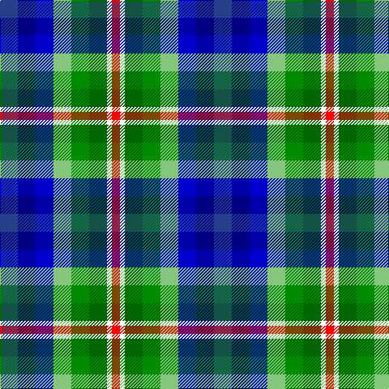

In pattern [BBBYGGWR](/patterns/bbbyggwr/).

This was sourced from register-of-tartans.  It is a [8 stripes tartan](/stripes/stripes8/).

Original link https://www.tartanregister.gov.uk/tartanDetails.aspx?ref=10313

## Thread count
B/22 DB22 Ba22 LG22 G22 Ga22 W6 R/10

## Palette
Each colour and its ΔE from the base-6 reference it is a variant of.

| Colour | Shade | Base | ΔE (OKLab) |
|---|---|---|---|
| B | <code style="background-color:#27408B;">#27408B</code> `#27408B` | B <code style="background-color:#2A418A;">#2A418A</code> | 0.01 |
| Ba | <code style="background-color:#0000CD;">#0000CD</code> `#0000CD` | B <code style="background-color:#2A418A;">#2A418A</code> | 0.14 |
| DB | <code style="background-color:#000080;">#000080</code> `#000080` | B <code style="background-color:#2A418A;">#2A418A</code> | 0.14 |
| G | <code style="background-color:#008B00;">#008B00</code> `#008B00` | G <code style="background-color:#006100;">#006100</code> | 0.13 |
| Ga | <code style="background-color:#006400;">#006400</code> `#006400` | G <code style="background-color:#006100;">#006100</code> | 0.01 |
| LG | <code style="background-color:#86C67C;">#86C67C</code> `#86C67C` | Y <code style="background-color:#F2BF00;">#F2BF00</code> | 0.15 |
| R | <code style="background-color:#FF0000;">#FF0000</code> `#FF0000` | R <code style="background-color:#CC0000;">#CC0000</code> | 0.11 |
| W | <code style="background-color:#FFFFFF;">#FFFFFF</code> `#FFFFFF` | W <code style="background-color:#F7F7F7;">#F7F7F7</code> | 0.02 |

# Sample pattern

## Nearest tartans

The nearest existing variants by ΔTartan distance.

1. [Reid (Mill City) (Name)](/setts/s8/b11ba11bb11g11ga11gb11w3r5x2~b1c0070-ba1c1c50-bb2c2c80-g289c18-ga006818-gb285800-rc80000-we0e0e0/) — ΔT 1.25
1. [Queensland (District)](/setts/s8/w3b4ba3y1g2wa1g1r1x12~b5c8ca8-ba2c2c80-g009c24-ra00048-we0e0e0-wac49cd8-ye8c000/) — ΔT 2.22
1. [Bailey, Leslie A (Personal)](/setts/s9/r3b7w1g6ba5y2ga2ra2r3x2~b202060-ba00008c-g006400-ga289c18-r880000-rae86000-we0e0e0-yd09800/) — ΔT 2.32
1. [O'Sullivan](/setts/s11/b6k4b10w2ba10g4ba6g9r2g4y2x4~b1474b4-ba1c0070-g408060-k101010-rc80000-wfcfcfc-ye8c000/) — ΔT 2.37
1. [Queensland](/setts/s8/w18b22ba15y6g10wa5g6r5x2~b5c8ca8-ba2c2c80-g009c24-rc80000-we0e0e0-wac49cd8-ye8c000/) — ΔT 2.39
1. [Williams, Edmund (Personal)](/setts/s6/b15ba15g15ga15k8w5x2~b440044-ba780078-g289c18-ga003820-k101010-wfcfcfc/) — ΔT 2.48
1. [Williams, Edmund (Personal)](/setts/s6/b15ba15g15ga15k8w5x2~b1c0070-ba780078-g00643c-ga043828-k101010-wffffff/) — ΔT 2.50
1. [Unidentified Gordon variant](/setts/s13/g4b2ga8b8ba9r2ba9b8w4ra4w12ra2w4x2~b2c4084-ba080848-g2a2303-ga503c14-rfa4b00-rabe7832-we0e0e0/) — ΔT 2.51
1. [Unidentified, Gordon variant](/setts/s13/b4ba2r8ba8bb9y2bb9ba8w4ra4w12ra2w4x2~b401000-ba304080-bb000050-r806050-ra906030-we0e0e0-yff8500/) — ΔT 2.51
1. [Bailey, Leslie A (Personal)](/setts/s9/r3b7w1g6ba5y2ya2ga2r3x2~b202060-ba2c2c80-g006818-ga289c18-ra00000-wc0c0c0-yd09800-yad87c00/) — ΔT 2.52

## Neighbour map

Every grey dot is one of 15726 variants placed by the first two principal components of the ΔTartan feature space (44% of its variance). Red is this tartan; blue dots are its nearest — click one to open its page.

<svg viewBox="0 0 640 380" role="img" style="max-width:100%;height:auto;border:1px solid #e0e0e0;border-radius:4px;display:block" xmlns="http://www.w3.org/2000/svg"><image href="/nn/cloud.v1.png" width="640" height="380"/><a href="/setts/s8/b11ba11bb11g11ga11gb11w3r5x2~b1c0070-ba1c1c50-bb2c2c80-g289c18-ga006818-gb285800-rc80000-we0e0e0/"><circle cx="14.0" cy="223.3" r="4" fill="#3465a4"><title>Reid (Mill City) (Name)</title></circle></a><a href="/setts/s8/w3b4ba3y1g2wa1g1r1x12~b5c8ca8-ba2c2c80-g009c24-ra00048-we0e0e0-wac49cd8-ye8c000/"><circle cx="14.0" cy="189.2" r="4" fill="#3465a4"><title>Queensland (District)</title></circle></a><a href="/setts/s9/r3b7w1g6ba5y2ga2ra2r3x2~b202060-ba00008c-g006400-ga289c18-r880000-rae86000-we0e0e0-yd09800/"><circle cx="14.0" cy="156.4" r="4" fill="#3465a4"><title>Bailey, Leslie A (Personal)</title></circle></a><a href="/setts/s11/b6k4b10w2ba10g4ba6g9r2g4y2x4~b1474b4-ba1c0070-g408060-k101010-rc80000-wfcfcfc-ye8c000/"><circle cx="16.6" cy="184.6" r="4" fill="#3465a4"><title>O'Sullivan</title></circle></a><a href="/setts/s8/w18b22ba15y6g10wa5g6r5x2~b5c8ca8-ba2c2c80-g009c24-rc80000-we0e0e0-wac49cd8-ye8c000/"><circle cx="14.0" cy="183.8" r="4" fill="#3465a4"><title>Queensland</title></circle></a><a href="/setts/s6/b15ba15g15ga15k8w5x2~b440044-ba780078-g289c18-ga003820-k101010-wfcfcfc/"><circle cx="14.0" cy="263.3" r="4" fill="#3465a4"><title>Williams, Edmund (Personal)</title></circle></a><a href="/setts/s6/b15ba15g15ga15k8w5x2~b1c0070-ba780078-g00643c-ga043828-k101010-wffffff/"><circle cx="14.0" cy="272.9" r="4" fill="#3465a4"><title>Williams, Edmund (Personal)</title></circle></a><a href="/setts/s13/g4b2ga8b8ba9r2ba9b8w4ra4w12ra2w4x2~b2c4084-ba080848-g2a2303-ga503c14-rfa4b00-rabe7832-we0e0e0/"><circle cx="14.0" cy="153.8" r="4" fill="#3465a4"><title>Unidentified Gordon variant</title></circle></a><a href="/setts/s13/b4ba2r8ba8bb9y2bb9ba8w4ra4w12ra2w4x2~b401000-ba304080-bb000050-r806050-ra906030-we0e0e0-yff8500/"><circle cx="14.0" cy="153.8" r="4" fill="#3465a4"><title>Unidentified, Gordon variant</title></circle></a><a href="/setts/s9/r3b7w1g6ba5y2ya2ga2r3x2~b202060-ba2c2c80-g006818-ga289c18-ra00000-wc0c0c0-yd09800-yad87c00/"><circle cx="14.0" cy="158.7" r="4" fill="#3465a4"><title>Bailey, Leslie A (Personal)</title></circle></a><circle cx="14.0" cy="211.2" r="5" fill="#c00000"/></svg>

ID: /setts/s8/b11ba11bb11y11g11ga11w3r5x2~b27408b-ba000080-bb0000cd-g008b00-ga006400-rff0000-wffffff-y86c67c/
