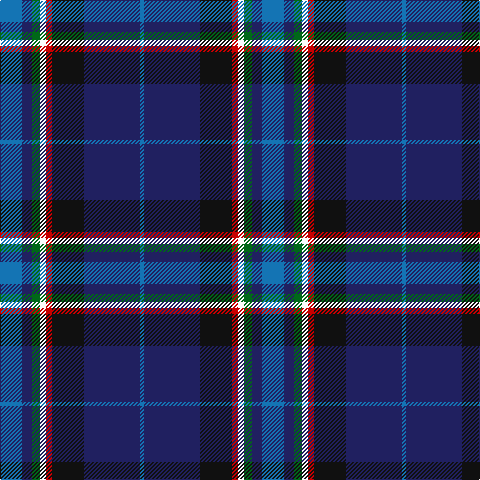

This page is one **sett** — a single exact thread-count. It belongs to the [tartan](/tartans/b11db5g4w3r3k16db28b2/)
(the same proportion at any scale), whose colour order is pattern [BBGWRKBB](/stripes/bbgwrkbb/).

Sourced from tartans-authority.  It is a [8 stripe tartan](/stripes/stripes8/).

Original link http://www.tartansauthority.com/tartan-ferret/display/11248/

## Register references

External register numbers recorded for this tartan.

- Scottish Register of Tartans: [11248](https://www.tartanregister.gov.uk/tartanDetails?ref=11248)
- Scottish Tartans Authority (ITI): 11248

## Thread count
B/22 DB10 G8 W6 R6 K32 DB56 B/4

## Palette

Palette: <strong>Tartan Register</strong>
<table><thead><tr><th>Colour</th><th>Threads</th><th>Shade</th><th>Base</th><th>OKLCh</th></tr></thead><tbody><tr><td>B/</td><td style="text-align:right;font-variant-numeric:tabular-nums">22</td><td><code style="background-color:#1474B4;">#1474B4</code> <small style="color:#888">#1474B4</small></td><td>B <code style="background-color:#2A418A;">#2A418A</code></td><td><small style="color:#888">oklch(54.0% 0.129 245.1)</small></td></tr><tr><td>DB</td><td style="text-align:right;font-variant-numeric:tabular-nums">10</td><td><code style="background-color:#202060;">#202060</code> <small style="color:#888">#202060</small></td><td>B <code style="background-color:#2A418A;">#2A418A</code></td><td><small style="color:#888">oklch(28.9% 0.111 276.9)</small></td></tr><tr><td>G</td><td style="text-align:right;font-variant-numeric:tabular-nums">8</td><td><code style="background-color:#006818;">#006818</code> <small style="color:#888">#006818</small></td><td>G <code style="background-color:#006100;">#006100</code></td><td><small style="color:#888">oklch(45.0% 0.142 145.0)</small></td></tr><tr><td>W</td><td style="text-align:right;font-variant-numeric:tabular-nums">6</td><td><code style="background-color:#FCFCFC;">#FCFCFC</code> <small style="color:#888">#FCFCFC</small></td><td>W <code style="background-color:#F7F7F7;">#F7F7F7</code></td><td><small style="color:#888">oklch(99.1% 0.000 89.9)</small></td></tr><tr><td>R</td><td style="text-align:right;font-variant-numeric:tabular-nums">6</td><td><code style="background-color:#C80000;">#C80000</code> <small style="color:#888">#C80000</small></td><td>R <code style="background-color:#CC0000;">#CC0000</code></td><td><small style="color:#888">oklch(52.3% 0.215 29.2)</small></td></tr><tr><td>K</td><td style="text-align:right;font-variant-numeric:tabular-nums">32</td><td><code style="background-color:#101010;">#101010</code> <small style="color:#888">#101010</small></td><td>K <code style="background-color:#000000;">#000000</code></td><td><small style="color:#888">oklch(17.3% 0.000 89.9)</small></td></tr><tr><td>DB</td><td style="text-align:right;font-variant-numeric:tabular-nums">56</td><td><code style="background-color:#202060;">#202060</code> <small style="color:#888">#202060</small></td><td>B <code style="background-color:#2A418A;">#2A418A</code></td><td><small style="color:#888">oklch(28.9% 0.111 276.9)</small></td></tr><tr><td>B/</td><td style="text-align:right;font-variant-numeric:tabular-nums">4</td><td><code style="background-color:#1474B4;">#1474B4</code> <small style="color:#888">#1474B4</small></td><td>B <code style="background-color:#2A418A;">#2A418A</code></td><td><small style="color:#888">oklch(54.0% 0.129 245.1)</small></td></tr></tbody></table>

# Sample pattern

## Nearest tartans

The nearest existing variants by ΔTartan distance, with this tartan at the top so the swatches line up against it.

ΔTartan

Tartan

Sett

—

<a href="/ttd/edit/#slug=b11db5g4w3r3k16db28b2~x2">Scottish Italian</a> <a class="nn-out" href="/setts/s8/b11db5g4w3r3k16db28b2~x2/" title="open its dictionary page">↗</a>

0.93

<a href="/ttd/edit/#slug=db35r2k16ly2t25w2t6~x2">US Forces (Thurso) Regimental Tartan Tartan Number: 549. Earliest known date: 1986 Originally listed as MacNeil, this sett was identified by Ken Dalgliesh, weaver in Selkirk, in 1999. See products available Copyright © Blair Urquhart, Comrie, 2015</a> <a class="nn-out" href="/setts/s7/db35r2k16ly2t25w2t6~x2/" title="open its dictionary page">↗</a>

0.93

<a href="/ttd/edit/#slug=db4ly2db24k2db5r3k14g14w3r3db3~x2">Czech National (District)</a> <a class="nn-out" href="/setts/s11/db4ly2db24k2db5r3k14g14w3r3db3~x2/" title="open its dictionary page">↗</a>

0.94

<a href="/ttd/edit/#slug=b12dt35lb4w3k11r5~x2">Ferster, James Carney (Personal)</a> <a class="nn-out" href="/setts/s6/b12dt35lb4w3k11r5~x2/" title="open its dictionary page">↗</a>

0.95

<a href="/ttd/edit/#slug=lo4k28r2db22b8dy3~x2">Loch Long One Design (Corporate)</a> <a class="nn-out" href="/setts/s6/lo4k28r2db22b8dy3~x2/" title="open its dictionary page">↗</a>

0.96

<a href="/ttd/edit/#slug=db4dy5g19dp5dy5k5dy5db36ly3~x2">Suzugamine (Corporate)</a> <a class="nn-out" href="/setts/s9/db4dy5g19dp5dy5k5dy5db36ly3~x2/" title="open its dictionary page">↗</a>

1.00

<a href="/ttd/edit/#slug=dp4db2t8db25k8g13ly4~x2">Renfrewshire</a> <a class="nn-out" href="/setts/s7/dp4db2t8db25k8g13ly4~x2/" title="open its dictionary page">↗</a>

1.00

<a href="/ttd/edit/#slug=k37r4db30n7k10w5n10y7~x2">Yates</a> <a class="nn-out" href="/setts/s8/k37r4db30n7k10w5n10y7~x2/" title="open its dictionary page">↗</a>

1.01

<a href="/ttd/edit/#slug=k3ly1dbi1db6m2db1m1db1dbi10w1~x4">Ertico</a> <a class="nn-out" href="/setts/s10/k3ly1dbi1db6m2db1m1db1dbi10w1~x4/" title="open its dictionary page">↗</a>

1.01

<a href="/ttd/edit/#slug=w1dp3g6k1db12ly1db2ly1~x4">Lambert, Patrice (Personal)</a> <a class="nn-out" href="/setts/s8/w1dp3g6k1db12ly1db2ly1~x4/" title="open its dictionary page">↗</a>

1.05

<a href="/ttd/edit/#slug=w4db54k53dp4t8ly4">Pipers' Trail, The</a> <a class="nn-out" href="/setts/s6/w4db54k53dp4t8ly4/" title="open its dictionary page">↗</a>

## Neighbour map

Every grey dot is one of 14359 variants placed by the first two principal components of the ΔTartan feature space (44% of its variance). Red is this tartan; blue dots are its nearest — click one to open its page.

<svg viewBox="0 0 640 380" role="img" style="max-width:100%;height:auto;border:1px solid #e0e0e0;border-radius:4px;display:block" xmlns="http://www.w3.org/2000/svg"><image href="/nn/cloud.v1.png" width="640" height="380"/><a href="/setts/s7/db35r2k16ly2t25w2t6~x2/"><circle cx="198.7" cy="147.5" r="4" fill="#3465a4"><title>US Forces (Thurso) Regimental Tartan Tartan Number: 549. Earliest known date: 1986 Originally listed as MacNeil, this sett was identified by Ken Dalgliesh, weaver in Selkirk, in 1999. See products available Copyright © Blair Urquhart, Comrie, 2015</title></circle></a><a href="/setts/s11/db4ly2db24k2db5r3k14g14w3r3db3~x2/"><circle cx="199.0" cy="141.2" r="4" fill="#3465a4"><title>Czech National (District)</title></circle></a><a href="/setts/s6/b12dt35lb4w3k11r5~x2/"><circle cx="220.1" cy="173.4" r="4" fill="#3465a4"><title>Ferster, James Carney (Personal)</title></circle></a><a href="/setts/s6/lo4k28r2db22b8dy3~x2/"><circle cx="216.3" cy="178.7" r="4" fill="#3465a4"><title>Loch Long One Design (Corporate)</title></circle></a><a href="/setts/s9/db4dy5g19dp5dy5k5dy5db36ly3~x2/"><circle cx="224.2" cy="156.8" r="4" fill="#3465a4"><title>Suzugamine (Corporate)</title></circle></a><a href="/setts/s7/dp4db2t8db25k8g13ly4~x2/"><circle cx="168.0" cy="174.7" r="4" fill="#3465a4"><title>Renfrewshire</title></circle></a><a href="/setts/s8/k37r4db30n7k10w5n10y7~x2/"><circle cx="174.5" cy="179.7" r="4" fill="#3465a4"><title>Yates</title></circle></a><a href="/setts/s10/k3ly1dbi1db6m2db1m1db1dbi10w1~x4/"><circle cx="171.8" cy="144.4" r="4" fill="#3465a4"><title>Ertico</title></circle></a><a href="/setts/s8/w1dp3g6k1db12ly1db2ly1~x4/"><circle cx="235.0" cy="145.6" r="4" fill="#3465a4"><title>Lambert, Patrice (Personal)</title></circle></a><a href="/setts/s6/w4db54k53dp4t8ly4/"><circle cx="232.4" cy="159.6" r="4" fill="#3465a4"><title>Pipers' Trail, The</title></circle></a><circle cx="208.2" cy="156.9" r="5" fill="#c00000"/></svg>

ID: /setts/s8/b11db5g4w3r3k16db28b2~x2/
