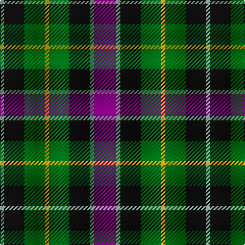

In pattern [BGKGYGKG](/patterns/bgkgygkg/).

This was sourced from register-of-tartans.  It is a [8 stripes tartan](/stripes/stripes8/).

Original link https://www.tartanregister.gov.uk/tartanDetails.aspx?ref=4856

## Thread count
LG/4 K20 G20 DY4 G20 K20 LG4 P/22

## Palette
Each colour and its ΔE from the base-6 reference it is a variant of.

| Colour | Shade | Base | ΔE (OKLab) |
|---|---|---|---|
| DG | <code style="background-color:#003820;">#003820</code> `#003820` | G <code style="background-color:#006100;">#006100</code> | 0.15 |
| DP | <code style="background-color:#440044;">#440044</code> `#440044` | B <code style="background-color:#2A418A;">#2A418A</code> | 0.18 |
| DY | <code style="background-color:#D09800;">#D09800</code> `#D09800` | Y <code style="background-color:#F2BF00;">#F2BF00</code> | 0.12 |
| G | <code style="background-color:#006818;">#006818</code> `#006818` | G <code style="background-color:#006100;">#006100</code> | 0.02 |
| K | <code style="background-color:#101010;">#101010</code> `#101010` | K <code style="background-color:#000000;">#000000</code> | 0.17 |
| LG | <code style="background-color:#789484;">#789484</code> `#789484` | G <code style="background-color:#006100;">#006100</code> | 0.24 |
| P | <code style="background-color:#780078;">#780078</code> `#780078` | B <code style="background-color:#2A418A;">#2A418A</code> | 0.17 |

# Sample pattern

## Nearest tartans

The nearest existing variants by ΔTartan distance.

1. [Wilson's No.217](/setts/s8/b11ba2k10g10y3g10k10ba2x2~b440044-ba2888c4-g006818-k101010-ye8c000/) — ΔT 0.37
1. [Wilson's No.176](/setts/s8/k8b3g13ba12y2ba12g13b3x2~b5c8ca8-ba440044-g006818-k101010-ye8c000/) — ΔT 0.53
1. [Cunningham / Wilson's No 120](/setts/s7/k11g12w2g12k12b12r3x2~b440044-g006818-k101010-rc80000-we0e0e0/) — ΔT 0.71
1. [Vosko Family Tartan Tartan Number: 373. Earliest known date: 1989 Designed for a wedding. See products available Copyright © Blair Urquhart, Comrie, 2015](/setts/s9/b25k12y4k9r6k9y4k12g25x2~b2c2c80-g006818-k101010-rc80000-ye8c000/) — ΔT 0.73
1. [MacKean Dress (Personal)](/setts/s9/r1k2g4k1g1k2b3k1w1x6~b2c2c80-g006818-k101010-rc80000-we0e0e0/) — ΔT 0.73
1. [Casely Family Tartan Tartan Number: 2146. Earliest known date: 1992 The chiefly sett of a family tartan designed by Harry Lindley for the Scottish Tartans Society, to whom Mr Gordon Casely petitioned for the design in 1990. Formal accreditation was granted in 1993. See products available Copyright © Blair Urquhart, Comrie, 2015](/setts/s10/g19r7g19k19g3b19y5b19g3k19x2~b2c2c80-g006818-k101010-rd05054-ydc943c/) — ΔT 0.80
1. [Vosko](/setts/s9/b8k4y2k3r2k3y2k4g8x4~b1c0070-g006818-k101010-r880000-yd09800/) — ΔT 0.80
1. [Scottish Parliament (unofficial)](/setts/s7/b14g18k3g18r20k14y3x2~b1c0070-g006818-k101010-r880000-yd09800/) — ΔT 0.81
1. [Birse Family Tartan Tartan Number: 1087. Earliest known date: 1930-50 This sample comes from the MacGregor-Hastie collection which forms the basis of the cloth archive of the Scottish Tartans Society. Some of the samples, including this one, were unmarked. One can assume that the sample dates between 1930 and 1950. See products available Copyright © Blair Urquhart, Comrie, 2015](/setts/s6/k4g16k14y3b16r4x2~b2c2c80-g006818-k101010-rc80000-ye8c000/) — ΔT 0.82
1. [Wilson's No.194](/setts/s10/b3w1k3g5r1k3r1g5k3w1x2~b440044-g006818-k101010-rc80000-we0e0e0/) — ΔT 0.83

## Neighbour map

Every grey dot is one of 15726 variants placed by the first two principal components of the ΔTartan feature space (44% of its variance). Red is this tartan; blue dots are its nearest — click one to open its page.

<svg viewBox="0 0 640 380" role="img" style="max-width:100%;height:auto;border:1px solid #e0e0e0;border-radius:4px;display:block" xmlns="http://www.w3.org/2000/svg"><image href="/nn/cloud.v1.png" width="640" height="380"/><a href="/setts/s8/b11ba2k10g10y3g10k10ba2x2~b440044-ba2888c4-g006818-k101010-ye8c000/"><circle cx="103.2" cy="237.6" r="4" fill="#3465a4"><title>Wilson's No.217</title></circle></a><a href="/setts/s8/k8b3g13ba12y2ba12g13b3x2~b5c8ca8-ba440044-g006818-k101010-ye8c000/"><circle cx="147.6" cy="230.4" r="4" fill="#3465a4"><title>Wilson's No.176</title></circle></a><a href="/setts/s7/k11g12w2g12k12b12r3x2~b440044-g006818-k101010-rc80000-we0e0e0/"><circle cx="128.3" cy="252.0" r="4" fill="#3465a4"><title>Cunningham / Wilson's No 120</title></circle></a><a href="/setts/s9/b25k12y4k9r6k9y4k12g25x2~b2c2c80-g006818-k101010-rc80000-ye8c000/"><circle cx="128.8" cy="212.2" r="4" fill="#3465a4"><title>Vosko Family Tartan Tartan Number: 373. Earliest known date: 1989 Designed for a wedding. See products available Copyright © Blair Urquhart, Comrie, 2015</title></circle></a><a href="/setts/s9/r1k2g4k1g1k2b3k1w1x6~b2c2c80-g006818-k101010-rc80000-we0e0e0/"><circle cx="96.8" cy="234.3" r="4" fill="#3465a4"><title>MacKean Dress (Personal)</title></circle></a><a href="/setts/s10/g19r7g19k19g3b19y5b19g3k19x2~b2c2c80-g006818-k101010-rd05054-ydc943c/"><circle cx="113.2" cy="226.0" r="4" fill="#3465a4"><title>Casely Family Tartan Tartan Number: 2146. Earliest known date: 1992 The chiefly sett of a family tartan designed by Harry Lindley for the Scottish Tartans Society, to whom Mr Gordon Casely petitioned for the design in 1990. Formal accreditation was granted in 1993. See products available Copyright © Blair Urquhart, Comrie, 2015</title></circle></a><a href="/setts/s9/b8k4y2k3r2k3y2k4g8x4~b1c0070-g006818-k101010-r880000-yd09800/"><circle cx="101.4" cy="238.3" r="4" fill="#3465a4"><title>Vosko</title></circle></a><a href="/setts/s7/b14g18k3g18r20k14y3x2~b1c0070-g006818-k101010-r880000-yd09800/"><circle cx="140.7" cy="241.8" r="4" fill="#3465a4"><title>Scottish Parliament (unofficial)</title></circle></a><a href="/setts/s6/k4g16k14y3b16r4x2~b2c2c80-g006818-k101010-rc80000-ye8c000/"><circle cx="104.1" cy="239.3" r="4" fill="#3465a4"><title>Birse Family Tartan Tartan Number: 1087. Earliest known date: 1930-50 This sample comes from the MacGregor-Hastie collection which forms the basis of the cloth archive of the Scottish Tartans Society. Some of the samples, including this one, were unmarked. One can assume that the sample dates between 1930 and 1950. See products available Copyright © Blair Urquhart, Comrie, 2015</title></circle></a><a href="/setts/s10/b3w1k3g5r1k3r1g5k3w1x2~b440044-g006818-k101010-rc80000-we0e0e0/"><circle cx="106.0" cy="219.2" r="4" fill="#3465a4"><title>Wilson's No.194</title></circle></a><circle cx="116.0" cy="233.2" r="5" fill="#c00000"/></svg>

ID: /setts/s8/b11g2k10ga10y2ga10k10g2x2~b780078-g789484-ga006818-k101010-yd09800/
