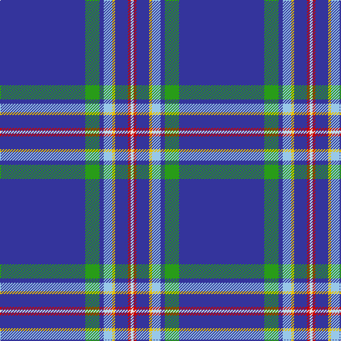

In pattern [BGBWYBRW](/patterns/bgbwybrw/).

This was sourced from tartans-authority.  It is a [8 stripes tartan](/stripes/stripes8/).

Original link http://www.tartansauthority.com/tartan-ferret/display/8359/

## Thread count
B/120 G20 B6 LB12 Y4 B18 R4 LN/4

## Palette
Each colour and its ΔE from the base-6 reference it is a variant of.

| Colour | Shade | Base | ΔE (OKLab) |
|---|---|---|---|
| B | <code style="background-color:#34349C;">#34349C</code> `#34349C` | B <code style="background-color:#2C4084;">#2C4084</code> | 0.05 |
| G | <code style="background-color:#289C18;">#289C18</code> `#289C18` | G <code style="background-color:#006400;">#006400</code> | 0.18 |
| LB | <code style="background-color:#98C8E8;">#98C8E8</code> `#98C8E8` | W <code style="background-color:#F4F4F0;">#F4F4F0</code> | 0.17 |
| LN | <code style="background-color:#E0E0E0;">#E0E0E0</code> `#E0E0E0` | W <code style="background-color:#F4F4F0;">#F4F4F0</code> | 0.06 |
| R | <code style="background-color:#C80000;">#C80000</code> `#C80000` | R <code style="background-color:#C80000;">#C80000</code> | 0.00 |
| Y | <code style="background-color:#E8C000;">#E8C000</code> `#E8C000` | Y <code style="background-color:#E8C000;">#E8C000</code> | 0.00 |

# Sample pattern

## Nearest tartans

The nearest existing variants by ΔTartan distance.

1. [PSN Test](/setts/s8/b100y4b24ba4b24w16bb12wa4-b34349c-ba1474b4-bb4888bc-w98c8e8-wae0e0e0-yd87c00/) — ΔT 1.22
1. [Boat of Garten (District)](/setts/s8/b122w8b4w14ba4g6y4b32-b2c2c80-ba9050d8-g006818-we0e0e0-ye8c000/) — ΔT 1.27
1. [Wyckoff, Ann Grainger Phillips Commemorative Tartan Tartan Number: 10610. Earliest known date: 2 May 2012 Created to commemorate the 85th birthday of the designer's mother, with a field of blue to match her eyes and with one line for each of her four children in the colour of his or her birth stone (sapphire, pearl, diamond, garnet). See products available Copyright © Blair Urquhart, Comrie, 2015](/setts/s8/b140ba10b6w10b6wa10b6k10-b50729f-ba0000cd-k000000-wffcccc-waffffff/) — ΔT 1.50
1. [London '88](/setts/s12/y8b110r8k8b4y4b4w10b6ra4r4k4-b2c2c80-k101010-r888888-rac80000-we0e0e0-ye8c000/) — ΔT 1.59
1. [Jewish (Kosher) (Corporate)](/setts/s11/w6b6w2ba88r2ba4r2ra8r2ba10y4-b2800a4-ba003c64-r888888-ra880000-wf0f0d8-ybc8c00/) — ΔT 1.64
1. [Blue Toon](/setts/s10/b112ba18w4ba4r4b18wa8ba4wa4y6-b5a5a82-ba141e46-rc80050-wffffff-wa98d0f0-ye8c000/) — ΔT 1.67
1. [Kendle (2013)](/setts/s6/r10b116w8ba12y8k8-b2c2c80-ba5c8ca8-k101010-rc80000-wa8ace8-ye8c000/) — ΔT 1.68
1. [Kendle (2013)](/setts/s6/r10b116y8ba12ya8k8-b2c2c80-ba5f749c-k1c1714-rc82828-yb0b0b0-yaf8e38c/) — ΔT 1.69
1. [London'88](/setts/s12/y8b110g8k8b4y4b4w10b6r4g4k4-b304080-g808080-k000000-rc00000-we0e0e0-yf0c000/) — ΔT 1.74
1. [Laidlaw's Highland Drovers (Corp)](/setts/s7/b70k20b8w4b6r4y4-b2c2c80-k101010-rc80000-we0e0e0-ye8c000/) — ΔT 1.78

## Neighbour map

Every grey dot is one of 15726 variants placed by the first two principal components of the ΔTartan feature space (44% of its variance). Red is this tartan; blue dots are its nearest — click one to open its page.

<svg viewBox="0 0 640 380" role="img" style="max-width:100%;height:auto;border:1px solid #e0e0e0;border-radius:4px;display:block" xmlns="http://www.w3.org/2000/svg"><image href="/nn/cloud.v1.png" width="640" height="380"/><a href="/setts/s8/b100y4b24ba4b24w16bb12wa4-b34349c-ba1474b4-bb4888bc-w98c8e8-wae0e0e0-yd87c00/"><circle cx="495.9" cy="126.6" r="4" fill="#3465a4"><title>PSN Test</title></circle></a><a href="/setts/s8/b122w8b4w14ba4g6y4b32-b2c2c80-ba9050d8-g006818-we0e0e0-ye8c000/"><circle cx="531.7" cy="110.0" r="4" fill="#3465a4"><title>Boat of Garten (District)</title></circle></a><a href="/setts/s8/b140ba10b6w10b6wa10b6k10-b50729f-ba0000cd-k000000-wffcccc-waffffff/"><circle cx="511.2" cy="108.0" r="4" fill="#3465a4"><title>Wyckoff, Ann Grainger Phillips Commemorative Tartan Tartan Number: 10610. Earliest known date: 2 May 2012 Created to commemorate the 85th birthday of the designer's mother, with a field of blue to match her eyes and with one line for each of her four children in the colour of his or her birth stone (sapphire, pearl, diamond, garnet). See products available Copyright © Blair Urquhart, Comrie, 2015</title></circle></a><a href="/setts/s12/y8b110r8k8b4y4b4w10b6ra4r4k4-b2c2c80-k101010-r888888-rac80000-we0e0e0-ye8c000/"><circle cx="424.5" cy="58.1" r="4" fill="#3465a4"><title>London '88</title></circle></a><a href="/setts/s11/w6b6w2ba88r2ba4r2ra8r2ba10y4-b2800a4-ba003c64-r888888-ra880000-wf0f0d8-ybc8c00/"><circle cx="500.8" cy="60.8" r="4" fill="#3465a4"><title>Jewish (Kosher) (Corporate)</title></circle></a><a href="/setts/s10/b112ba18w4ba4r4b18wa8ba4wa4y6-b5a5a82-ba141e46-rc80050-wffffff-wa98d0f0-ye8c000/"><circle cx="451.2" cy="81.3" r="4" fill="#3465a4"><title>Blue Toon</title></circle></a><a href="/setts/s6/r10b116w8ba12y8k8-b2c2c80-ba5c8ca8-k101010-rc80000-wa8ace8-ye8c000/"><circle cx="416.8" cy="136.7" r="4" fill="#3465a4"><title>Kendle (2013)</title></circle></a><a href="/setts/s6/r10b116y8ba12ya8k8-b2c2c80-ba5f749c-k1c1714-rc82828-yb0b0b0-yaf8e38c/"><circle cx="417.2" cy="136.8" r="4" fill="#3465a4"><title>Kendle (2013)</title></circle></a><a href="/setts/s12/y8b110g8k8b4y4b4w10b6r4g4k4-b304080-g808080-k000000-rc00000-we0e0e0-yf0c000/"><circle cx="420.5" cy="56.6" r="4" fill="#3465a4"><title>London'88</title></circle></a><a href="/setts/s7/b70k20b8w4b6r4y4-b2c2c80-k101010-rc80000-we0e0e0-ye8c000/"><circle cx="449.8" cy="150.5" r="4" fill="#3465a4"><title>Laidlaw's Highland Drovers (Corp)</title></circle></a><circle cx="475.1" cy="94.9" r="5" fill="#c00000"/></svg>

ID: /setts/s8/b120g20b6w12y4b18r4wa4-b34349c-g289c18-rc80000-w98c8e8-wae0e0e0-ye8c000/
