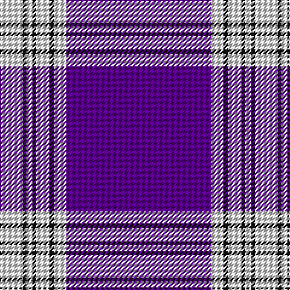

In pattern [BWKWKWKW](/patterns/bwkwkwkw/).

This was sourced from register-of-tartans.  It is a [8 stripes tartan](/stripes/stripes8/).

Original link https://www.tartanregister.gov.uk/tartanDetails.aspx?ref=2930

## Thread count
LN/19 K3 LN5 K3 LN11 K4 LN10 P/120

## Palette
Each colour and its ΔE from the base-6 reference it is a variant of.

| Colour | Shade | Base | ΔE (OKLab) |
|---|---|---|---|
| K | <code style="background-color:#101010;">#101010</code> `#101010` | K <code style="background-color:#000000;">#000000</code> | 0.17 |
| LN | <code style="background-color:#E0E0E0;">#E0E0E0</code> `#E0E0E0` | W <code style="background-color:#F4F4F0;">#F4F4F0</code> | 0.06 |
| P | <code style="background-color:#5A008C;">#5A008C</code> `#5A008C` | B <code style="background-color:#2C4084;">#2C4084</code> | 0.12 |

# Sample pattern

## Nearest tartans

The nearest existing variants by ΔTartan distance.

1. [Menzies Mauve Dress Clan Tartan Tartan Number: 648. Earliest known date: c.1870 STS collection. See products available Copyright © Blair Urquhart, Comrie, 2015](/setts/s8/b120w10k4w11k3w5k3w19-b780078-k101010-we0e0e0/) — ΔT 1.06
1. [Menzies, Mauve and White](/setts/s8/b120w10k4w11k3w5k3w19-b800080-k000000-we0e0e0/) — ΔT 1.08
1. [Baker Family Tartan Tartan Number: 613. Earliest known date: pre 2003 STS notes 'Sample in trade specimens file.' See products available Copyright © Blair Urquhart, Comrie, 2015](/setts/s8/b112ba12w4ba12b16w8bb4w20-b2c2c80-ba480800-bb780078-we0e0e0/) — ΔT 1.77
1. [Angotta](/setts/s13/y12b2y2b2y2b10y4b10y8b4r2b80r2-b380474-ree0000-ycdad00/) — ΔT 1.91
1. [Baker Dress Family Tartan Tartan Number: 2180. Earliest known date: 1999 STS notes 'Sample in trade specimens file.' See products available Copyright © Blair Urquhart, Comrie, 2015](/setts/s8/b112y12w4y12b16w8r4w20-b2c2c80-rc80000-we0e0e0-ye8c000/) — ΔT 1.94
1. [Tennessee Pioneer Blanket](/setts/s8/b144w24b4y4b4r24b2w18-b9058d8-rcc4438-wfcfcfc-yfccc00/) — ΔT 1.94
1. [George, Stuart (Personal)](/setts/s9/b124w4b8w10b12y4r16y6w8-b202060-ra00000-wfcfcfc-ye8c000/) — ΔT 1.98
1. [Antigonish](/setts/s8/b16ba4b16ba96w24ba16w4ba8-b5c8ca8-ba2c2c80-wfcfcfc/) — ΔT 2.02
1. [Baker](/setts/s8/b112r12w4r12b16w8ba4w20-b202060-ba780078-ra07c58-wf8f4d0/) — ΔT 2.04
1. [SiMBA](/setts/s6/b4g6w42b84wa2g4-b780078-g006818-wc49cd8-wafcfcfc/) — ΔT 2.07

## Neighbour map

Every grey dot is one of 15726 variants placed by the first two principal components of the ΔTartan feature space (44% of its variance). Red is this tartan; blue dots are its nearest — click one to open its page.

<svg viewBox="0 0 640 380" role="img" style="max-width:100%;height:auto;border:1px solid #e0e0e0;border-radius:4px;display:block" xmlns="http://www.w3.org/2000/svg"><image href="/nn/cloud.v1.png" width="640" height="380"/><a href="/setts/s8/b120w10k4w11k3w5k3w19-b780078-k101010-we0e0e0/"><circle cx="481.8" cy="96.2" r="4" fill="#3465a4"><title>Menzies Mauve Dress Clan Tartan Tartan Number: 648. Earliest known date: c.1870 STS collection. See products available Copyright © Blair Urquhart, Comrie, 2015</title></circle></a><a href="/setts/s8/b120w10k4w11k3w5k3w19-b800080-k000000-we0e0e0/"><circle cx="478.8" cy="94.1" r="4" fill="#3465a4"><title>Menzies, Mauve and White</title></circle></a><a href="/setts/s8/b112ba12w4ba12b16w8bb4w20-b2c2c80-ba480800-bb780078-we0e0e0/"><circle cx="425.0" cy="121.5" r="4" fill="#3465a4"><title>Baker Family Tartan Tartan Number: 613. Earliest known date: pre 2003 STS notes 'Sample in trade specimens file.' See products available Copyright © Blair Urquhart, Comrie, 2015</title></circle></a><a href="/setts/s13/y12b2y2b2y2b10y4b10y8b4r2b80r2-b380474-ree0000-ycdad00/"><circle cx="545.3" cy="88.8" r="4" fill="#3465a4"><title>Angotta</title></circle></a><a href="/setts/s8/b112y12w4y12b16w8r4w20-b2c2c80-rc80000-we0e0e0-ye8c000/"><circle cx="409.9" cy="113.1" r="4" fill="#3465a4"><title>Baker Dress Family Tartan Tartan Number: 2180. Earliest known date: 1999 STS notes 'Sample in trade specimens file.' See products available Copyright © Blair Urquhart, Comrie, 2015</title></circle></a><a href="/setts/s8/b144w24b4y4b4r24b2w18-b9058d8-rcc4438-wfcfcfc-yfccc00/"><circle cx="474.2" cy="81.7" r="4" fill="#3465a4"><title>Tennessee Pioneer Blanket</title></circle></a><a href="/setts/s9/b124w4b8w10b12y4r16y6w8-b202060-ra00000-wfcfcfc-ye8c000/"><circle cx="479.7" cy="101.1" r="4" fill="#3465a4"><title>George, Stuart (Personal)</title></circle></a><a href="/setts/s8/b16ba4b16ba96w24ba16w4ba8-b5c8ca8-ba2c2c80-wfcfcfc/"><circle cx="414.0" cy="150.5" r="4" fill="#3465a4"><title>Antigonish</title></circle></a><a href="/setts/s8/b112r12w4r12b16w8ba4w20-b202060-ba780078-ra07c58-wf8f4d0/"><circle cx="411.7" cy="116.0" r="4" fill="#3465a4"><title>Baker</title></circle></a><a href="/setts/s6/b4g6w42b84wa2g4-b780078-g006818-wc49cd8-wafcfcfc/"><circle cx="436.2" cy="120.2" r="4" fill="#3465a4"><title>SiMBA</title></circle></a><circle cx="473.4" cy="100.4" r="5" fill="#c00000"/></svg>

ID: /setts/s8/b120w10k4w11k3w5k3w19-b5a008c-k101010-we0e0e0/
