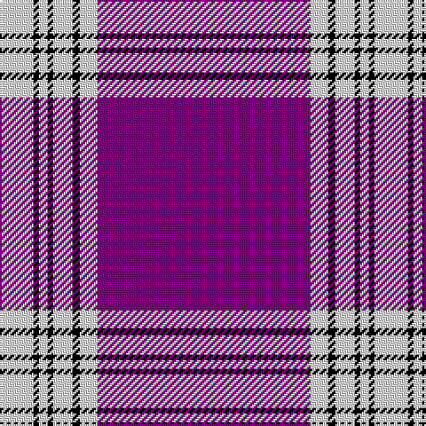

In pattern [BWKWKWKW](/patterns/bwkwkwkw/).

This was sourced from weddslist.  It is a [8 stripes tartan](/stripes/stripes8/).

Original link http://www.weddslist.com/cgi-bin/tartans/pg.pl?source=sts

## Thread count
LN/19 K3 LN5 K3 LN11 K4 LN10 P/120

## Palette
Each colour and its ΔE from the base-6 reference it is a variant of.

| Colour | Shade | Base | ΔE (OKLab) |
|---|---|---|---|
| K | <code style="background-color:#000000;">#000000</code> `#000000` | K <code style="background-color:#000000;">#000000</code> | 0.00 |
| LN | <code style="background-color:#E0E0E0;">#E0E0E0</code> `#E0E0E0` | W <code style="background-color:#F4F4F0;">#F4F4F0</code> | 0.06 |
| P | <code style="background-color:#800080;">#800080</code> `#800080` | B <code style="background-color:#2C4084;">#2C4084</code> | 0.17 |

# Sample pattern

## Nearest tartans

The nearest existing variants by ΔTartan distance.

1. [Menzies Mauve Dress Clan Tartan Tartan Number: 648. Earliest known date: c.1870 STS collection. See products available Copyright © Blair Urquhart, Comrie, 2015](/setts/s8/b120w10k4w11k3w5k3w19-b780078-k101010-we0e0e0/) — ΔT 0.18
1. [Menzies Mauve and White](/setts/s8/b120w10k4w11k3w5k3w19-b5a008c-k101010-we0e0e0/) — ΔT 1.08
1. [SiMBA](/setts/s6/b4g6w42b84wa2g4-b780078-g006818-wc49cd8-wafcfcfc/) — ΔT 1.86
1. [SiMBA](/setts/s6/b4g6w42b84wa2g4-b780078-g408060-wc49cd8-waffffff/) — ΔT 1.95
1. [Tennessee Pioneer Blanket](/setts/s8/b144w24b4y4b4r24b2w18-b9058d8-rcc4438-wfcfcfc-yfccc00/) — ΔT 2.00
1. [Jupiter Shop Channel Co Ltd](/setts/s13/k12r2k2r2k2r10k4r10k8r4w2r80w2-k101010-rfc68b4-wffffff/) — ΔT 2.13
1. [Dunlop Dress Family Tartan Tartan Number: 1784. Earliest known date: 1984 Revised version See products available Copyright © Blair Urquhart, Comrie, 2015](/setts/s8/w6b2w60b2ba56w2ba2w6-b2c2c80-ba780078-we0e0e0/) — ΔT 2.21
1. [Southern Illinois University - Carbondale](/setts/s9/k10b80k8w4k8b20w8b10w2-b75263d-k101010-wffffff/) — ΔT 2.23
1. [Dunlop, dress](/setts/s8/w6b2w60b2ba56w2ba2w6-b304080-ba800080-we0e0e0/) — ΔT 2.23
1. [Irn Bru](/setts/s8/r98b32k4w6b4w4b6r4-b0000ff-k101010-rff5f04-wfcfcfc/) — ΔT 2.25

## Neighbour map

Every grey dot is one of 15726 variants placed by the first two principal components of the ΔTartan feature space (44% of its variance). Red is this tartan; blue dots are its nearest — click one to open its page.

<svg viewBox="0 0 640 380" role="img" style="max-width:100%;height:auto;border:1px solid #e0e0e0;border-radius:4px;display:block" xmlns="http://www.w3.org/2000/svg"><image href="/nn/cloud.v1.png" width="640" height="380"/><a href="/setts/s8/b120w10k4w11k3w5k3w19-b780078-k101010-we0e0e0/"><circle cx="481.8" cy="96.2" r="4" fill="#3465a4"><title>Menzies Mauve Dress Clan Tartan Tartan Number: 648. Earliest known date: c.1870 STS collection. See products available Copyright © Blair Urquhart, Comrie, 2015</title></circle></a><a href="/setts/s8/b120w10k4w11k3w5k3w19-b5a008c-k101010-we0e0e0/"><circle cx="473.4" cy="100.4" r="4" fill="#3465a4"><title>Menzies Mauve and White</title></circle></a><a href="/setts/s6/b4g6w42b84wa2g4-b780078-g006818-wc49cd8-wafcfcfc/"><circle cx="436.2" cy="120.2" r="4" fill="#3465a4"><title>SiMBA</title></circle></a><a href="/setts/s6/b4g6w42b84wa2g4-b780078-g408060-wc49cd8-waffffff/"><circle cx="440.3" cy="121.5" r="4" fill="#3465a4"><title>SiMBA</title></circle></a><a href="/setts/s8/b144w24b4y4b4r24b2w18-b9058d8-rcc4438-wfcfcfc-yfccc00/"><circle cx="474.2" cy="81.7" r="4" fill="#3465a4"><title>Tennessee Pioneer Blanket</title></circle></a><a href="/setts/s13/k12r2k2r2k2r10k4r10k8r4w2r80w2-k101010-rfc68b4-wffffff/"><circle cx="547.4" cy="62.4" r="4" fill="#3465a4"><title>Jupiter Shop Channel Co Ltd</title></circle></a><a href="/setts/s8/w6b2w60b2ba56w2ba2w6-b2c2c80-ba780078-we0e0e0/"><circle cx="373.0" cy="110.2" r="4" fill="#3465a4"><title>Dunlop Dress Family Tartan Tartan Number: 1784. Earliest known date: 1984 Revised version See products available Copyright © Blair Urquhart, Comrie, 2015</title></circle></a><a href="/setts/s9/k10b80k8w4k8b20w8b10w2-b75263d-k101010-wffffff/"><circle cx="513.1" cy="121.0" r="4" fill="#3465a4"><title>Southern Illinois University - Carbondale</title></circle></a><a href="/setts/s8/w6b2w60b2ba56w2ba2w6-b304080-ba800080-we0e0e0/"><circle cx="375.1" cy="110.2" r="4" fill="#3465a4"><title>Dunlop, dress</title></circle></a><a href="/setts/s8/r98b32k4w6b4w4b6r4-b0000ff-k101010-rff5f04-wfcfcfc/"><circle cx="402.2" cy="93.7" r="4" fill="#3465a4"><title>Irn Bru</title></circle></a><circle cx="478.8" cy="94.1" r="5" fill="#c00000"/></svg>

ID: /setts/s8/b120w10k4w11k3w5k3w19-b800080-k000000-we0e0e0/
