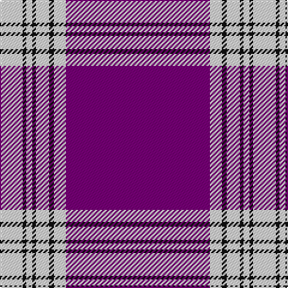

In pattern [BWKWKWKW](/patterns/bwkwkwkw/).

This was sourced from house-of-tartan.  It is a [8 stripes tartan](/stripes/stripes8/).

Original link http://www.house-of-tartan.scotland.net/house/TartanViewjs.asp?colr=Def&tnam=648

## Thread count
LN/19 K3 LN5 K3 LN11 K4 LN10 P/120

## Palette
Each colour and its ΔE from the base-6 reference it is a variant of.

| Colour | Shade | Base | ΔE (OKLab) |
|---|---|---|---|
| K | <code style="background-color:#101010;">#101010</code> `#101010` | K <code style="background-color:#000000;">#000000</code> | 0.17 |
| LN | <code style="background-color:#E0E0E0;">#E0E0E0</code> `#E0E0E0` | W <code style="background-color:#F7F7F7;">#F7F7F7</code> | 0.07 |
| P | <code style="background-color:#780078;">#780078</code> `#780078` | B <code style="background-color:#2A418A;">#2A418A</code> | 0.17 |

# Sample pattern

## Nearest tartans

The nearest existing variants by ΔTartan distance.

1. [Menzies, Mauve and White](/setts/s8/b120w10k4w11k3w5k3w19~b800080-k000000-we0e0e0/) — ΔT 0.18
1. [Menzies Mauve and White](/setts/s8/b120w10k4w11k3w5k3w19~b5a008c-k101010-we0e0e0/) — ΔT 1.06
1. [SiMBA](/setts/s6/b2g3w21b42wa1g2~b780078-g006818-wc49cd8-wafcfcfc~x2/) — ΔT 1.80
1. [SiMBA](/setts/s6/b2g3w21b42wa1g2~b780078-g408060-wc49cd8-waffffff~x2/) — ΔT 1.89
1. [Tennessee Pioneer Blanket](/setts/s8/b72w12b2y2b2r12b1w9~b9058d8-rcc4438-wfcfcfc-yfccc00~x2/) — ΔT 1.96
1. [Southern Illinois University - Carbondale](/setts/s9/k5b40k4w2k4b10w4b5w1~b75263d-k101010-wffffff~x2/) — ΔT 2.11
1. [Salvation Army Dress (Corporate)](/setts/s8/b74k2r15k2y4k2r16b10~b2c2c80-k101010-rc80000-ye8c000~x2/) — ΔT 2.15
1. [Salvation Army Dress Corporate Tartan Tartan Number: 546. Earliest known date: 1983 The colours chosen are the same as those for the flag. Red for the Blood of Christ, blue for the Heavenly Father, yellow for Fire of the Holy Spirit when tongues of fire symbolized his presence at Penticost. See products available Copyright © Blair Urquhart, Comrie, 2015](/setts/s7/b80r21k2y4k2r16b10~b2c2c80-k101010-rc80000-ye8c000~x2/) — ΔT 2.15
1. [Jupiter Shop Channel Co Ltd](/setts/s13/k6r1k1r1k1r5k2r5k4r2w1r40w1~k101010-rfc68b4-wffffff~x2/) — ΔT 2.15
1. [Angotta](/setts/s13/y6b1y1b1y1b5y2b5y4b2r1b40r1~b380474-ree0000-ycdad00~x2/) — ΔT 2.18

## Neighbour map

Every grey dot is one of 15726 variants placed by the first two principal components of the ΔTartan feature space (44% of its variance). Red is this tartan; blue dots are its nearest — click one to open its page.

<svg viewBox="0 0 640 380" role="img" style="max-width:100%;height:auto;border:1px solid #e0e0e0;border-radius:4px;display:block" xmlns="http://www.w3.org/2000/svg"><image href="/nn/cloud.v1.png" width="640" height="380"/><a href="/setts/s8/b120w10k4w11k3w5k3w19~b800080-k000000-we0e0e0/"><circle cx="479.2" cy="100.3" r="4" fill="#3465a4"><title>Menzies, Mauve and White</title></circle></a><a href="/setts/s8/b120w10k4w11k3w5k3w19~b5a008c-k101010-we0e0e0/"><circle cx="474.0" cy="106.4" r="4" fill="#3465a4"><title>Menzies Mauve and White</title></circle></a><a href="/setts/s6/b2g3w21b42wa1g2~b780078-g006818-wc49cd8-wafcfcfc~x2/"><circle cx="437.1" cy="124.3" r="4" fill="#3465a4"><title>SiMBA</title></circle></a><a href="/setts/s6/b2g3w21b42wa1g2~b780078-g408060-wc49cd8-waffffff~x2/"><circle cx="441.2" cy="125.4" r="4" fill="#3465a4"><title>SiMBA</title></circle></a><a href="/setts/s8/b72w12b2y2b2r12b1w9~b9058d8-rcc4438-wfcfcfc-yfccc00~x2/"><circle cx="475.6" cy="86.1" r="4" fill="#3465a4"><title>Tennessee Pioneer Blanket</title></circle></a><a href="/setts/s9/k5b40k4w2k4b10w4b5w1~b75263d-k101010-wffffff~x2/"><circle cx="513.2" cy="126.9" r="4" fill="#3465a4"><title>Southern Illinois University - Carbondale</title></circle></a><a href="/setts/s8/b74k2r15k2y4k2r16b10~b2c2c80-k101010-rc80000-ye8c000~x2/"><circle cx="470.8" cy="124.2" r="4" fill="#3465a4"><title>Salvation Army Dress (Corporate)</title></circle></a><a href="/setts/s7/b80r21k2y4k2r16b10~b2c2c80-k101010-rc80000-ye8c000~x2/"><circle cx="471.4" cy="132.5" r="4" fill="#3465a4"><title>Salvation Army Dress Corporate Tartan Tartan Number: 546. Earliest known date: 1983 The colours chosen are the same as those for the flag. Red for the Blood of Christ, blue for the Heavenly Father, yellow for Fire of the Holy Spirit when tongues of fire symbolized his presence at Penticost. See products available Copyright © Blair Urquhart, Comrie, 2015</title></circle></a><a href="/setts/s13/k6r1k1r1k1r5k2r5k4r2w1r40w1~k101010-rfc68b4-wffffff~x2/"><circle cx="547.7" cy="69.2" r="4" fill="#3465a4"><title>Jupiter Shop Channel Co Ltd</title></circle></a><a href="/setts/s13/y6b1y1b1y1b5y2b5y4b2r1b40r1~b380474-ree0000-ycdad00~x2/"><circle cx="546.1" cy="95.3" r="4" fill="#3465a4"><title>Angotta</title></circle></a><circle cx="482.3" cy="102.2" r="5" fill="#c00000"/></svg>

ID: /setts/s8/b120w10k4w11k3w5k3w19~b780078-k101010-we0e0e0/
