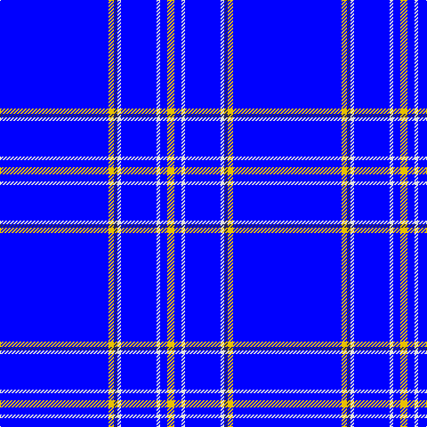

In pattern [BYBWBWBY](/patterns/bybwbwby/).

This was sourced from register-of-tartans.  It is a [8 stripes tartan](/stripes/stripes8/).

Original link https://www.tartanregister.gov.uk/tartanDetails.aspx?ref=3614

## Thread count
B/122 Y6 DB4 LN4 B40 LN4 B8 Y/8

## Palette
Each colour and its ΔE from the base-6 reference it is a variant of.

| Colour | Shade | Base | ΔE (OKLab) |
|---|---|---|---|
| B | <code style="background-color:#0000FF;">#0000FF</code> `#0000FF` | B <code style="background-color:#2C4084;">#2C4084</code> | 0.21 |
| DB | <code style="background-color:#202060;">#202060</code> `#202060` | B <code style="background-color:#2C4084;">#2C4084</code> | 0.11 |
| LN | <code style="background-color:#E0E0E0;">#E0E0E0</code> `#E0E0E0` | W <code style="background-color:#F4F4F0;">#F4F4F0</code> | 0.06 |
| Y | <code style="background-color:#E8C000;">#E8C000</code> `#E8C000` | Y <code style="background-color:#E8C000;">#E8C000</code> | 0.00 |

# Sample pattern

## Nearest tartans

The nearest existing variants by ΔTartan distance.

1. [Agua](/setts/s6/w26r4b26r4b140w6-b0000cd-re1523d-w82cffd/) — ΔT 1.66
1. [Blueheart](/setts/s7/k4b72w20b4w12b72k4-b0000cd-k101010-w00fcfc/) — ΔT 2.33
1. [Duke of York (Royal)](/setts/s8/b122r12w4r16y4b6y4b30-b00008c-r8c0000-wfcfcfc-yc88c00/) — ΔT 3.09
1. [Steffen, Markus (Personal)](/setts/s6/b140w16b40r12ra12r12-b00009c-r8b1c62-rab0171f-wffffff/) — ΔT 3.25
1. [Centrica Energy](/setts/s9/w12b79y6b53ya4b22wa10b24yb8-b00008b-wffffff-waf6a4d5-yee9a00-ya6ca6cd-yb7ccd7c/) — ΔT 3.42
1. [Volunteer Lifesaving Corps (Corp.)](/setts/s5/r10w8k8b160w8-b38409c-k101010-rc80000-wf8f8f8/) — ΔT 3.44
1. [RAAF #4](/setts/s9/b96w4b14w4b14w4b40ba22r4-b2c2c80-ba5c8ca8-rc80000-we0e0e0/) — ΔT 3.48
1. [Boat of Garten (District)](/setts/s8/b122w8b4w14ba4g6y4b32-b2c2c80-ba9050d8-g006818-we0e0e0-ye8c000/) — ΔT 3.51
1. [Greenock Morton F. C. (Corporate)](/setts/s5/b19w6b105y4b5-b1c0070-we0e0e0-ye8c000/) — ΔT 3.51
1. [PSN Test](/setts/s8/b100y4b24ba4b24w16bb12wa4-b34349c-ba1474b4-bb4888bc-w98c8e8-wae0e0e0-yd87c00/) — ΔT 3.59

## Neighbour map

Every grey dot is one of 15726 variants placed by the first two principal components of the ΔTartan feature space (44% of its variance). Red is this tartan; blue dots are its nearest — click one to open its page.

<svg viewBox="0 0 640 380" role="img" style="max-width:100%;height:auto;border:1px solid #e0e0e0;border-radius:4px;display:block" xmlns="http://www.w3.org/2000/svg"><image href="/nn/cloud.v1.png" width="640" height="380"/><a href="/setts/s6/w26r4b26r4b140w6-b0000cd-re1523d-w82cffd/"><circle cx="560.4" cy="162.1" r="4" fill="#3465a4"><title>Agua</title></circle></a><a href="/setts/s7/k4b72w20b4w12b72k4-b0000cd-k101010-w00fcfc/"><circle cx="480.5" cy="191.9" r="4" fill="#3465a4"><title>Blueheart</title></circle></a><a href="/setts/s8/b122r12w4r16y4b6y4b30-b00008c-r8c0000-wfcfcfc-yc88c00/"><circle cx="547.6" cy="138.3" r="4" fill="#3465a4"><title>Duke of York (Royal)</title></circle></a><a href="/setts/s6/b140w16b40r12ra12r12-b00009c-r8b1c62-rab0171f-wffffff/"><circle cx="464.3" cy="191.2" r="4" fill="#3465a4"><title>Steffen, Markus (Personal)</title></circle></a><a href="/setts/s9/w12b79y6b53ya4b22wa10b24yb8-b00008b-wffffff-waf6a4d5-yee9a00-ya6ca6cd-yb7ccd7c/"><circle cx="445.0" cy="137.1" r="4" fill="#3465a4"><title>Centrica Energy</title></circle></a><a href="/setts/s5/r10w8k8b160w8-b38409c-k101010-rc80000-wf8f8f8/"><circle cx="560.5" cy="161.8" r="4" fill="#3465a4"><title>Volunteer Lifesaving Corps (Corp.)</title></circle></a><a href="/setts/s9/b96w4b14w4b14w4b40ba22r4-b2c2c80-ba5c8ca8-rc80000-we0e0e0/"><circle cx="547.3" cy="154.8" r="4" fill="#3465a4"><title>RAAF #4</title></circle></a><a href="/setts/s8/b122w8b4w14ba4g6y4b32-b2c2c80-ba9050d8-g006818-we0e0e0-ye8c000/"><circle cx="531.7" cy="110.0" r="4" fill="#3465a4"><title>Boat of Garten (District)</title></circle></a><a href="/setts/s5/b19w6b105y4b5-b1c0070-we0e0e0-ye8c000/"><circle cx="626.0" cy="193.0" r="4" fill="#3465a4"><title>Greenock Morton F. C. (Corporate)</title></circle></a><a href="/setts/s8/b100y4b24ba4b24w16bb12wa4-b34349c-ba1474b4-bb4888bc-w98c8e8-wae0e0e0-yd87c00/"><circle cx="495.9" cy="126.6" r="4" fill="#3465a4"><title>PSN Test</title></circle></a><circle cx="587.7" cy="134.3" r="5" fill="#c00000"/></svg>

ID: /setts/s8/b122y6ba4w4b40w4b8y8-b0000ff-ba202060-we0e0e0-ye8c000/
