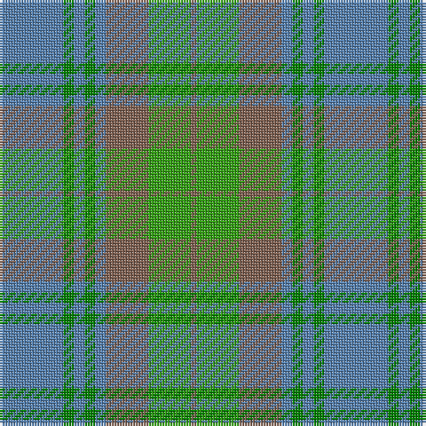

In pattern [BGBGBRGR](/patterns/bgbgbrgr/).

This was sourced from weddslist.  It is a [8 stripes tartan](/stripes/stripes8/).

Original link http://www.weddslist.com/cgi-bin/tartans/pg.pl?source=sts

## Thread count
B/24 Ga4 B4 Ga4 B4 LT16 G16 LT/2

## Palette
Each colour and its ΔE from the base-6 reference it is a variant of.

| Colour | Shade | Base | ΔE (OKLab) |
|---|---|---|---|
| B | <code style="background-color:#5480B0;">#5480B0</code> `#5480B0` | B <code style="background-color:#2A418A;">#2A418A</code> | 0.19 |
| G | <code style="background-color:#30A010;">#30A010</code> `#30A010` | G <code style="background-color:#006100;">#006100</code> | 0.20 |
| Ga | <code style="background-color:#008000;">#008000</code> `#008000` | G <code style="background-color:#006100;">#006100</code> | 0.10 |
| LT | <code style="background-color:#806050;">#806050</code> `#806050` | R <code style="background-color:#CC0000;">#CC0000</code> | 0.17 |

# Sample pattern

## Nearest tartans

The nearest existing variants by ΔTartan distance.

1. [Ancient Universal (Fashion?)](/setts/s8/g12ga2g2ga2g2gb8gc8gb1x2~g789484-ga003820-gb604000-gc5c6428/) — ΔT 1.13
1. [Universal Ancient International Tartan Tartan Number: 136. Earliest known date: Canada This design is different in warp and weft. The display gives the general appearance only. Produced to celebrate American tourism is Scotland. The colours are taken from the flags of the two nations and the Atlantic Ocean that separates them. See products available Copyright © Blair Urquhart, Comrie, 2015](/setts/s8/b12g2b2g2b2ga8gb8ga1x2~b5c8ca8-g006818-ga604000-gb289c18/) — ΔT 1.13
1. [Chambers Bay](/setts/s7/g2b15y5g2b2g7w2x4~b5f749c-g408060-wffffff-yb0b0b0/) — ΔT 1.45
1. [Un-named (D C Dalgliesh) #2](/setts/s10/b5y2b2y9k3b9g3b3g25ya2x2~b1474b4-g408060-k101010-y84a8b0-yaacb0b8/) — ΔT 1.49
1. [Universal Ancient](/setts/s8/b12g2b2g2b2ga8gb8ga1x2~b3c82af-g005020-ga503c14-gb309c18/) — ΔT 1.50
1. [Canadian Fancy](/setts/s6/g4r25g6b12g12b3x2~b5480b0-g008000-r806050/) — ΔT 1.52
1. [Highland Road (Fashion)](/setts/s9/k3y15b3y4b3y4b10g30w3x2~b5c8ca8-g587478-k101010-we0e0e0-ya0a0a0/) — ΔT 1.60
1. [Strange Of Balcaskie](/setts/s7/g32r7g7r16b32y3r8x2~b304080-g008000-r806050-yf0c000/) — ΔT 1.67
1. [Irvine of Drum](/setts/s8/b3k3b21g49b21k3b3w3x2~b5c8ca8-g408060-k101010-wfcfcfc/) — ΔT 1.69
1. [Cranston](/setts/s8/g14b2g2b2g3b6ga12r2x2~b5c8ca8-g006818-ga289c18-rc80000/) — ΔT 1.70

## Neighbour map

Every grey dot is one of 15726 variants placed by the first two principal components of the ΔTartan feature space (44% of its variance). Red is this tartan; blue dots are its nearest — click one to open its page.

<svg viewBox="0 0 640 380" role="img" style="max-width:100%;height:auto;border:1px solid #e0e0e0;border-radius:4px;display:block" xmlns="http://www.w3.org/2000/svg"><image href="/nn/cloud.v1.png" width="640" height="380"/><a href="/setts/s8/g12ga2g2ga2g2gb8gc8gb1x2~g789484-ga003820-gb604000-gc5c6428/"><circle cx="282.1" cy="217.6" r="4" fill="#3465a4"><title>Ancient Universal (Fashion?)</title></circle></a><a href="/setts/s8/b12g2b2g2b2ga8gb8ga1x2~b5c8ca8-g006818-ga604000-gb289c18/"><circle cx="262.8" cy="213.1" r="4" fill="#3465a4"><title>Universal Ancient International Tartan Tartan Number: 136. Earliest known date: Canada This design is different in warp and weft. The display gives the general appearance only. Produced to celebrate American tourism is Scotland. The colours are taken from the flags of the two nations and the Atlantic Ocean that separates them. See products available Copyright © Blair Urquhart, Comrie, 2015</title></circle></a><a href="/setts/s7/g2b15y5g2b2g7w2x4~b5f749c-g408060-wffffff-yb0b0b0/"><circle cx="304.0" cy="234.2" r="4" fill="#3465a4"><title>Chambers Bay</title></circle></a><a href="/setts/s10/b5y2b2y9k3b9g3b3g25ya2x2~b1474b4-g408060-k101010-y84a8b0-yaacb0b8/"><circle cx="284.2" cy="177.5" r="4" fill="#3465a4"><title>Un-named (D C Dalgliesh) #2</title></circle></a><a href="/setts/s8/b12g2b2g2b2ga8gb8ga1x2~b3c82af-g005020-ga503c14-gb309c18/"><circle cx="252.0" cy="211.3" r="4" fill="#3465a4"><title>Universal Ancient</title></circle></a><a href="/setts/s6/g4r25g6b12g12b3x2~b5480b0-g008000-r806050/"><circle cx="314.0" cy="282.4" r="4" fill="#3465a4"><title>Canadian Fancy</title></circle></a><a href="/setts/s9/k3y15b3y4b3y4b10g30w3x2~b5c8ca8-g587478-k101010-we0e0e0-ya0a0a0/"><circle cx="266.6" cy="189.1" r="4" fill="#3465a4"><title>Highland Road (Fashion)</title></circle></a><a href="/setts/s7/g32r7g7r16b32y3r8x2~b304080-g008000-r806050-yf0c000/"><circle cx="235.6" cy="228.0" r="4" fill="#3465a4"><title>Strange Of Balcaskie</title></circle></a><a href="/setts/s8/b3k3b21g49b21k3b3w3x2~b5c8ca8-g408060-k101010-wfcfcfc/"><circle cx="365.5" cy="190.9" r="4" fill="#3465a4"><title>Irvine of Drum</title></circle></a><a href="/setts/s8/g14b2g2b2g3b6ga12r2x2~b5c8ca8-g006818-ga289c18-rc80000/"><circle cx="268.4" cy="240.5" r="4" fill="#3465a4"><title>Cranston</title></circle></a><circle cx="288.3" cy="223.0" r="5" fill="#c00000"/></svg>

ID: /setts/s8/b12g2b2g2b2r8ga8r1x2~b5480b0-g008000-ga30a010-r806050/
