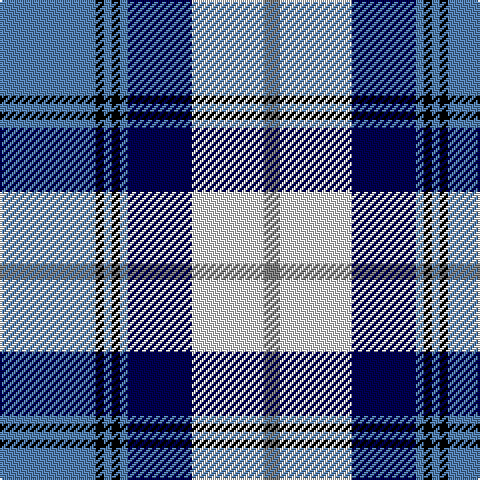

In pattern [BKBKBBWG](/patterns/bkbkbbwg/).

This was sourced from weddslist.  It is a [8 stripes tartan](/stripes/stripes8/).

Original link http://www.weddslist.com/cgi-bin/tartans/pg.pl?source=sts

## Thread count
B/48 K4 B4 K4 B4 DB32 LN36 N/8

## Palette
Each colour and its ΔE from the base-6 reference it is a variant of.

| Colour | Shade | Base | ΔE (OKLab) |
|---|---|---|---|
| B | <code style="background-color:#5480B0;">#5480B0</code> `#5480B0` | B <code style="background-color:#2A418A;">#2A418A</code> | 0.19 |
| DB | <code style="background-color:#000050;">#000050</code> `#000050` | B <code style="background-color:#2A418A;">#2A418A</code> | 0.21 |
| K | <code style="background-color:#000000;">#000000</code> `#000000` | K <code style="background-color:#000000;">#000000</code> | 0.00 |
| LN | <code style="background-color:#E0E0E0;">#E0E0E0</code> `#E0E0E0` | W <code style="background-color:#F7F7F7;">#F7F7F7</code> | 0.07 |
| N | <code style="background-color:#808080;">#808080</code> `#808080` | G <code style="background-color:#006100;">#006100</code> | 0.23 |

# Sample pattern

## Nearest tartans

The nearest existing variants by ΔTartan distance.

1. [Arran (Pendleton)](/setts/s8/b12k1b1k1b1ba8w9g2~b3c82af-ba080848-g808080-k101010-we0e0e0~x4/) — ΔT 0.24
1. [Sneddon, Jonathan Taylor (Personal)](/setts/s8/b15k2w2k2w2k16y22ya2~b0000ff-k101010-wffffff-ya0a0a0-yaffff00~x4/) — ΔT 0.60
1. [Arran - 1989 (Fashion)](/setts/s8/b12k1b1k1b1ba8w9r2~b5c8ca8-ba202060-k101010-r888888-wfcfcfc~x4/) — ΔT 0.67
1. [Loch Ness (Fashion)](/setts/s7/r2b2r2b21y11k17w2~b5c8ca8-k00002c-rc80000-w98c8e8-y48a4c0~x2/) — ΔT 0.82
1. [Sinclair Dress (Dance)](/setts/s7/b4r2b31k10g4w21g2~b38409c-g006818-k101010-rc80000-we0e0e0~x2/) — ΔT 0.94
1. [Davidson (Wedding) (Personal)](/setts/s7/r2b14k6g1w12g1w2~b2c2c80-g006818-k101010-rc80000-wfcfcfc~x4/) — ΔT 0.95
1. [MacKellar Royal Blue Dress Tartan Tartan Number: 8181. Earliest known date: Threadcount and colours aren't 100% original. Generated manually. See products available Copyright © Blair Urquhart, Comrie, 2015](/setts/s11/b23w2b3ba4b3w2b5k11bb2w23k3~b2c2c80-ba2888c4-bb8c008c-k101010-we0e0e0~x2/) — ΔT 0.96
1. [Davidson, Bride's](/setts/s7/r2b14k6g1w12g1w2~b304080-g008000-k000000-rc00000-we0e0e0~x4/) — ΔT 1.00
1. [Loch Ness in Scotland](/setts/s7/g2b14y6ya1g1ya6r1~b000064-g289c18-rc8002c-y48a4c0-yaa0a0a0~x4/) — ΔT 1.01
1. [Fraser Gathering Dress (1997)](/setts/s9/g2w24g2b5ga4g11ga2b12r2~b1c0070-g006818-ga003820-rc80000-we0e0e0~x2/) — ΔT 1.04

## Neighbour map

Every grey dot is one of 15726 variants placed by the first two principal components of the ΔTartan feature space (44% of its variance). Red is this tartan; blue dots are its nearest — click one to open its page.

<svg viewBox="0 0 640 380" role="img" style="max-width:100%;height:auto;border:1px solid #e0e0e0;border-radius:4px;display:block" xmlns="http://www.w3.org/2000/svg"><image href="/nn/cloud.v1.png" width="640" height="380"/><a href="/setts/s8/b12k1b1k1b1ba8w9g2~b3c82af-ba080848-g808080-k101010-we0e0e0~x4/"><circle cx="154.7" cy="148.3" r="4" fill="#3465a4"><title>Arran (Pendleton)</title></circle></a><a href="/setts/s8/b15k2w2k2w2k16y22ya2~b0000ff-k101010-wffffff-ya0a0a0-yaffff00~x4/"><circle cx="130.8" cy="148.1" r="4" fill="#3465a4"><title>Sneddon, Jonathan Taylor (Personal)</title></circle></a><a href="/setts/s8/b12k1b1k1b1ba8w9r2~b5c8ca8-ba202060-k101010-r888888-wfcfcfc~x4/"><circle cx="152.8" cy="143.4" r="4" fill="#3465a4"><title>Arran - 1989 (Fashion)</title></circle></a><a href="/setts/s7/r2b2r2b21y11k17w2~b5c8ca8-k00002c-rc80000-w98c8e8-y48a4c0~x2/"><circle cx="165.8" cy="169.7" r="4" fill="#3465a4"><title>Loch Ness (Fashion)</title></circle></a><a href="/setts/s7/b4r2b31k10g4w21g2~b38409c-g006818-k101010-rc80000-we0e0e0~x2/"><circle cx="210.7" cy="145.1" r="4" fill="#3465a4"><title>Sinclair Dress (Dance)</title></circle></a><a href="/setts/s7/r2b14k6g1w12g1w2~b2c2c80-g006818-k101010-rc80000-wfcfcfc~x4/"><circle cx="146.2" cy="141.7" r="4" fill="#3465a4"><title>Davidson (Wedding) (Personal)</title></circle></a><a href="/setts/s11/b23w2b3ba4b3w2b5k11bb2w23k3~b2c2c80-ba2888c4-bb8c008c-k101010-we0e0e0~x2/"><circle cx="169.8" cy="128.5" r="4" fill="#3465a4"><title>MacKellar Royal Blue Dress Tartan Tartan Number: 8181. Earliest known date: Threadcount and colours aren't 100% original. Generated manually. See products available Copyright © Blair Urquhart, Comrie, 2015</title></circle></a><a href="/setts/s7/r2b14k6g1w12g1w2~b304080-g008000-k000000-rc00000-we0e0e0~x4/"><circle cx="148.3" cy="144.9" r="4" fill="#3465a4"><title>Davidson, Bride's</title></circle></a><a href="/setts/s7/g2b14y6ya1g1ya6r1~b000064-g289c18-rc8002c-y48a4c0-yaa0a0a0~x4/"><circle cx="196.3" cy="156.2" r="4" fill="#3465a4"><title>Loch Ness in Scotland</title></circle></a><a href="/setts/s9/g2w24g2b5ga4g11ga2b12r2~b1c0070-g006818-ga003820-rc80000-we0e0e0~x2/"><circle cx="134.6" cy="137.1" r="4" fill="#3465a4"><title>Fraser Gathering Dress (1997)</title></circle></a><circle cx="150.6" cy="146.5" r="5" fill="#c00000"/></svg>

ID: /setts/s8/b12k1b1k1b1ba8w9g2~b5480b0-ba000050-g808080-k000000-we0e0e0~x4/
