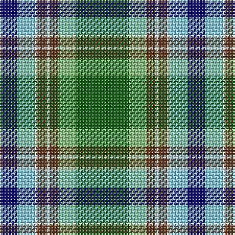

In pattern [BWWGWGYG](/patterns/bwwgwgyg/).

This was sourced from register-of-tartans.  It is a [8 stripes tartan](/stripes/stripes8/).

Original link https://www.tartanregister.gov.uk/tartanDetails.aspx?ref=10574

## Thread count
DB/12 LB12 W2 T6 W2 T6 LG12 G/36

## Palette
Each colour and its ΔE from the base-6 reference it is a variant of.

| Colour | Shade | Base | ΔE (OKLab) |
|---|---|---|---|
| DB | <code style="background-color:#000080;">#000080</code> `#000080` | B <code style="background-color:#2C4084;">#2C4084</code> | 0.14 |
| G | <code style="background-color:#006400;">#006400</code> `#006400` | G <code style="background-color:#006400;">#006400</code> | 0.00 |
| LB | <code style="background-color:#82CFFD;">#82CFFD</code> `#82CFFD` | W <code style="background-color:#F4F4F0;">#F4F4F0</code> | 0.18 |
| LG | <code style="background-color:#86C67C;">#86C67C</code> `#86C67C` | Y <code style="background-color:#E8C000;">#E8C000</code> | 0.14 |
| T | <code style="background-color:#603311;">#603311</code> `#603311` | G <code style="background-color:#006400;">#006400</code> | 0.18 |
| W | <code style="background-color:#FFFFFF;">#FFFFFF</code> `#FFFFFF` | W <code style="background-color:#F4F4F0;">#F4F4F0</code> | 0.03 |

# Sample pattern

ID: /setts/s8/b12w12wa2g6wa2g6y12ga36-b000080-g603311-ga006400-w82cffd-waffffff-y86c67c/
