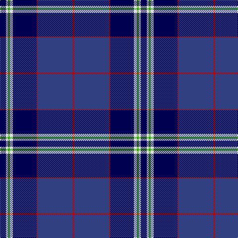

In pattern [BWGWBRBR](/patterns/bwgwbrbr/).

This was sourced from weddslist.  It is a [8 stripes tartan](/stripes/stripes8/).

Original link http://www.weddslist.com/cgi-bin/tartans/pg.pl?source=sts

## Thread count
DB/12 LN4 G4 LN6 DB48 R2 B70 R/4

## Palette
Each colour and its ΔE from the base-6 reference it is a variant of.

| Colour | Shade | Base | ΔE (OKLab) |
|---|---|---|---|
| B | <code style="background-color:#304080;">#304080</code> `#304080` | B <code style="background-color:#2C4084;">#2C4084</code> | 0.01 |
| DB | <code style="background-color:#000050;">#000050</code> `#000050` | B <code style="background-color:#2C4084;">#2C4084</code> | 0.20 |
| G | <code style="background-color:#30A010;">#30A010</code> `#30A010` | G <code style="background-color:#006400;">#006400</code> | 0.19 |
| LN | <code style="background-color:#E0E0E0;">#E0E0E0</code> `#E0E0E0` | W <code style="background-color:#F4F4F0;">#F4F4F0</code> | 0.06 |
| R | <code style="background-color:#C00000;">#C00000</code> `#C00000` | R <code style="background-color:#C80000;">#C80000</code> | 0.02 |

# Sample pattern

## Nearest tartans

The nearest existing variants by ΔTartan distance.

1. [Binder Wedding (Personal)](/setts/s8/g2b2k2b60k60w4b10y2-b3850c8-g289c18-k101010-we0e0e0-ydc943c/) — ΔT 0.92
1. [Hill (Name)](/setts/s9/w6b4y2b4y2b62k56r4k4-b2c2c80-k101010-rc80000-we0e0e0-ye8c000/) — ΔT 1.07
1. [Musselburgh](/setts/s9/b56w4b12y8b12w4b16ba96r12-b5c8ca8-ba1c0070-r880000-wc0c0c0-yd09800/) — ΔT 1.18
1. [Finnie (Personal)](/setts/s8/b8w8b74k40w2ba10w2k8-b2c2c80-ba780078-k101010-we0e0e0/) — ΔT 1.19
1. [Binder Wedding (Personal)](/setts/s8/g2b2k2b60k60w4b10y2-b2c4084-g649848-k101010-wffffff-yffe600/) — ΔT 1.20
1. [Mead (Tennessee) Modern Dress (Personal)](/setts/s10/b72k6r12k6ba20r10ba6y8k2b4-b271b86-ba041b67-k101010-rdd1212-yf9c75c/) — ΔT 1.21
1. [Grahame Laurie Band (Corporate)](/setts/s7/k8y2b6y2k36ba84w7-b780078-ba2c2c80-k101010-we0e0e0-yfccc00/) — ΔT 1.22
1. [Mead (Personal)](/setts/s10/b72k6r12k6ba20r10ba6y8k2b4-b3850c8-ba003c64-k101010-rc80000-yfccc00/) — ΔT 1.26
1. [Gorman Family (Canada) (Personal)](/setts/s6/g12b32ba98bb28ba4w12-b405068-ba1c0070-bb487088-g289c18-we0e0e0/) — ΔT 1.27
1. [Binder Wedding (Personal) Name Tartan Tartan Number: 10728. Earliest known date: 1 November 2012 Designed to celebrate the wedding of Anna Binder and Michael Slozga and to found a family tartan for their descendants. Anna and Michael are both pipers; they met through a pipe band and share a passion for Scottish traditional pipe band music. Registrant details: Mr Michael Szolga, 252/5 Waldegg, Waldegg, , Austria, 2754 See products available Copyright © Blair Urquhart, Comrie, 2015](/setts/s8/k2b10w4ka60b60ka2b2k2-b0000cd-k000000-ka101010-wffffff/) — ΔT 1.29

## Neighbour map

Every grey dot is one of 15726 variants placed by the first two principal components of the ΔTartan feature space (44% of its variance). Red is this tartan; blue dots are its nearest — click one to open its page.

<svg viewBox="0 0 640 380" role="img" style="max-width:100%;height:auto;border:1px solid #e0e0e0;border-radius:4px;display:block" xmlns="http://www.w3.org/2000/svg"><image href="/nn/cloud.v1.png" width="640" height="380"/><a href="/setts/s8/g2b2k2b60k60w4b10y2-b3850c8-g289c18-k101010-we0e0e0-ydc943c/"><circle cx="334.8" cy="114.3" r="4" fill="#3465a4"><title>Binder Wedding (Personal)</title></circle></a><a href="/setts/s9/w6b4y2b4y2b62k56r4k4-b2c2c80-k101010-rc80000-we0e0e0-ye8c000/"><circle cx="332.2" cy="109.8" r="4" fill="#3465a4"><title>Hill (Name)</title></circle></a><a href="/setts/s9/b56w4b12y8b12w4b16ba96r12-b5c8ca8-ba1c0070-r880000-wc0c0c0-yd09800/"><circle cx="268.5" cy="120.1" r="4" fill="#3465a4"><title>Musselburgh</title></circle></a><a href="/setts/s8/b8w8b74k40w2ba10w2k8-b2c2c80-ba780078-k101010-we0e0e0/"><circle cx="360.6" cy="132.1" r="4" fill="#3465a4"><title>Finnie (Personal)</title></circle></a><a href="/setts/s8/g2b2k2b60k60w4b10y2-b2c4084-g649848-k101010-wffffff-yffe600/"><circle cx="353.2" cy="123.2" r="4" fill="#3465a4"><title>Binder Wedding (Personal)</title></circle></a><a href="/setts/s10/b72k6r12k6ba20r10ba6y8k2b4-b271b86-ba041b67-k101010-rdd1212-yf9c75c/"><circle cx="312.9" cy="96.8" r="4" fill="#3465a4"><title>Mead (Tennessee) Modern Dress (Personal)</title></circle></a><a href="/setts/s7/k8y2b6y2k36ba84w7-b780078-ba2c2c80-k101010-we0e0e0-yfccc00/"><circle cx="382.2" cy="114.4" r="4" fill="#3465a4"><title>Grahame Laurie Band (Corporate)</title></circle></a><a href="/setts/s10/b72k6r12k6ba20r10ba6y8k2b4-b3850c8-ba003c64-k101010-rc80000-yfccc00/"><circle cx="305.8" cy="92.3" r="4" fill="#3465a4"><title>Mead (Personal)</title></circle></a><a href="/setts/s6/g12b32ba98bb28ba4w12-b405068-ba1c0070-bb487088-g289c18-we0e0e0/"><circle cx="301.3" cy="155.7" r="4" fill="#3465a4"><title>Gorman Family (Canada) (Personal)</title></circle></a><a href="/setts/s8/k2b10w4ka60b60ka2b2k2-b0000cd-k000000-ka101010-wffffff/"><circle cx="335.4" cy="121.3" r="4" fill="#3465a4"><title>Binder Wedding (Personal) Name Tartan Tartan Number: 10728. Earliest known date: 1 November 2012 Designed to celebrate the wedding of Anna Binder and Michael Slozga and to found a family tartan for their descendants. Anna and Michael are both pipers; they met through a pipe band and share a passion for Scottish traditional pipe band music. Registrant details: Mr Michael Szolga, 252/5 Waldegg, Waldegg, , Austria, 2754 See products available Copyright © Blair Urquhart, Comrie, 2015</title></circle></a><circle cx="308.9" cy="117.8" r="5" fill="#c00000"/></svg>

ID: /setts/s8/b12w4g4w6b48r2ba70r4-b000050-ba304080-g30a010-rc00000-we0e0e0/
