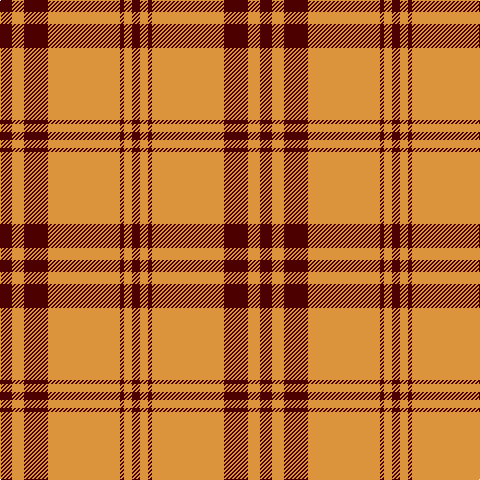

In pattern [BYBBYBYB](/patterns/bybbybyb/).

This was sourced from tartans-authority.  It is a [8 stripes tartan](/stripes/stripes8/).

Original link http://www.tartansauthority.com/tartan-ferret/display/4112/

## Thread count
DR/12 O12 DR16 DR8 O72 DR4 O8 DR/8

## Palette
Each colour and its ΔE from the base-6 reference it is a variant of.

| Colour | Shade | Base | ΔE (OKLab) |
|---|---|---|---|
| DR | <code style="background-color:#4C0000;">#4C0000</code> `#4C0000` | B <code style="background-color:#2C4084;">#2C4084</code> | 0.24 |
| O | <code style="background-color:#DC943C;">#DC943C</code> `#DC943C` | Y <code style="background-color:#E8C000;">#E8C000</code> | 0.12 |

# Sample pattern

ID: /setts/s8/b12y12b16b8y72b4y8b8-b4c0000-ydc943c/
