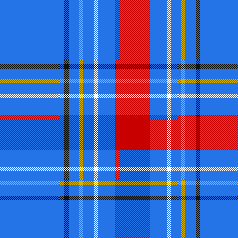

In pattern [BKBYBWBR](/patterns/bkbybwbr/).

This was sourced from register-of-tartans.  It is a [8 stripes tartan](/stripes/stripes8/).

Original link https://www.tartanregister.gov.uk/tartanDetails.aspx?ref=2859

## Attestations

This cloth appears in 2 source records; the oldest owns this page.

- 01/01/1892 — Maud, Mary (register-of-tartans, [record](https://www.tartanregister.gov.uk/tartanDetails.aspx?ref=2859))
- pre 1892 — Maud, Mary (Fashion) (tartans-authority, [record](http://www.tartansauthority.com/tartan-ferret/display/268/))

## Thread count
B/130 K9 B21 Y8 B21 W8 B35 R/70

## Palette
Each colour and its ΔE from the base-6 reference it is a variant of.

| Colour | Shade | Base | ΔE (OKLab) |
|---|---|---|---|
| B | <code style="background-color:#2474E8;">#2474E8</code> `#2474E8` | B <code style="background-color:#2A418A;">#2A418A</code> | 0.19 |
| K | <code style="background-color:#101010;">#101010</code> `#101010` | K <code style="background-color:#000000;">#000000</code> | 0.17 |
| R | <code style="background-color:#C80000;">#C80000</code> `#C80000` | R <code style="background-color:#CC0000;">#CC0000</code> | 0.01 |
| W | <code style="background-color:#FCFCFC;">#FCFCFC</code> `#FCFCFC` | W <code style="background-color:#F7F7F7;">#F7F7F7</code> | 0.01 |
| Y | <code style="background-color:#D8B000;">#D8B000</code> `#D8B000` | Y <code style="background-color:#F2BF00;">#F2BF00</code> | 0.06 |

# Sample pattern

## Nearest tartans

The nearest existing variants by ΔTartan distance.

1. [Jouy (Personal)](/setts/s13/b5w5b5w5b15w1r2w1b21y2b5k2y4~b3850c8-k101010-rb84c00-we8ccb8-yfccc00~x2/) — ΔT 1.19
1. [Carlisle Family (Name)](/setts/s7/b33y6r3y6k3y15b32~b3474fc-k000000-r8c0000-yc88c00~x4/) — ΔT 1.33
1. [Edinburgh Festival](/setts/s8/b46ba3y3ba3y4ba12w3k3~b1474b4-ba64008c-k000000-wfcfcfc-yfca098~x2/) — ΔT 1.59
1. [Edinburgh Festival(Corporate)](/setts/s8/b46ba3y3ba3y4ba12w3k3~b1474b4-ba64008c-k000000-wfcfcfc-yec9898~x2/) — ΔT 1.60
1. [Wheadon (Name)](/setts/s6/b40g7y3g7b15r5~b34349c-g008c20-rc80000-ye8c000~x2/) — ΔT 1.63
1. [Gonzaga University's True Blue and W](/setts/s7/w6b2w3b2g2b20r1~b2c2c80-g006818-rc80000-wfcfcfc~x2/) — ΔT 1.65
1. [Fujisankei Serene (Corporate)](/setts/s9/r1w6b4w1b16ba1b4ba6w1~b2c2c80-ba5c5c5c-r888888-wc0c0c0~x4/) — ΔT 1.73
1. [Mortell (Personal)](/setts/s10/b20ba2w5r2b10ba5b20ba2w5r5~b2c2c80-ba1870a4-rc80000-we0e0e0~x2/) — ΔT 1.74
1. [Starr](/setts/s7/w1b20wa3ba3b4w4wa1~b1474b4-ba2c2c80-w98c8e8-waf8f8f8~x4/) — ΔT 1.75
1. [Tokyo Bluebells (Corporate)](/setts/s8/b18r1b1r1b1k7b13w2~b1474b4-k101010-rc80000-we0e0e0~x4/) — ΔT 1.76

## Neighbour map

Every grey dot is one of 15726 variants placed by the first two principal components of the ΔTartan feature space (44% of its variance). Red is this tartan; blue dots are its nearest — click one to open its page.

<svg viewBox="0 0 640 380" role="img" style="max-width:100%;height:auto;border:1px solid #e0e0e0;border-radius:4px;display:block" xmlns="http://www.w3.org/2000/svg"><image href="/nn/cloud.v1.png" width="640" height="380"/><a href="/setts/s13/b5w5b5w5b15w1r2w1b21y2b5k2y4~b3850c8-k101010-rb84c00-we8ccb8-yfccc00~x2/"><circle cx="370.3" cy="121.3" r="4" fill="#3465a4"><title>Jouy (Personal)</title></circle></a><a href="/setts/s7/b33y6r3y6k3y15b32~b3474fc-k000000-r8c0000-yc88c00~x4/"><circle cx="358.4" cy="197.4" r="4" fill="#3465a4"><title>Carlisle Family (Name)</title></circle></a><a href="/setts/s8/b46ba3y3ba3y4ba12w3k3~b1474b4-ba64008c-k000000-wfcfcfc-yfca098~x2/"><circle cx="336.9" cy="129.0" r="4" fill="#3465a4"><title>Edinburgh Festival</title></circle></a><a href="/setts/s8/b46ba3y3ba3y4ba12w3k3~b1474b4-ba64008c-k000000-wfcfcfc-yec9898~x2/"><circle cx="339.9" cy="130.4" r="4" fill="#3465a4"><title>Edinburgh Festival(Corporate)</title></circle></a><a href="/setts/s6/b40g7y3g7b15r5~b34349c-g008c20-rc80000-ye8c000~x2/"><circle cx="425.8" cy="203.7" r="4" fill="#3465a4"><title>Wheadon (Name)</title></circle></a><a href="/setts/s7/w6b2w3b2g2b20r1~b2c2c80-g006818-rc80000-wfcfcfc~x2/"><circle cx="377.8" cy="145.1" r="4" fill="#3465a4"><title>Gonzaga University's True Blue and W</title></circle></a><a href="/setts/s9/r1w6b4w1b16ba1b4ba6w1~b2c2c80-ba5c5c5c-r888888-wc0c0c0~x4/"><circle cx="342.2" cy="168.2" r="4" fill="#3465a4"><title>Fujisankei Serene (Corporate)</title></circle></a><a href="/setts/s10/b20ba2w5r2b10ba5b20ba2w5r5~b2c2c80-ba1870a4-rc80000-we0e0e0~x2/"><circle cx="335.2" cy="188.7" r="4" fill="#3465a4"><title>Mortell (Personal)</title></circle></a><a href="/setts/s7/w1b20wa3ba3b4w4wa1~b1474b4-ba2c2c80-w98c8e8-waf8f8f8~x4/"><circle cx="401.0" cy="162.4" r="4" fill="#3465a4"><title>Starr</title></circle></a><a href="/setts/s8/b18r1b1r1b1k7b13w2~b1474b4-k101010-rc80000-we0e0e0~x4/"><circle cx="458.8" cy="172.8" r="4" fill="#3465a4"><title>Tokyo Bluebells (Corporate)</title></circle></a><circle cx="385.1" cy="150.6" r="5" fill="#c00000"/></svg>

ID: /setts/s8/b130k9b21y8b21w8b35r70~b2474e8-k101010-rc80000-wfcfcfc-yd8b000/
