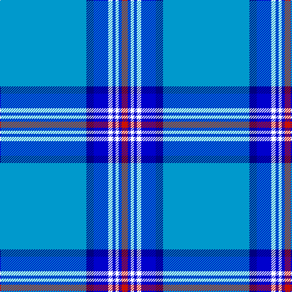

In pattern [BBBWBWBR](/patterns/bbbwbwbr/).

This was sourced from register-of-tartans.  It is a [8 stripes tartan](/stripes/stripes8/).

Original link https://www.tartanregister.gov.uk/tartanDetails.aspx?ref=6011

## Register references

External register numbers recorded for this tartan.

- Scottish Register of Tartans: [6011](https://www.tartanregister.gov.uk/tartanDetails.aspx?ref=6011)

## Thread count
B/142 DB12 Ba24 W7 Ba5 W5 Ba5 R/10

## Palette
Each colour and its ΔE from the base-6 reference it is a variant of.

| Colour | Shade | Base | ΔE (OKLab) |
|---|---|---|---|
| B | <code style="background-color:#0099CC;">#0099CC</code> `#0099CC` | B <code style="background-color:#2A418A;">#2A418A</code> | 0.25 |
| Ba | <code style="background-color:#0000CD;">#0000CD</code> `#0000CD` | B <code style="background-color:#2A418A;">#2A418A</code> | 0.14 |
| DB | <code style="background-color:#000080;">#000080</code> `#000080` | B <code style="background-color:#2A418A;">#2A418A</code> | 0.14 |
| R | <code style="background-color:#CC1100;">#CC1100</code> `#CC1100` | R <code style="background-color:#CC0000;">#CC0000</code> | 0.01 |
| W | <code style="background-color:#FFFFFF;">#FFFFFF</code> `#FFFFFF` | W <code style="background-color:#F7F7F7;">#F7F7F7</code> | 0.02 |

# Sample pattern

## Nearest tartans

The nearest existing variants by ΔTartan distance.

1. [Akashi](/setts/s12/w8b8w4b64ba6wa6b4wa6ba10b30y2w5~b1474b4-ba202060-wfcfcfc-wa98c8e8-yd87c00/) — ΔT 1.20
1. [Starr](/setts/s7/w1b20wa3ba3b4w4wa1~b1474b4-ba2c2c80-w98c8e8-waf8f8f8~x4/) — ΔT 1.50
1. [StammBar](/setts/s12/w4b8w4y8w2y2w4b42r1ya2r1b2~b1870a4-ra00000-wfcfcfc-y48a4c0-yafccc00~x2/) — ΔT 1.55
1. [Leblant-Macqueron (Personal)](/setts/s7/w5g6wa2ga7wa2b44wa2~b1474b4-g604000-ga006818-wc0c0c0-wae0e0e0~x2/) — ΔT 1.59
1. [Stratford, (Oregon) City of (Dist.)](/setts/s10/b42w5b1w1y9b1g2w1b1r1~b1474b4-g00643c-rc80000-we0e0e0-ybc8c00~x4/) — ΔT 1.67
1. [London Fog Blue (Fashion)](/setts/s12/b144k9b13w9b4k9b4y13w9b4w13k4~b2888c4-k101010-wd4d4c4-yccc0a4/) — ΔT 1.68
1. [Parr](/setts/s10/b106r3b4r6b8k28g8w4g12k8~b1474b4-g408060-k101010-rc80000-we8ccb8/) — ΔT 1.72
1. [Akashi](/setts/s12/w8b8w4b64ba6wa6b4wa6ba10b30y2w5~b3850c8-ba1c1c50-wffffff-wa98c8e8-yec8048/) — ΔT 1.74
1. [North Tyneside Pipe Band](/setts/s7/b62ba22w3ba2w2ba3r1~b1474b4-ba202060-rc80000-we0e0e0~x2/) — ΔT 1.81
1. [Caledonian Railway (Commemorative)](/setts/s11/b6k1y6k1b28w1k2w1b16w1r5~b1474b4-k101010-rc80000-we8ccb8-ybc8c00~x2/) — ΔT 1.85

## Neighbour map

Every grey dot is one of 15726 variants placed by the first two principal components of the ΔTartan feature space (44% of its variance). Red is this tartan; blue dots are its nearest — click one to open its page.

<svg viewBox="0 0 640 380" role="img" style="max-width:100%;height:auto;border:1px solid #e0e0e0;border-radius:4px;display:block" xmlns="http://www.w3.org/2000/svg"><image href="/nn/cloud.v1.png" width="640" height="380"/><a href="/setts/s12/w8b8w4b64ba6wa6b4wa6ba10b30y2w5~b1474b4-ba202060-wfcfcfc-wa98c8e8-yd87c00/"><circle cx="408.4" cy="98.9" r="4" fill="#3465a4"><title>Akashi</title></circle></a><a href="/setts/s7/w1b20wa3ba3b4w4wa1~b1474b4-ba2c2c80-w98c8e8-waf8f8f8~x4/"><circle cx="401.0" cy="162.4" r="4" fill="#3465a4"><title>Starr</title></circle></a><a href="/setts/s12/w4b8w4y8w2y2w4b42r1ya2r1b2~b1870a4-ra00000-wfcfcfc-y48a4c0-yafccc00~x2/"><circle cx="400.6" cy="69.7" r="4" fill="#3465a4"><title>StammBar</title></circle></a><a href="/setts/s7/w5g6wa2ga7wa2b44wa2~b1474b4-g604000-ga006818-wc0c0c0-wae0e0e0~x2/"><circle cx="396.9" cy="135.5" r="4" fill="#3465a4"><title>Leblant-Macqueron (Personal)</title></circle></a><a href="/setts/s10/b42w5b1w1y9b1g2w1b1r1~b1474b4-g00643c-rc80000-we0e0e0-ybc8c00~x4/"><circle cx="479.5" cy="81.6" r="4" fill="#3465a4"><title>Stratford, (Oregon) City of (Dist.)</title></circle></a><a href="/setts/s12/b144k9b13w9b4k9b4y13w9b4w13k4~b2888c4-k101010-wd4d4c4-yccc0a4/"><circle cx="479.8" cy="88.3" r="4" fill="#3465a4"><title>London Fog Blue (Fashion)</title></circle></a><a href="/setts/s10/b106r3b4r6b8k28g8w4g12k8~b1474b4-g408060-k101010-rc80000-we8ccb8/"><circle cx="400.1" cy="96.4" r="4" fill="#3465a4"><title>Parr</title></circle></a><a href="/setts/s12/w8b8w4b64ba6wa6b4wa6ba10b30y2w5~b3850c8-ba1c1c50-wffffff-wa98c8e8-yec8048/"><circle cx="401.1" cy="93.8" r="4" fill="#3465a4"><title>Akashi</title></circle></a><a href="/setts/s7/b62ba22w3ba2w2ba3r1~b1474b4-ba202060-rc80000-we0e0e0~x2/"><circle cx="479.1" cy="126.9" r="4" fill="#3465a4"><title>North Tyneside Pipe Band</title></circle></a><a href="/setts/s11/b6k1y6k1b28w1k2w1b16w1r5~b1474b4-k101010-rc80000-we8ccb8-ybc8c00~x2/"><circle cx="458.7" cy="117.1" r="4" fill="#3465a4"><title>Caledonian Railway (Commemorative)</title></circle></a><circle cx="414.3" cy="105.7" r="5" fill="#c00000"/></svg>

ID: /setts/s8/b142ba12bb24w7bb5w5bb5r10~b0099cc-ba000080-bb0000cd-rcc1100-wffffff/
