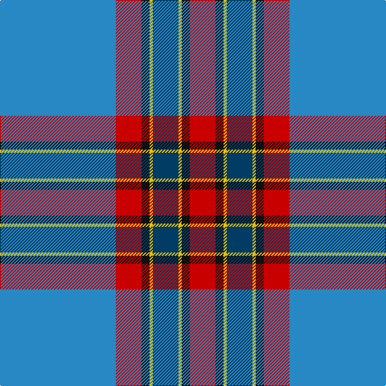

In pattern [BRKYBYKR](/patterns/brkybykr/).

This was sourced from house-of-tartan.  It is a [8 stripes tartan](/stripes/stripes8/).

Original link http://www.house-of-tartan.scotland.net/house/TartanViewjs.asp?colr=Def&tnam=6990

## Thread count
B/144 R32 K10 Y4 DB32 Y4 K10 R/32

## Palette
Each colour and its ΔE from the base-6 reference it is a variant of.

| Colour | Shade | Base | ΔE (OKLab) |
|---|---|---|---|
| B | <code style="background-color:#2888C4;">#2888C4</code> `#2888C4` | B <code style="background-color:#2C4084;">#2C4084</code> | 0.21 |
| DB | <code style="background-color:#003C64;">#003C64</code> `#003C64` | B <code style="background-color:#2C4084;">#2C4084</code> | 0.07 |
| K | <code style="background-color:#101010;">#101010</code> `#101010` | K <code style="background-color:#000000;">#000000</code> | 0.17 |
| R | <code style="background-color:#C80000;">#C80000</code> `#C80000` | R <code style="background-color:#C80000;">#C80000</code> | 0.00 |
| Y | <code style="background-color:#E8C000;">#E8C000</code> `#E8C000` | Y <code style="background-color:#E8C000;">#E8C000</code> | 0.00 |

# Sample pattern

## Nearest tartans

The nearest existing variants by ΔTartan distance.

1. [Ballarat](/setts/s10/w10b76r6ba22r2ba22r6b8w10y2-b5c5c5c-ba202060-r888888-wfcfcfc-yfcb464/) — ΔT 0.67
1. [Ballarat](/setts/s10/w10b76g6ba22g2ba22g6b8w10y2-b505050-ba141e46-g808080-wf8f4d0-yd87c00/) — ΔT 0.97
1. [MacRaes of America](/setts/s8/w16b8y4b72ba96b4ba8r10-b202060-ba5c8ca8-rc80000-wf0f0d8-ye8c000/) — ΔT 1.01
1. [Sandelin (Personal)](/setts/s8/w20b4w2b70g20y6g20r8-b2c2c80-g006818-rc80000-we0e0e0-ybc8c00/) — ΔT 1.03
1. [Holyrood Golden Jubilee II (Commemo)](/setts/s10/b96ba24y6w6y6r22b10r4y14w4-b003c64-ba5c8ca8-r880000-wf8f8f8-ybc8c00/) — ΔT 1.05
1. [Russian Scottish](/setts/s9/w6b4w4b80r6y2r20g20r2-b3c3cb4-g006818-rc80000-we0e0e0-ye8c000/) — ΔT 1.14
1. [Ascension Island Heritage Society](/setts/s7/r16b90w2g8k22ga12r8-b5f749c-g808080-ga289c18-k101010-rdc0000-wf8f4d0/) — ΔT 1.19
1. [Ascension Island Heritage Trust](/setts/s7/r16b90w2ra8k22g12r8-b5c8ca8-g006818-k101010-rc80000-ra888888-wfcfcfc/) — ΔT 1.20
1. [Iberia Dress, Blue (Fashion)](/setts/s7/b120w4r20g12w8r30y20-b2c2c80-g003820-rc80000-we0e0e0-ye8c000/) — ΔT 1.27
1. [Kruenaegel and Schropp](/setts/s8/b80r4w12ba4w8ba32g12w4-b2c5890-ba043c48-g549028-r902c58-we8e8e8/) — ΔT 1.27

## Neighbour map

Every grey dot is one of 15726 variants placed by the first two principal components of the ΔTartan feature space (44% of its variance). Red is this tartan; blue dots are its nearest — click one to open its page.

<svg viewBox="0 0 640 380" role="img" style="max-width:100%;height:auto;border:1px solid #e0e0e0;border-radius:4px;display:block" xmlns="http://www.w3.org/2000/svg"><image href="/nn/cloud.v1.png" width="640" height="380"/><a href="/setts/s10/w10b76r6ba22r2ba22r6b8w10y2-b5c5c5c-ba202060-r888888-wfcfcfc-yfcb464/"><circle cx="299.8" cy="89.6" r="4" fill="#3465a4"><title>Ballarat</title></circle></a><a href="/setts/s10/w10b76g6ba22g2ba22g6b8w10y2-b505050-ba141e46-g808080-wf8f4d0-yd87c00/"><circle cx="302.0" cy="92.5" r="4" fill="#3465a4"><title>Ballarat</title></circle></a><a href="/setts/s8/w16b8y4b72ba96b4ba8r10-b202060-ba5c8ca8-rc80000-wf0f0d8-ye8c000/"><circle cx="279.3" cy="118.8" r="4" fill="#3465a4"><title>MacRaes of America</title></circle></a><a href="/setts/s8/w20b4w2b70g20y6g20r8-b2c2c80-g006818-rc80000-we0e0e0-ybc8c00/"><circle cx="269.0" cy="111.0" r="4" fill="#3465a4"><title>Sandelin (Personal)</title></circle></a><a href="/setts/s10/b96ba24y6w6y6r22b10r4y14w4-b003c64-ba5c8ca8-r880000-wf8f8f8-ybc8c00/"><circle cx="308.1" cy="105.6" r="4" fill="#3465a4"><title>Holyrood Golden Jubilee II (Commemo)</title></circle></a><a href="/setts/s9/w6b4w4b80r6y2r20g20r2-b3c3cb4-g006818-rc80000-we0e0e0-ye8c000/"><circle cx="359.5" cy="83.8" r="4" fill="#3465a4"><title>Russian Scottish</title></circle></a><a href="/setts/s7/r16b90w2g8k22ga12r8-b5f749c-g808080-ga289c18-k101010-rdc0000-wf8f4d0/"><circle cx="338.5" cy="90.6" r="4" fill="#3465a4"><title>Ascension Island Heritage Society</title></circle></a><a href="/setts/s7/r16b90w2ra8k22g12r8-b5c8ca8-g006818-k101010-rc80000-ra888888-wfcfcfc/"><circle cx="331.3" cy="89.5" r="4" fill="#3465a4"><title>Ascension Island Heritage Trust</title></circle></a><a href="/setts/s7/b120w4r20g12w8r30y20-b2c2c80-g003820-rc80000-we0e0e0-ye8c000/"><circle cx="321.0" cy="110.7" r="4" fill="#3465a4"><title>Iberia Dress, Blue (Fashion)</title></circle></a><a href="/setts/s8/b80r4w12ba4w8ba32g12w4-b2c5890-ba043c48-g549028-r902c58-we8e8e8/"><circle cx="277.4" cy="129.5" r="4" fill="#3465a4"><title>Kruenaegel and Schropp</title></circle></a><circle cx="322.7" cy="101.9" r="5" fill="#c00000"/></svg>

ID: /setts/s8/b144r32k10y4ba32y4k10r32-b2888c4-ba003c64-k101010-rc80000-ye8c000/
