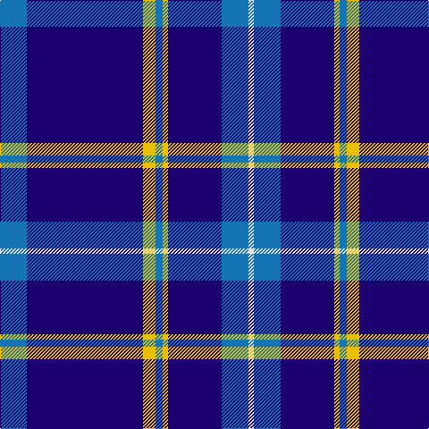

**Bands:** [BBYBYBBW](/stripes/bbybybbw/) · **Stripes:** [B DB LY B LY DB B W](/stripes/stripes8/) B DB LY B LY DB B W

This was sourced from tartans-authority.  It is a [8 band tartan](/bands/bands8/).

Original link http://www.tartansauthority.com/tartan-ferret/display/8031/

## Thread count
B/30 DB130 Y14 B8 Y6 DB60 B30 LN/6

## Palette
Each colour and its ΔE from the base-6 reference it is a variant of.

| Colour | Shade | Base | ΔE (OKLab) |
|---|---|---|---|
| B | <code style="background-color:#1474B4;">#1474B4</code> `#1474B4` | B <code style="background-color:#2A418A;">#2A418A</code> | 0.15 |
| DB | <code style="background-color:#1C0070;">#1C0070</code> `#1C0070` | B <code style="background-color:#2A418A;">#2A418A</code> | 0.14 |
| LN | <code style="background-color:#E0E0E0;">#E0E0E0</code> `#E0E0E0` | W <code style="background-color:#F7F7F7;">#F7F7F7</code> | 0.07 |
| Y | <code style="background-color:#E8C000;">#E8C000</code> `#E8C000` | Y <code style="background-color:#F2BF00;">#F2BF00</code> | 0.02 |

# Sample pattern

## Nearest tartans

The nearest existing variants by ΔTartan distance.

1. [French Freemasons' Pride](/setts/s6/db128r8g41n4g4n4/) — ΔT 1.25
1. [Indigo Blue Works](/setts/s11/db9k1db4k1db18b5k1b1k1b5db4~x2/) — ΔT 1.28
1. [Prince George's Police Pipe Band](/setts/s8/db42r2y16r2db6r2y8lo3~x2/) — ΔT 1.33
1. [Baker Family Tartan Tartan Number: 613. Earliest known date: pre 2003 STS notes 'Sample in trade specimens file.' See products available Copyright © Blair Urquhart, Comrie, 2015](/setts/s8/db28dr3w1dr3db4w2dp1w5~x4/) — ΔT 1.35
1. [Blue Rust](/setts/s8/db21n2w1n2db1r2db1o6~x4/) — ΔT 1.35
1. [RAAF](/setts/s9/db66w2db10w2db10w2db12r3t24~x2/) — ΔT 1.37
1. [Calum's Cabin](/setts/s9/db32ly4db12db2db4db2o16db67ly6/) — ΔT 1.38
1. [Masai Shuka 29 (Artefact)](/setts/s8/r5db20r3db20k6db3lb2db1~x2/) — ΔT 1.42
1. [Tokyo Bluebells](/setts/s8/db18r1db1r1db1k7db13w2~x4/) — ΔT 1.44
1. [Christopher Newport University](/setts/s9/db5k1lb2k1w6k1lb2db25lb2~x2/) — ΔT 1.45

## Neighbour map

Every grey dot is one of 14299 variants placed by the first two principal components of the ΔTartan feature space (44% of its variance). Red is this tartan; blue dots are its nearest — click one to open its page.

<svg viewBox="0 0 640 380" role="img" style="max-width:100%;height:auto;border:1px solid #e0e0e0;border-radius:4px;display:block" xmlns="http://www.w3.org/2000/svg"><image href="/nn/cloud.v1.png" width="640" height="380"/><a href="/setts/s6/db128r8g41n4g4n4/"><circle cx="455.7" cy="150.7" r="4" fill="#3465a4"><title>French Freemasons' Pride</title></circle></a><a href="/setts/s11/db9k1db4k1db18b5k1b1k1b5db4~x2/"><circle cx="358.2" cy="163.0" r="4" fill="#3465a4"><title>Indigo Blue Works</title></circle></a><a href="/setts/s8/db42r2y16r2db6r2y8lo3~x2/"><circle cx="365.8" cy="146.2" r="4" fill="#3465a4"><title>Prince George's Police Pipe Band</title></circle></a><a href="/setts/s8/db28dr3w1dr3db4w2dp1w5~x4/"><circle cx="428.3" cy="122.3" r="4" fill="#3465a4"><title>Baker Family Tartan Tartan Number: 613. Earliest known date: pre 2003 STS notes 'Sample in trade specimens file.' See products available Copyright © Blair Urquhart, Comrie, 2015</title></circle></a><a href="/setts/s8/db21n2w1n2db1r2db1o6~x4/"><circle cx="383.4" cy="133.4" r="4" fill="#3465a4"><title>Blue Rust</title></circle></a><a href="/setts/s9/db66w2db10w2db10w2db12r3t24~x2/"><circle cx="494.9" cy="133.7" r="4" fill="#3465a4"><title>RAAF</title></circle></a><a href="/setts/s9/db32ly4db12db2db4db2o16db67ly6/"><circle cx="467.7" cy="140.5" r="4" fill="#3465a4"><title>Calum's Cabin</title></circle></a><a href="/setts/s8/r5db20r3db20k6db3lb2db1~x2/"><circle cx="453.2" cy="175.9" r="4" fill="#3465a4"><title>Masai Shuka 29 (Artefact)</title></circle></a><a href="/setts/s8/db18r1db1r1db1k7db13w2~x4/"><circle cx="460.5" cy="168.5" r="4" fill="#3465a4"><title>Tokyo Bluebells</title></circle></a><a href="/setts/s9/db5k1lb2k1w6k1lb2db25lb2~x2/"><circle cx="382.0" cy="115.8" r="4" fill="#3465a4"><title>Christopher Newport University</title></circle></a><circle cx="406.2" cy="161.6" r="5" fill="#c00000"/></svg>

ID: /setts/s8/b15db65ly7b4ly3db30b15w3~x2/
