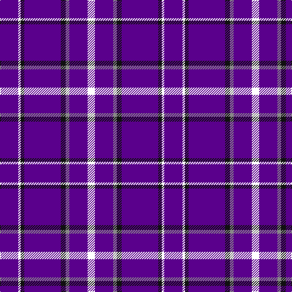

In pattern [BWKBKRBW](/patterns/bwkbkrbw/).

This was sourced from register-of-tartans.  It is a [8 stripes tartan](/stripes/stripes8/).

Original link https://www.tartanregister.gov.uk/tartanDetails.aspx?ref=10894

## Thread count
P/30 W4 K6 P60 K8 N6 P30 W/12

## Palette
Each colour and its ΔE from the base-6 reference it is a variant of.

| Colour | Shade | Base | ΔE (OKLab) |
|---|---|---|---|
| K | <code style="background-color:#101010;">#101010</code> `#101010` | K <code style="background-color:#000000;">#000000</code> | 0.17 |
| N | <code style="background-color:#888888;">#888888</code> `#888888` | R <code style="background-color:#CC0000;">#CC0000</code> | 0.24 |
| P | <code style="background-color:#5A008C;">#5A008C</code> `#5A008C` | B <code style="background-color:#2A418A;">#2A418A</code> | 0.13 |
| W | <code style="background-color:#FFFFFF;">#FFFFFF</code> `#FFFFFF` | W <code style="background-color:#F7F7F7;">#F7F7F7</code> | 0.02 |

# Sample pattern

## Nearest tartans

The nearest existing variants by ΔTartan distance.

1. [Stephen F Austin State University](/setts/s8/b15w2k3b30k4r3b15w6x2~b780078-k101010-r888888-wfcfcfc/) — ΔT 1.18
1. [Kansas State University](/setts/s9/b60k10b6y6b6w4b4k15b15~b5a008c-k101010-wffffff-yb0b0b0/) — ΔT 1.28
1. [Masai Shuka 29 (Artefact)](/setts/s8/r5b20r3b20k6b3w2b1x2~b2c2c80-k000000-rc80000-w98c8e8/) — ΔT 1.70
1. [Newton Primary School](/setts/s9/b26r3b3w2b3r3b6r6y2x4~b2c2c80-rc80000-we0e0e0-ye8c000/) — ΔT 1.78
1. [Steffen, Morris (Personal)](/setts/s6/b35w4b10r3ra3r3x4~b2c2c80-r901c38-rac80000-we0e0e0/) — ΔT 1.84
1. [Clackson (Personal)](/setts/s13/b24r2b8w5b4y5b4w5b4y5b8r2b24x2~b2c2c80-rc80000-we0e0e0-ye8c000/) — ΔT 1.97
1. [Louisville Fire & Rescue P&D](/setts/s9/w1b8r3b2r1b2r3b8y1x4~b2c2c80-rc80000-we0e0e0-ybc8c00/) — ΔT 2.04
1. [Nike ACG Lunarstorm (Fashion)](/setts/s7/b8r2b18r1b2w10b4x2~b2c2c80-rc80000-wf8f8f8/) — ΔT 2.05
1. [Scottish Qualifications Auth. (Corp)](/setts/s7/b36y5b8w3b8w10b3x2~b202060-wc0c0c0-yd87c00/) — ΔT 2.07
1. [Instakilt, Blue (Fashion)](/setts/s7/b8w4b50k12b4k15r5x2~b6840fc-k101010-re40018-wf8f8f8/) — ΔT 2.08

## Neighbour map

Every grey dot is one of 15726 variants placed by the first two principal components of the ΔTartan feature space (44% of its variance). Red is this tartan; blue dots are its nearest — click one to open its page.

<svg viewBox="0 0 640 380" role="img" style="max-width:100%;height:auto;border:1px solid #e0e0e0;border-radius:4px;display:block" xmlns="http://www.w3.org/2000/svg"><image href="/nn/cloud.v1.png" width="640" height="380"/><a href="/setts/s8/b15w2k3b30k4r3b15w6x2~b780078-k101010-r888888-wfcfcfc/"><circle cx="460.0" cy="174.0" r="4" fill="#3465a4"><title>Stephen F Austin State University</title></circle></a><a href="/setts/s9/b60k10b6y6b6w4b4k15b15~b5a008c-k101010-wffffff-yb0b0b0/"><circle cx="453.8" cy="165.2" r="4" fill="#3465a4"><title>Kansas State University</title></circle></a><a href="/setts/s8/r5b20r3b20k6b3w2b1x2~b2c2c80-k000000-rc80000-w98c8e8/"><circle cx="451.2" cy="178.5" r="4" fill="#3465a4"><title>Masai Shuka 29 (Artefact)</title></circle></a><a href="/setts/s9/b26r3b3w2b3r3b6r6y2x4~b2c2c80-rc80000-we0e0e0-ye8c000/"><circle cx="425.5" cy="164.9" r="4" fill="#3465a4"><title>Newton Primary School</title></circle></a><a href="/setts/s6/b35w4b10r3ra3r3x4~b2c2c80-r901c38-rac80000-we0e0e0/"><circle cx="493.1" cy="199.4" r="4" fill="#3465a4"><title>Steffen, Morris (Personal)</title></circle></a><a href="/setts/s13/b24r2b8w5b4y5b4w5b4y5b8r2b24x2~b2c2c80-rc80000-we0e0e0-ye8c000/"><circle cx="410.1" cy="167.6" r="4" fill="#3465a4"><title>Clackson (Personal)</title></circle></a><a href="/setts/s9/w1b8r3b2r1b2r3b8y1x4~b2c2c80-rc80000-we0e0e0-ybc8c00/"><circle cx="380.8" cy="210.2" r="4" fill="#3465a4"><title>Louisville Fire &amp; Rescue P&amp;D</title></circle></a><a href="/setts/s7/b8r2b18r1b2w10b4x2~b2c2c80-rc80000-wf8f8f8/"><circle cx="407.1" cy="190.7" r="4" fill="#3465a4"><title>Nike ACG Lunarstorm (Fashion)</title></circle></a><a href="/setts/s7/b36y5b8w3b8w10b3x2~b202060-wc0c0c0-yd87c00/"><circle cx="451.9" cy="207.7" r="4" fill="#3465a4"><title>Scottish Qualifications Auth. (Corp)</title></circle></a><a href="/setts/s7/b8w4b50k12b4k15r5x2~b6840fc-k101010-re40018-wf8f8f8/"><circle cx="348.9" cy="173.9" r="4" fill="#3465a4"><title>Instakilt, Blue (Fashion)</title></circle></a><circle cx="450.5" cy="178.6" r="5" fill="#c00000"/></svg>

ID: /setts/s8/b15w2k3b30k4r3b15w6x2~b5a008c-k101010-r888888-wffffff/
