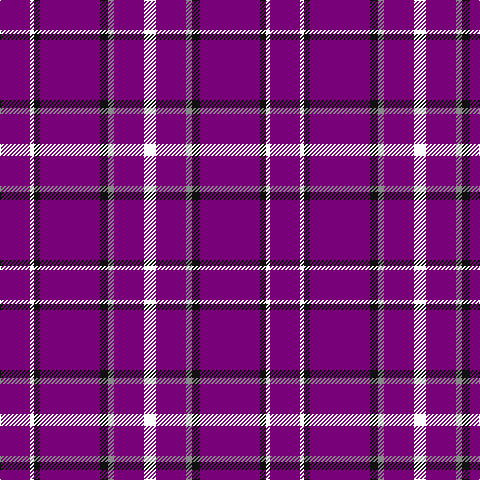

In pattern [BWKBKRBW](/patterns/bwkbkrbw/).

This was sourced from tartans-authority.  It is a [8 stripes tartan](/stripes/stripes8/).

Original link http://www.tartansauthority.com/tartan-ferret/display/10894/

## Thread count
P/30 W4 K6 P60 K8 N6 P30 W/12

## Palette
Each colour and its ΔE from the base-6 reference it is a variant of.

| Colour | Shade | Base | ΔE (OKLab) |
|---|---|---|---|
| K | <code style="background-color:#101010;">#101010</code> `#101010` | K <code style="background-color:#000000;">#000000</code> | 0.17 |
| N | <code style="background-color:#888888;">#888888</code> `#888888` | R <code style="background-color:#CC0000;">#CC0000</code> | 0.24 |
| P | <code style="background-color:#780078;">#780078</code> `#780078` | B <code style="background-color:#2A418A;">#2A418A</code> | 0.17 |
| W | <code style="background-color:#FCFCFC;">#FCFCFC</code> `#FCFCFC` | W <code style="background-color:#F7F7F7;">#F7F7F7</code> | 0.01 |

# Sample pattern

## Nearest tartans

The nearest existing variants by ΔTartan distance.

1. [Stephen F Austin State University](/setts/s8/b15w2k3b30k4r3b15w6x2~b5a008c-k101010-r888888-wffffff/) — ΔT 1.18
1. [Kansas State University](/setts/s9/b60k10b6y6b6w4b4k15b15~b5a008c-k101010-wffffff-yb0b0b0/) — ΔT 1.72
1. [Newton Primary School](/setts/s9/b26r3b3w2b3r3b6r6y2x4~b2c2c80-rc80000-we0e0e0-ye8c000/) — ΔT 1.90
1. [Glen App Trade Tartan Tartan Number: 636. Earliest known date: pre 2003 A fashion check See products available Copyright © Blair Urquhart, Comrie, 2015](/setts/s5/b37w9b3ba9w3x2~b780078-ba480800-we0e0e0/) — ΔT 2.04
1. [Orlando Fire Department (Corporate)](/setts/s9/b12y1r16b1r1b14r3b14y1x4~b2c2c80-rc80000-ye8c000/) — ΔT 2.08
1. [Louisville Fire & Rescue P&D](/setts/s9/w1b8r3b2r1b2r3b8y1x4~b2c2c80-rc80000-we0e0e0-ybc8c00/) — ΔT 2.08
1. [Glen App](/setts/s5/b37w9b3r9w3x2~b800080-r703000-we0e0e0/) — ΔT 2.08
1. [Masai Shuka 29 (Artefact)](/setts/s8/r5b20r3b20k6b3w2b1x2~b2c2c80-k000000-rc80000-w98c8e8/) — ΔT 2.21
1. [Cornell (Corporate)](/setts/s8/r74w27r13y7r13w13r74k7~k101010-r901c38-we0e0e0-ya0a0a0/) — ΔT 2.23
1. [South Australian Pipes & Drums (Corp](/setts/s6/b60y6b11r25b11y6x2~b2c2c80-rc80000-ye8c000/) — ΔT 2.24

## Neighbour map

Every grey dot is one of 15726 variants placed by the first two principal components of the ΔTartan feature space (44% of its variance). Red is this tartan; blue dots are its nearest — click one to open its page.

<svg viewBox="0 0 640 380" role="img" style="max-width:100%;height:auto;border:1px solid #e0e0e0;border-radius:4px;display:block" xmlns="http://www.w3.org/2000/svg"><image href="/nn/cloud.v1.png" width="640" height="380"/><a href="/setts/s8/b15w2k3b30k4r3b15w6x2~b5a008c-k101010-r888888-wffffff/"><circle cx="450.5" cy="178.6" r="4" fill="#3465a4"><title>Stephen F Austin State University</title></circle></a><a href="/setts/s9/b60k10b6y6b6w4b4k15b15~b5a008c-k101010-wffffff-yb0b0b0/"><circle cx="453.8" cy="165.2" r="4" fill="#3465a4"><title>Kansas State University</title></circle></a><a href="/setts/s9/b26r3b3w2b3r3b6r6y2x4~b2c2c80-rc80000-we0e0e0-ye8c000/"><circle cx="425.5" cy="164.9" r="4" fill="#3465a4"><title>Newton Primary School</title></circle></a><a href="/setts/s5/b37w9b3ba9w3x2~b780078-ba480800-we0e0e0/"><circle cx="396.6" cy="199.3" r="4" fill="#3465a4"><title>Glen App Trade Tartan Tartan Number: 636. Earliest known date: pre 2003 A fashion check See products available Copyright © Blair Urquhart, Comrie, 2015</title></circle></a><a href="/setts/s9/b12y1r16b1r1b14r3b14y1x4~b2c2c80-rc80000-ye8c000/"><circle cx="419.1" cy="194.0" r="4" fill="#3465a4"><title>Orlando Fire Department (Corporate)</title></circle></a><a href="/setts/s9/w1b8r3b2r1b2r3b8y1x4~b2c2c80-rc80000-we0e0e0-ybc8c00/"><circle cx="380.8" cy="210.2" r="4" fill="#3465a4"><title>Louisville Fire &amp; Rescue P&amp;D</title></circle></a><a href="/setts/s5/b37w9b3r9w3x2~b800080-r703000-we0e0e0/"><circle cx="402.3" cy="199.5" r="4" fill="#3465a4"><title>Glen App</title></circle></a><a href="/setts/s8/r5b20r3b20k6b3w2b1x2~b2c2c80-k000000-rc80000-w98c8e8/"><circle cx="451.2" cy="178.5" r="4" fill="#3465a4"><title>Masai Shuka 29 (Artefact)</title></circle></a><a href="/setts/s8/r74w27r13y7r13w13r74k7~k101010-r901c38-we0e0e0-ya0a0a0/"><circle cx="451.7" cy="181.7" r="4" fill="#3465a4"><title>Cornell (Corporate)</title></circle></a><a href="/setts/s6/b60y6b11r25b11y6x2~b2c2c80-rc80000-ye8c000/"><circle cx="408.9" cy="220.0" r="4" fill="#3465a4"><title>South Australian Pipes &amp; Drums (Corp</title></circle></a><circle cx="460.0" cy="174.0" r="5" fill="#c00000"/></svg>

ID: /setts/s8/b15w2k3b30k4r3b15w6x2~b780078-k101010-r888888-wfcfcfc/
