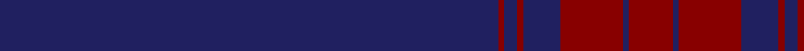

In pattern [BRBRBRBR](/patterns/brbrbrbr/).

This was sourced from tartans-authority.  It is a [8 stripes tartan](/stripes/stripes8/).

Original link http://www.tartansauthority.com/tartan-ferret/display/10795/

## Thread count
DB/160 DR2 DB4 DR2 DB12 DR20 DB2 DR/14

## Palette
Each colour and its ΔE from the base-6 reference it is a variant of.

| Colour | Shade | Base | ΔE (OKLab) |
|---|---|---|---|
| DB | <code style="background-color:#202060;">#202060</code> `#202060` | B <code style="background-color:#2A418A;">#2A418A</code> | 0.11 |
| DR | <code style="background-color:#880000;">#880000</code> `#880000` | R <code style="background-color:#CC0000;">#CC0000</code> | 0.15 |

# Sample pattern

## Nearest tartans

The nearest existing variants by ΔTartan distance.

1. [Webster, Colin Wesley (Personal)](/setts/s10/k200b10k8b6k4g2k4b4k8b10-b780078-g5c6428-k101010/) — ΔT 2.22
1. [Loch Monar (Fashion)](/setts/s11/b84b20b4b4r4b4b20r12b4r6b4-b1c0070-r800028/) — ΔT 2.25
1. [Norwich No.030](/setts/s6/b66g6r2b66g6r2-b2c2c80-g006818-rc80000/) — ΔT 2.35
1. [Lewis Welsh Name Tartan Tartan Number: 5758. Earliest known date: 22002 The tartan for this Welsh surname and its variations, Lewis, Lewys, Lou, Louis, Lew, Lewes, is actually woven in Wales at the Cambrian Woollen Mill, weaving on the same site since 1830. This tartan differs from many traditional patterns in that the warp and weft differ, giving the finished worsted wool cloth more of a predominant stripe, vertically noticeable in the finished Kilt, or Cilt in Wales. See products available Copyright © Blair Urquhart, Comrie, 2015](/setts/s7/b112y4g38y2g4y2b4-b202060-g005c34-ya08858/) — ΔT 2.55
1. [Laird (Restricted)](/setts/s9/k150g4k8b20ba2b8ba2b8k8-b780078-ba2c2c80-g006818-k101010/) — ΔT 2.57
1. [Lynch](/setts/s6/r38b12r14b202g12b14-b304080-g006030-rc00000/) — ΔT 2.63
1. [Callaghan](/setts/s7/k10r2k82g16k16y2k10-g003820-k00002c-r943030-yb8a82c/) — ΔT 2.66
1. [Selkirk Silver Band (Corporate)](/setts/s10/k150r2k8b30k4b2k6ba2k4r2-b5c5c5c-ba1c0070-k101010-r880000/) — ΔT 2.75
1. [Auchairne (Corporate)](/setts/s6/b22ba14b6ba140w8ba12-b1474b4-ba1c1c50-w98c8e8/) — ΔT 2.77
1. [Cullen (Christian Hill)](/setts/s7/b16y4b16g14b114k6ba2-b202060-ba5c8ca8-g285800-k101010-yd09800/) — ΔT 2.80

## Neighbour map

Every grey dot is one of 15726 variants placed by the first two principal components of the ΔTartan feature space (44% of its variance). Red is this tartan; blue dots are its nearest — click one to open its page.

<svg viewBox="0 0 640 380" role="img" style="max-width:100%;height:auto;border:1px solid #e0e0e0;border-radius:4px;display:block" xmlns="http://www.w3.org/2000/svg"><image href="/nn/cloud.v1.png" width="640" height="380"/><a href="/setts/s10/k200b10k8b6k4g2k4b4k8b10-b780078-g5c6428-k101010/"><circle cx="626.0" cy="140.4" r="4" fill="#3465a4"><title>Webster, Colin Wesley (Personal)</title></circle></a><a href="/setts/s11/b84b20b4b4r4b4b20r12b4r6b4-b1c0070-r800028/"><circle cx="626.0" cy="202.6" r="4" fill="#3465a4"><title>Loch Monar (Fashion)</title></circle></a><a href="/setts/s6/b66g6r2b66g6r2-b2c2c80-g006818-rc80000/"><circle cx="626.0" cy="218.1" r="4" fill="#3465a4"><title>Norwich No.030</title></circle></a><a href="/setts/s7/b112y4g38y2g4y2b4-b202060-g005c34-ya08858/"><circle cx="577.7" cy="161.3" r="4" fill="#3465a4"><title>Lewis Welsh Name Tartan Tartan Number: 5758. Earliest known date: 22002 The tartan for this Welsh surname and its variations, Lewis, Lewys, Lou, Louis, Lew, Lewes, is actually woven in Wales at the Cambrian Woollen Mill, weaving on the same site since 1830. This tartan differs from many traditional patterns in that the warp and weft differ, giving the finished worsted wool cloth more of a predominant stripe, vertically noticeable in the finished Kilt, or Cilt in Wales. See products available Copyright © Blair Urquhart, Comrie, 2015</title></circle></a><a href="/setts/s9/k150g4k8b20ba2b8ba2b8k8-b780078-ba2c2c80-g006818-k101010/"><circle cx="626.0" cy="125.0" r="4" fill="#3465a4"><title>Laird (Restricted)</title></circle></a><a href="/setts/s6/r38b12r14b202g12b14-b304080-g006030-rc00000/"><circle cx="593.8" cy="205.9" r="4" fill="#3465a4"><title>Lynch</title></circle></a><a href="/setts/s7/k10r2k82g16k16y2k10-g003820-k00002c-r943030-yb8a82c/"><circle cx="626.0" cy="187.1" r="4" fill="#3465a4"><title>Callaghan</title></circle></a><a href="/setts/s10/k150r2k8b30k4b2k6ba2k4r2-b5c5c5c-ba1c0070-k101010-r880000/"><circle cx="626.0" cy="121.0" r="4" fill="#3465a4"><title>Selkirk Silver Band (Corporate)</title></circle></a><a href="/setts/s6/b22ba14b6ba140w8ba12-b1474b4-ba1c1c50-w98c8e8/"><circle cx="611.6" cy="193.9" r="4" fill="#3465a4"><title>Auchairne (Corporate)</title></circle></a><a href="/setts/s7/b16y4b16g14b114k6ba2-b202060-ba5c8ca8-g285800-k101010-yd09800/"><circle cx="626.0" cy="144.2" r="4" fill="#3465a4"><title>Cullen (Christian Hill)</title></circle></a><circle cx="626.0" cy="174.7" r="5" fill="#c00000"/></svg>

ID: /setts/s8/b160r2b4r2b12r20b2r14-b202060-r880000/
