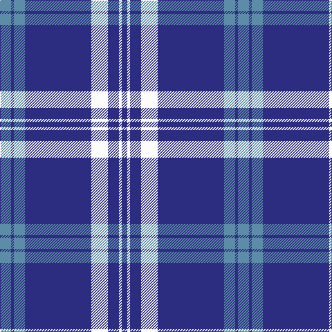

In pattern [BBBBWBWB](/patterns/bbbbwbwb/).

This was sourced from register-of-tartans.  It is a [8 stripes tartan](/stripes/stripes8/).

Original link https://www.tartanregister.gov.uk/tartanDetails.aspx?ref=95

## Thread count
B/16 DB4 B16 DB96 W24 DB16 W4 DB/8

## Palette
Each colour and its ΔE from the base-6 reference it is a variant of.

| Colour | Shade | Base | ΔE (OKLab) |
|---|---|---|---|
| B | <code style="background-color:#5C8CA8;">#5C8CA8</code> `#5C8CA8` | B <code style="background-color:#2A418A;">#2A418A</code> | 0.23 |
| DB | <code style="background-color:#2C2C80;">#2C2C80</code> `#2C2C80` | B <code style="background-color:#2A418A;">#2A418A</code> | 0.06 |
| W | <code style="background-color:#FCFCFC;">#FCFCFC</code> `#FCFCFC` | W <code style="background-color:#F7F7F7;">#F7F7F7</code> | 0.01 |

# Sample pattern

## Nearest tartans

The nearest existing variants by ΔTartan distance.

1. [Gonzaga University's True Blue and W](/setts/s7/w12b4w6b4g4b40r2-b2c2c80-g006818-rc80000-wfcfcfc/) — ΔT 1.13
1. [University of North Carolina at Greensboro, The](/setts/s9/b96y11b8y11b16y6w4y16w8-b2c2c80-wfcfcfc-ye8c000/) — ΔT 1.21
1. [Baker Family Tartan Tartan Number: 613. Earliest known date: pre 2003 STS notes 'Sample in trade specimens file.' See products available Copyright © Blair Urquhart, Comrie, 2015](/setts/s8/b112ba12w4ba12b16w8bb4w20-b2c2c80-ba480800-bb780078-we0e0e0/) — ΔT 1.22
1. [Baker Dress Family Tartan Tartan Number: 2180. Earliest known date: 1999 STS notes 'Sample in trade specimens file.' See products available Copyright © Blair Urquhart, Comrie, 2015](/setts/s8/b112y12w4y12b16w8r4w20-b2c2c80-rc80000-we0e0e0-ye8c000/) — ΔT 1.23
1. [Unidentified Tartan Tartan Number: 622. Earliest known date: Carmichael collection. See products available Copyright © Blair Urquhart, Comrie, 2015](/setts/s10/b10w24b8w8b8w6b74w6b6r8-b2c2c80-rc80000-we0e0e0/) — ΔT 1.25
1. [Loevenstein Castle #3](/setts/s6/b80r2y8r4b16y48-b00008c-r8c0000-yb0b0b0/) — ΔT 1.27
1. [Christopher Newport University](/setts/s9/b10k2w4k2wa12k2w4b50w4-b202060-k101010-wc0c0c0-wafcfcfc/) — ΔT 1.32
1. [Baker](/setts/s8/b112r12w4r12b16w8ba4w20-b304080-ba800080-r703000-we0e0e0/) — ΔT 1.33
1. [Unidentified #26](/setts/s10/b10w24b8w8b8w6b74w6b6r8-b2c4084-rdc0000-we0e0e0/) — ΔT 1.35
1. [Nike ACG Lunarstorm (Fashion)](/setts/s7/b16r4b36r2b4w20b8-b2c2c80-rc80000-wf8f8f8/) — ΔT 1.37

## Neighbour map

Every grey dot is one of 15726 variants placed by the first two principal components of the ΔTartan feature space (44% of its variance). Red is this tartan; blue dots are its nearest — click one to open its page.

<svg viewBox="0 0 640 380" role="img" style="max-width:100%;height:auto;border:1px solid #e0e0e0;border-radius:4px;display:block" xmlns="http://www.w3.org/2000/svg"><image href="/nn/cloud.v1.png" width="640" height="380"/><a href="/setts/s7/w12b4w6b4g4b40r2-b2c2c80-g006818-rc80000-wfcfcfc/"><circle cx="377.9" cy="140.3" r="4" fill="#3465a4"><title>Gonzaga University's True Blue and W</title></circle></a><a href="/setts/s9/b96y11b8y11b16y6w4y16w8-b2c2c80-wfcfcfc-ye8c000/"><circle cx="423.3" cy="130.8" r="4" fill="#3465a4"><title>University of North Carolina at Greensboro, The</title></circle></a><a href="/setts/s8/b112ba12w4ba12b16w8bb4w20-b2c2c80-ba480800-bb780078-we0e0e0/"><circle cx="425.0" cy="121.5" r="4" fill="#3465a4"><title>Baker Family Tartan Tartan Number: 613. Earliest known date: pre 2003 STS notes 'Sample in trade specimens file.' See products available Copyright © Blair Urquhart, Comrie, 2015</title></circle></a><a href="/setts/s8/b112y12w4y12b16w8r4w20-b2c2c80-rc80000-we0e0e0-ye8c000/"><circle cx="409.9" cy="113.1" r="4" fill="#3465a4"><title>Baker Dress Family Tartan Tartan Number: 2180. Earliest known date: 1999 STS notes 'Sample in trade specimens file.' See products available Copyright © Blair Urquhart, Comrie, 2015</title></circle></a><a href="/setts/s10/b10w24b8w8b8w6b74w6b6r8-b2c2c80-rc80000-we0e0e0/"><circle cx="389.7" cy="157.0" r="4" fill="#3465a4"><title>Unidentified Tartan Tartan Number: 622. Earliest known date: Carmichael collection. See products available Copyright © Blair Urquhart, Comrie, 2015</title></circle></a><a href="/setts/s6/b80r2y8r4b16y48-b00008c-r8c0000-yb0b0b0/"><circle cx="400.5" cy="155.5" r="4" fill="#3465a4"><title>Loevenstein Castle #3</title></circle></a><a href="/setts/s9/b10k2w4k2wa12k2w4b50w4-b202060-k101010-wc0c0c0-wafcfcfc/"><circle cx="386.7" cy="112.9" r="4" fill="#3465a4"><title>Christopher Newport University</title></circle></a><a href="/setts/s8/b112r12w4r12b16w8ba4w20-b304080-ba800080-r703000-we0e0e0/"><circle cx="432.7" cy="123.8" r="4" fill="#3465a4"><title>Baker</title></circle></a><a href="/setts/s10/b10w24b8w8b8w6b74w6b6r8-b2c4084-rdc0000-we0e0e0/"><circle cx="392.9" cy="158.4" r="4" fill="#3465a4"><title>Unidentified #26</title></circle></a><a href="/setts/s7/b16r4b36r2b4w20b8-b2c2c80-rc80000-wf8f8f8/"><circle cx="408.5" cy="185.0" r="4" fill="#3465a4"><title>Nike ACG Lunarstorm (Fashion)</title></circle></a><circle cx="414.0" cy="150.5" r="5" fill="#c00000"/></svg>

ID: /setts/s8/b16ba4b16ba96w24ba16w4ba8-b5c8ca8-ba2c2c80-wfcfcfc/
