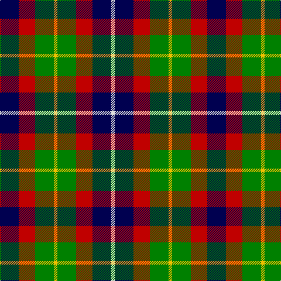

In pattern [BRGYGRBW](/patterns/brgygrbw/).

This was sourced from weddslist.  It is a [8 stripes tartan](/stripes/stripes8/).

Original link http://www.weddslist.com/cgi-bin/tartans/pg.pl?source=sts

## Thread count
DB/32 R28 G32 Y6 G32 R28 DB32 LN/6

## Palette
Each colour and its ΔE from the base-6 reference it is a variant of.

| Colour | Shade | Base | ΔE (OKLab) |
|---|---|---|---|
| DB | <code style="background-color:#000050;">#000050</code> `#000050` | B <code style="background-color:#2A418A;">#2A418A</code> | 0.21 |
| G | <code style="background-color:#008000;">#008000</code> `#008000` | G <code style="background-color:#006100;">#006100</code> | 0.10 |
| LN | <code style="background-color:#E0E0E0;">#E0E0E0</code> `#E0E0E0` | W <code style="background-color:#F7F7F7;">#F7F7F7</code> | 0.07 |
| R | <code style="background-color:#C00000;">#C00000</code> `#C00000` | R <code style="background-color:#CC0000;">#CC0000</code> | 0.03 |
| Y | <code style="background-color:#F0C000;">#F0C000</code> `#F0C000` | Y <code style="background-color:#F2BF00;">#F2BF00</code> | 0.00 |

# Sample pattern

## Nearest tartans

The nearest existing variants by ΔTartan distance.

1. [Forrester (James) (Personal)](/setts/s8/b16r14g16y3g16r14b16w3~b202060-g006818-rc80000-we0e0e0-ye8c000~x2/) — ΔT 0.75
1. [Wilson's, No 120](/setts/s7/k12g12w2g12k12b12r3~b800080-g008000-k000000-rc00000-we0e0e0~x2/) — ΔT 1.17
1. [Wilson's No.194](/setts/s10/b3w1k3g5r1k3r1g5k3w1~b440044-g006818-k101010-rc80000-we0e0e0~x2/) — ΔT 1.20
1. [Selkirk (Personal) Original](/setts/s8/b11g2k10ga10y2ga10k10g2~b780078-g789484-ga006818-k101010-yd09800~x2/) — ΔT 1.26
1. [Thompson's Fancy (Fashion)](/setts/s6/r1g6b2w4k4w1~b1c0070-g604000-k101010-r880000-w98c8e8~x6/) — ΔT 1.27
1. [Wilson's, No 194](/setts/s6/b3w1k3g5r1k3~b800080-g008000-k000000-rc00000-we0e0e0~x2/) — ΔT 1.28
1. [Ramsay (Orange)](/setts/s7/k4y9k13g6y3g9w4~g006818-k101010-we0e0e0-yd87c00~x2/) — ΔT 1.29
1. [Wilson's No.217](/setts/s8/b11ba2k10g10y3g10k10ba2~b440044-ba2888c4-g006818-k101010-ye8c000~x2/) — ΔT 1.30
1. [MacLaren](/setts/s7/b9k7g5r4g7k1y1~b800080-g008000-k000000-rc00020-yf0c000~x2/) — ΔT 1.30
1. [Cooke](/setts/s7/k6b2ba12g8r5k2g3~b8080d0-ba304080-g008000-k000000-rc00020~x4/) — ΔT 1.30

## Neighbour map

Every grey dot is one of 15726 variants placed by the first two principal components of the ΔTartan feature space (44% of its variance). Red is this tartan; blue dots are its nearest — click one to open its page.

<svg viewBox="0 0 640 380" role="img" style="max-width:100%;height:auto;border:1px solid #e0e0e0;border-radius:4px;display:block" xmlns="http://www.w3.org/2000/svg"><image href="/nn/cloud.v1.png" width="640" height="380"/><a href="/setts/s8/b16r14g16y3g16r14b16w3~b202060-g006818-rc80000-we0e0e0-ye8c000~x2/"><circle cx="90.7" cy="238.6" r="4" fill="#3465a4"><title>Forrester (James) (Personal)</title></circle></a><a href="/setts/s7/k12g12w2g12k12b12r3~b800080-g008000-k000000-rc00000-we0e0e0~x2/"><circle cx="89.4" cy="236.9" r="4" fill="#3465a4"><title>Wilson's, No 120</title></circle></a><a href="/setts/s10/b3w1k3g5r1k3r1g5k3w1~b440044-g006818-k101010-rc80000-we0e0e0~x2/"><circle cx="106.0" cy="219.2" r="4" fill="#3465a4"><title>Wilson's No.194</title></circle></a><a href="/setts/s8/b11g2k10ga10y2ga10k10g2~b780078-g789484-ga006818-k101010-yd09800~x2/"><circle cx="116.0" cy="233.2" r="4" fill="#3465a4"><title>Selkirk (Personal) Original</title></circle></a><a href="/setts/s6/r1g6b2w4k4w1~b1c0070-g604000-k101010-r880000-w98c8e8~x6/"><circle cx="84.6" cy="219.2" r="4" fill="#3465a4"><title>Thompson's Fancy (Fashion)</title></circle></a><a href="/setts/s6/b3w1k3g5r1k3~b800080-g008000-k000000-rc00000-we0e0e0~x2/"><circle cx="81.7" cy="239.4" r="4" fill="#3465a4"><title>Wilson's, No 194</title></circle></a><a href="/setts/s7/k4y9k13g6y3g9w4~g006818-k101010-we0e0e0-yd87c00~x2/"><circle cx="92.4" cy="256.2" r="4" fill="#3465a4"><title>Ramsay (Orange)</title></circle></a><a href="/setts/s8/b11ba2k10g10y3g10k10ba2~b440044-ba2888c4-g006818-k101010-ye8c000~x2/"><circle cx="103.2" cy="237.6" r="4" fill="#3465a4"><title>Wilson's No.217</title></circle></a><a href="/setts/s7/b9k7g5r4g7k1y1~b800080-g008000-k000000-rc00020-yf0c000~x2/"><circle cx="103.8" cy="201.1" r="4" fill="#3465a4"><title>MacLaren</title></circle></a><a href="/setts/s7/k6b2ba12g8r5k2g3~b8080d0-ba304080-g008000-k000000-rc00020~x4/"><circle cx="78.2" cy="218.1" r="4" fill="#3465a4"><title>Cooke</title></circle></a><circle cx="70.3" cy="233.9" r="5" fill="#c00000"/></svg>

ID: /setts/s8/b16r14g16y3g16r14b16w3~b000050-g008000-rc00000-we0e0e0-yf0c000~x2/
