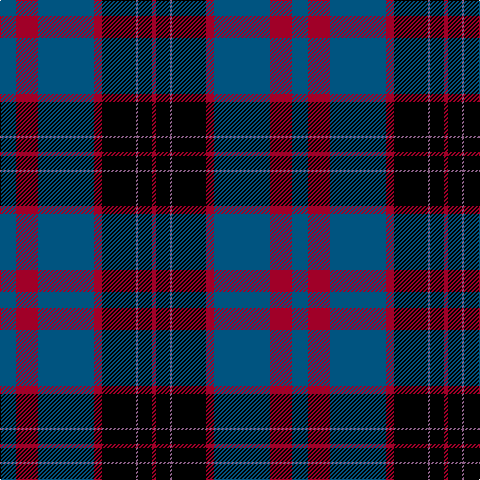

In pattern [BRBRKBKR](/patterns/brbrkbkr/).

This was sourced from tartans-authority.  It is a [8 stripes tartan](/stripes/stripes8/).

Original link http://www.tartansauthority.com/tartan-ferret/display/7669/

## Thread count
DB/16 DR22 DB56 DR8 K34 LP2 K14 DR/4

## Palette
Each colour and its ΔE from the base-6 reference it is a variant of.

| Colour | Shade | Base | ΔE (OKLab) |
|---|---|---|---|
| DB | <code style="background-color:#005480;">#005480</code> `#005480` | B <code style="background-color:#2C4084;">#2C4084</code> | 0.06 |
| DR | <code style="background-color:#A00028;">#A00028</code> `#A00028` | R <code style="background-color:#C80000;">#C80000</code> | 0.09 |
| K | <code style="background-color:#000000;">#000000</code> `#000000` | K <code style="background-color:#000000;">#000000</code> | 0.00 |
| LP | <code style="background-color:#8C6088;">#8C6088</code> `#8C6088` | B <code style="background-color:#2C4084;">#2C4084</code> | 0.19 |

# Sample pattern

ID: /setts/s8/b16r22b56r8k34ba2k14r4-b005480-ba8c6088-k000000-ra00028/
de style="background-color:#000000;">#000000</code> | 0.00 |
| LP | <code style="background-color:#9C70B8;">#9C70B8</code> `#9C70B8` | B <code style="background-color:#2C4084;">#2C4084</code> | 0.24 |
| LPa | <code style="background-color:#8C6088;">#8C6088</code> `#8C6088` | B <code style="background-color:#2C4084;">#2C4084</code> | 0.19 |

# Sample pattern

ID: /setts/s8/b16r22b56r8k34ba2k14r4-b005480-ba8c6088-k000000-ra00028/
