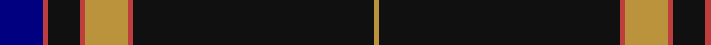

In pattern [BRKRYRKY](/patterns/brkryrky/).

This was sourced from register-of-tartans.  It is a [8 stripes tartan](/stripes/stripes8/).

Original link https://www.tartanregister.gov.uk/tartanDetails.aspx?ref=10635

## Thread count
DB/16 R2 K12 R2 DO16 R2 K90 DO/2

## Palette
Each colour and its ΔE from the base-6 reference it is a variant of.

| Colour | Shade | Base | ΔE (OKLab) |
|---|---|---|---|
| DB | <code style="background-color:#000080;">#000080</code> `#000080` | B <code style="background-color:#2C4084;">#2C4084</code> | 0.14 |
| DO | <code style="background-color:#BC933D;">#BC933D</code> `#BC933D` | Y <code style="background-color:#E8C000;">#E8C000</code> | 0.15 |
| K | <code style="background-color:#101010;">#101010</code> `#101010` | K <code style="background-color:#000000;">#000000</code> | 0.17 |
| R | <code style="background-color:#BE3D3D;">#BE3D3D</code> `#BE3D3D` | R <code style="background-color:#C80000;">#C80000</code> | 0.06 |

# Sample pattern

## Nearest tartans

The nearest existing variants by ΔTartan distance.

1. [degli Uberti, Baron of Cartsburn (P)](/setts/s8/b16r2k12r2y16r2k90y2-b202060-k101010-rc80000-ybc8c00/) — ΔT 0.37
1. [Marine Harvest Scotland (Corporate)](/setts/s8/b20w4k4b2k12w2k90y4-b1474b4-k101010-wc0c0c0-yd87c00/) — ΔT 0.88
1. [American Heritage](/setts/s11/w5k2b14k4r8k4b4k80r6k4r4-b244470-k101010-r880000-wf8f4d0/) — ΔT 0.98
1. [Brooks Brothers Signature (Corporate](/setts/s9/k10y2g14r2k90r10y6k8y6-g003820-k00002c-r880000-ybc8c00/) — ΔT 0.98
1. [Capco](/setts/s8/k124w4k8w8b12k8ba16w8-b14283c-ba5f749c-k1c1714-wf8f8f8/) — ΔT 1.10
1. [Marine Harvest (Scotland)](/setts/s8/b20ba4k4b2k12ba2k90y4-b0000cd-ba778899-k101010-yffa500/) — ΔT 1.14
1. [Grassi (Personal)](/setts/s9/b6ba4r4k120ba4k6ba24k2r6-b780078-ba5c5c5c-k101010-r888888/) — ΔT 1.17
1. [Midnight Glen (Fashion)](/setts/s9/b6k80w6b12k20b20k6w2r6-b542050-k101010-rb45c6c-wd0c4b4/) — ΔT 1.20
1. [Llewellyn (Welsh Name)](/setts/s9/k74r4k7r4k9r40k2r4k2-k101010-r888888/) — ΔT 1.21
1. [Washington County Sheriff’s Office (Oregon)](/setts/s8/b12k12b12ba6w2k78y6k6-b778899-ba0000cd-k101010-wffffff-yffd700/) — ΔT 1.22

## Neighbour map

Every grey dot is one of 15726 variants placed by the first two principal components of the ΔTartan feature space (44% of its variance). Red is this tartan; blue dots are its nearest — click one to open its page.

<svg viewBox="0 0 640 380" role="img" style="max-width:100%;height:auto;border:1px solid #e0e0e0;border-radius:4px;display:block" xmlns="http://www.w3.org/2000/svg"><image href="/nn/cloud.v1.png" width="640" height="380"/><a href="/setts/s8/b16r2k12r2y16r2k90y2-b202060-k101010-rc80000-ybc8c00/"><circle cx="504.1" cy="117.9" r="4" fill="#3465a4"><title>degli Uberti, Baron of Cartsburn (P)</title></circle></a><a href="/setts/s8/b20w4k4b2k12w2k90y4-b1474b4-k101010-wc0c0c0-yd87c00/"><circle cx="536.6" cy="115.9" r="4" fill="#3465a4"><title>Marine Harvest Scotland (Corporate)</title></circle></a><a href="/setts/s11/w5k2b14k4r8k4b4k80r6k4r4-b244470-k101010-r880000-wf8f4d0/"><circle cx="491.8" cy="103.9" r="4" fill="#3465a4"><title>American Heritage</title></circle></a><a href="/setts/s9/k10y2g14r2k90r10y6k8y6-g003820-k00002c-r880000-ybc8c00/"><circle cx="505.5" cy="116.4" r="4" fill="#3465a4"><title>Brooks Brothers Signature (Corporate</title></circle></a><a href="/setts/s8/k124w4k8w8b12k8ba16w8-b14283c-ba5f749c-k1c1714-wf8f8f8/"><circle cx="481.5" cy="116.6" r="4" fill="#3465a4"><title>Capco</title></circle></a><a href="/setts/s8/b20ba4k4b2k12ba2k90y4-b0000cd-ba778899-k101010-yffa500/"><circle cx="547.8" cy="122.3" r="4" fill="#3465a4"><title>Marine Harvest (Scotland)</title></circle></a><a href="/setts/s9/b6ba4r4k120ba4k6ba24k2r6-b780078-ba5c5c5c-k101010-r888888/"><circle cx="548.8" cy="110.7" r="4" fill="#3465a4"><title>Grassi (Personal)</title></circle></a><a href="/setts/s9/b6k80w6b12k20b20k6w2r6-b542050-k101010-rb45c6c-wd0c4b4/"><circle cx="473.5" cy="135.1" r="4" fill="#3465a4"><title>Midnight Glen (Fashion)</title></circle></a><a href="/setts/s9/k74r4k7r4k9r40k2r4k2-k101010-r888888/"><circle cx="419.4" cy="114.6" r="4" fill="#3465a4"><title>Llewellyn (Welsh Name)</title></circle></a><a href="/setts/s8/b12k12b12ba6w2k78y6k6-b778899-ba0000cd-k101010-wffffff-yffd700/"><circle cx="443.9" cy="104.5" r="4" fill="#3465a4"><title>Washington County Sheriff’s Office (Oregon)</title></circle></a><circle cx="496.5" cy="115.9" r="5" fill="#c00000"/></svg>

ID: /setts/s8/b16r2k12r2y16r2k90y2-b000080-k101010-rbe3d3d-ybc933d/
