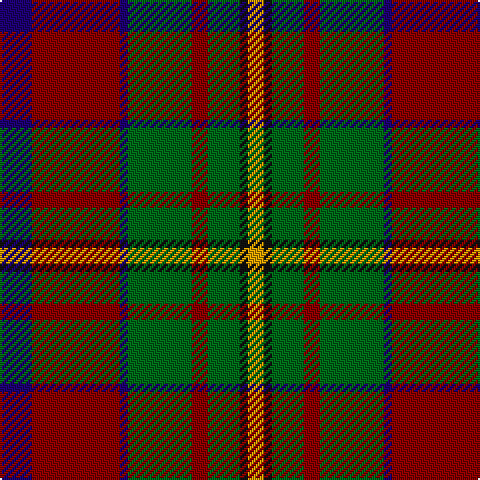

In pattern [BRBGRGKY](/patterns/brbgrgky/).

This was sourced from register-of-tartans.  It is a [8 stripes tartan](/stripes/stripes8/).

Original link https://www.tartanregister.gov.uk/tartanDetails.aspx?ref=789

## Attestations

This cloth appears in 2 source records; the oldest owns this page.

- 01/01/1980 — Craik of Assington (Personal) (register-of-tartans, [record](https://www.tartanregister.gov.uk/tartanDetails.aspx?ref=789))
- 1980 — Craik (Personal) (tartans-authority, [record](http://www.tartansauthority.com/tartan-ferret/display/494/))

## Thread count
DB/16 DR44 DB4 G32 DR8 G16 K4 DY/8

## Palette
Each colour and its ΔE from the base-6 reference it is a variant of.

| Colour | Shade | Base | ΔE (OKLab) |
|---|---|---|---|
| DB | <code style="background-color:#1C0070;">#1C0070</code> `#1C0070` | B <code style="background-color:#2C4084;">#2C4084</code> | 0.14 |
| DR | <code style="background-color:#880000;">#880000</code> `#880000` | R <code style="background-color:#C80000;">#C80000</code> | 0.14 |
| DY | <code style="background-color:#D09800;">#D09800</code> `#D09800` | Y <code style="background-color:#E8C000;">#E8C000</code> | 0.11 |
| G | <code style="background-color:#006818;">#006818</code> `#006818` | G <code style="background-color:#006400;">#006400</code> | 0.02 |
| K | <code style="background-color:#101010;">#101010</code> `#101010` | K <code style="background-color:#000000;">#000000</code> | 0.17 |

# Sample pattern

## Nearest tartans

The nearest existing variants by ΔTartan distance.

1. [Caledonian Brewery (Corporate)](/setts/s7/w8g26ga12r32wa4r4ga4-g003820-ga006818-r880000-wc0c0c0-waa8ace8/) — ΔT 0.69
1. [Sikh (Corporate)](/setts/s8/r60k8r6k8r6g40b40y8-b14283c-g006818-k101010-rb84c00-ye8c000/) — ΔT 0.71
1. [Bennett, J P. (Personal)](/setts/s7/r4g36k4g6k40ga60w4-g74787c-ga604000-k101010-rc80000-we0e0e0/) — ΔT 0.81
1. [Craik of Assington Personal Tartan Tartan Number: 494. Earliest known date: 1981 Restricted See products available Copyright © Blair Urquhart, Comrie, 2015](/setts/s8/b16r44b4g32r8g16k4y8-b2c2c80-g006818-k101010-rc80000-ye8c000/) — ΔT 0.88
1. [Wellmont Foundation (Corporate)](/setts/s7/b24w4b26g6ga4r48ga6-b14283c-g003820-ga006818-ra40000-wfcfcfc/) — ΔT 0.98
1. [Graham of Montrose Red](/setts/s9/w4k4r40g40k20w20r40k4w4-g006818-k101010-r880000-wa8ace8/) — ΔT 1.00
1. [Bryant (Dalgleish) (Personal)](/setts/s6/w6r60k36b12g60k4-b1c0070-g006818-k101010-r880000-wc0c0c0/) — ΔT 1.00
1. [Sawyer](/setts/s8/g8y4g40b4k16r32w4r8-b1c0070-g006818-k101010-ra00000-wa8ace8-yb8b8b8/) — ΔT 1.01
1. [Patterson, John](/setts/s6/g6b24w2ga24r24ga4-b304080-g008000-ga003000-rc00000-we0e0e0/) — ΔT 1.03
1. [Sikh](/setts/s8/r56k12r7k12r7g50b50y10-b2c2c80-g006818-k101010-rb84c00-ye8c000/) — ΔT 1.03

## Neighbour map

Every grey dot is one of 15726 variants placed by the first two principal components of the ΔTartan feature space (44% of its variance). Red is this tartan; blue dots are its nearest — click one to open its page.

<svg viewBox="0 0 640 380" role="img" style="max-width:100%;height:auto;border:1px solid #e0e0e0;border-radius:4px;display:block" xmlns="http://www.w3.org/2000/svg"><image href="/nn/cloud.v1.png" width="640" height="380"/><a href="/setts/s7/w8g26ga12r32wa4r4ga4-g003820-ga006818-r880000-wc0c0c0-waa8ace8/"><circle cx="182.9" cy="195.2" r="4" fill="#3465a4"><title>Caledonian Brewery (Corporate)</title></circle></a><a href="/setts/s8/r60k8r6k8r6g40b40y8-b14283c-g006818-k101010-rb84c00-ye8c000/"><circle cx="192.7" cy="173.5" r="4" fill="#3465a4"><title>Sikh (Corporate)</title></circle></a><a href="/setts/s7/r4g36k4g6k40ga60w4-g74787c-ga604000-k101010-rc80000-we0e0e0/"><circle cx="228.6" cy="169.2" r="4" fill="#3465a4"><title>Bennett, J P. (Personal)</title></circle></a><a href="/setts/s8/b16r44b4g32r8g16k4y8-b2c2c80-g006818-k101010-rc80000-ye8c000/"><circle cx="193.6" cy="172.2" r="4" fill="#3465a4"><title>Craik of Assington Personal Tartan Tartan Number: 494. Earliest known date: 1981 Restricted See products available Copyright © Blair Urquhart, Comrie, 2015</title></circle></a><a href="/setts/s7/b24w4b26g6ga4r48ga6-b14283c-g003820-ga006818-ra40000-wfcfcfc/"><circle cx="246.0" cy="177.7" r="4" fill="#3465a4"><title>Wellmont Foundation (Corporate)</title></circle></a><a href="/setts/s9/w4k4r40g40k20w20r40k4w4-g006818-k101010-r880000-wa8ace8/"><circle cx="196.6" cy="171.6" r="4" fill="#3465a4"><title>Graham of Montrose Red</title></circle></a><a href="/setts/s6/w6r60k36b12g60k4-b1c0070-g006818-k101010-r880000-wc0c0c0/"><circle cx="190.0" cy="187.5" r="4" fill="#3465a4"><title>Bryant (Dalgleish) (Personal)</title></circle></a><a href="/setts/s8/g8y4g40b4k16r32w4r8-b1c0070-g006818-k101010-ra00000-wa8ace8-yb8b8b8/"><circle cx="187.8" cy="161.1" r="4" fill="#3465a4"><title>Sawyer</title></circle></a><a href="/setts/s6/g6b24w2ga24r24ga4-b304080-g008000-ga003000-rc00000-we0e0e0/"><circle cx="166.7" cy="198.6" r="4" fill="#3465a4"><title>Patterson, John</title></circle></a><a href="/setts/s8/r56k12r7k12r7g50b50y10-b2c2c80-g006818-k101010-rb84c00-ye8c000/"><circle cx="139.3" cy="186.9" r="4" fill="#3465a4"><title>Sikh</title></circle></a><circle cx="206.4" cy="184.3" r="5" fill="#c00000"/></svg>

ID: /setts/s8/b16r44b4g32r8g16k4y8-b1c0070-g006818-k101010-r880000-yd09800/
