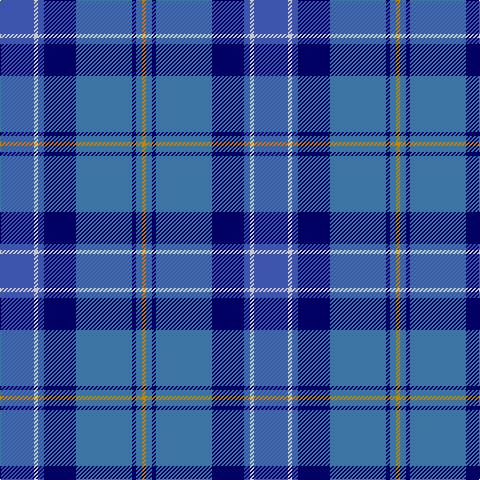

In pattern [BWBBBBBY](/patterns/bwbbbbby/).

This was sourced from tartans-authority.  It is a [8 stripes tartan](/stripes/stripes8/).

Original link http://www.tartansauthority.com/tartan-ferret/display/2150/

## Thread count
Ba/34 N4 Ba6 DB32 B56 DB4 B6 DY/4

## Palette
Each colour and its ΔE from the base-6 reference it is a variant of.

| Colour | Shade | Base | ΔE (OKLab) |
|---|---|---|---|
| B | <code style="background-color:#3C74A4;">#3C74A4</code> `#3C74A4` | B <code style="background-color:#2A418A;">#2A418A</code> | 0.15 |
| Ba | <code style="background-color:#3C54AC;">#3C54AC</code> `#3C54AC` | B <code style="background-color:#2A418A;">#2A418A</code> | 0.08 |
| DB | <code style="background-color:#000064;">#000064</code> `#000064` | B <code style="background-color:#2A418A;">#2A418A</code> | 0.18 |
| DY | <code style="background-color:#C48800;">#C48800</code> `#C48800` | Y <code style="background-color:#F2BF00;">#F2BF00</code> | 0.16 |
| N | <code style="background-color:#C8C8C8;">#C8C8C8</code> `#C8C8C8` | W <code style="background-color:#F7F7F7;">#F7F7F7</code> | 0.14 |

# Sample pattern

## Nearest tartans

The nearest existing variants by ΔTartan distance.

1. [Blue Peter](/setts/s9/y3b20b4ba4b4ba20g4bb4y2~b38409c-ba003c64-bb780078-g289c18-yfccc00~x2/) — ΔT 1.12
1. [U.S. 2001 Air Force (Military?)](/setts/s7/b49g3k22r2ba33bb3ba7~b2c2c80-ba1474b4-bb1c0070-g006818-k101010-rc80000~x2/) — ΔT 1.45
1. [Banff and Buchan District Tartan Tartan Number: 2150. Earliest known date: 1992 This tartan has been designed for the District of Banff and Buchan. It is based on the sett of the Ogilvy Tartan which originates from this district. The colours are taken from the surrounding landscape - the blues of the mountains and the sea, also of the sky, with touches of white. The yellow is reminiscent of the cornfields. (J.Roberts) The tartan is produced by Macnaughtons of Pitlochry. See products available Copyright © Blair Urquhart, Comrie, 2015](/setts/s8/b26w2b3ba15bb26ba2bb3y4~b202060-ba2c2c80-bb5c8ca8-we0e0e0-ye8c000~x2/) — ΔT 1.52
1. [Blue Ridge Highlands Heritage](/setts/s8/b27ba9w3g6ba33w3bb3y2~b5c8ca8-ba2c2c80-bb680028-g00643c-wa8ace8-ye8c000~x2/) — ΔT 1.55
1. [Rhode Island, State of](/setts/s7/b4ba28b11w2b2g14y2~b14283c-ba1474b4-g408060-we0e0e0-ye8c000~x2/) — ΔT 1.58
1. [Georgian Bay, Waters of](/setts/s6/b35w3b8ba36g9r3~b1b3f8b-ba009acd-g002618-rbb7168-wffffff~x2/) — ΔT 1.58
1. [Icelandair](/setts/s7/b3ba24k11b20w2b5y3~b2c4084-ba2888c4-k101010-wffffff-yd87c00~x2/) — ΔT 1.60
1. [MacFarland-Collins (Name)](/setts/s6/b40ba16k5bb16w2bc6~b2c2c80-ba1474b4-bb3850c8-bc780078-k101010-wfcfcfc~x2/) — ΔT 1.60
1. [Goldblatt, Joe, Jeff (Personal)](/setts/s9/b6ba4k4ba26k12b3bb42y4bb4~b780078-ba003c64-bb2c2c80-k00002c-ye8c000/) — ΔT 1.61
1. [Pride of Lorient (Fashion)](/setts/s17/r2b8ba1b4ba2b3ba3b1ba15bb1ba4bb2ba2bb4ba1bb9w2~b2888c4-ba2c2c80-bb003c64-rc80000-we8ccb8~x2/) — ΔT 1.62

## Neighbour map

Every grey dot is one of 15726 variants placed by the first two principal components of the ΔTartan feature space (44% of its variance). Red is this tartan; blue dots are its nearest — click one to open its page.

<svg viewBox="0 0 640 380" role="img" style="max-width:100%;height:auto;border:1px solid #e0e0e0;border-radius:4px;display:block" xmlns="http://www.w3.org/2000/svg"><image href="/nn/cloud.v1.png" width="640" height="380"/><a href="/setts/s9/y3b20b4ba4b4ba20g4bb4y2~b38409c-ba003c64-bb780078-g289c18-yfccc00~x2/"><circle cx="230.8" cy="182.0" r="4" fill="#3465a4"><title>Blue Peter</title></circle></a><a href="/setts/s7/b49g3k22r2ba33bb3ba7~b2c2c80-ba1474b4-bb1c0070-g006818-k101010-rc80000~x2/"><circle cx="259.3" cy="150.1" r="4" fill="#3465a4"><title>U.S. 2001 Air Force (Military?)</title></circle></a><a href="/setts/s8/b26w2b3ba15bb26ba2bb3y4~b202060-ba2c2c80-bb5c8ca8-we0e0e0-ye8c000~x2/"><circle cx="192.6" cy="164.1" r="4" fill="#3465a4"><title>Banff and Buchan District Tartan Tartan Number: 2150. Earliest known date: 1992 This tartan has been designed for the District of Banff and Buchan. It is based on the sett of the Ogilvy Tartan which originates from this district. The colours are taken from the surrounding landscape - the blues of the mountains and the sea, also of the sky, with touches of white. The yellow is reminiscent of the cornfields. (J.Roberts) The tartan is produced by Macnaughtons of Pitlochry. See products available Copyright © Blair Urquhart, Comrie, 2015</title></circle></a><a href="/setts/s8/b27ba9w3g6ba33w3bb3y2~b5c8ca8-ba2c2c80-bb680028-g00643c-wa8ace8-ye8c000~x2/"><circle cx="260.6" cy="141.2" r="4" fill="#3465a4"><title>Blue Ridge Highlands Heritage</title></circle></a><a href="/setts/s7/b4ba28b11w2b2g14y2~b14283c-ba1474b4-g408060-we0e0e0-ye8c000~x2/"><circle cx="243.2" cy="175.8" r="4" fill="#3465a4"><title>Rhode Island, State of</title></circle></a><a href="/setts/s6/b35w3b8ba36g9r3~b1b3f8b-ba009acd-g002618-rbb7168-wffffff~x2/"><circle cx="244.3" cy="192.1" r="4" fill="#3465a4"><title>Georgian Bay, Waters of</title></circle></a><a href="/setts/s7/b3ba24k11b20w2b5y3~b2c4084-ba2888c4-k101010-wffffff-yd87c00~x2/"><circle cx="203.3" cy="184.1" r="4" fill="#3465a4"><title>Icelandair</title></circle></a><a href="/setts/s6/b40ba16k5bb16w2bc6~b2c2c80-ba1474b4-bb3850c8-bc780078-k101010-wfcfcfc~x2/"><circle cx="275.4" cy="175.1" r="4" fill="#3465a4"><title>MacFarland-Collins (Name)</title></circle></a><a href="/setts/s9/b6ba4k4ba26k12b3bb42y4bb4~b780078-ba003c64-bb2c2c80-k00002c-ye8c000/"><circle cx="285.9" cy="179.5" r="4" fill="#3465a4"><title>Goldblatt, Joe, Jeff (Personal)</title></circle></a><a href="/setts/s17/r2b8ba1b4ba2b3ba3b1ba15bb1ba4bb2ba2bb4ba1bb9w2~b2888c4-ba2c2c80-bb003c64-rc80000-we8ccb8~x2/"><circle cx="251.5" cy="150.1" r="4" fill="#3465a4"><title>Pride of Lorient (Fashion)</title></circle></a><circle cx="254.4" cy="176.5" r="5" fill="#c00000"/></svg>

ID: /setts/s8/b17w2b3ba16bb28ba2bb3y2~b3c54ac-ba000064-bb3c74a4-wc8c8c8-yc48800~x2/
