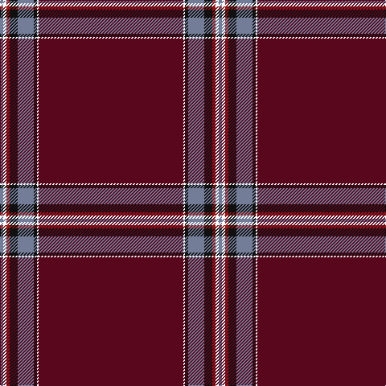

In pattern [BKKBKRKB](/patterns/bkkbkrkb/).

This was sourced from register-of-tartans.  It is a [8 stripes tartan](/stripes/stripes8/).

Original link https://www.tartanregister.gov.uk/tartanDetails.aspx?ref=10445

## Thread count
B/4 W4 DRa4 K10 B20 K4 W2 DR/180

## Palette
Each colour and its ΔE from the base-6 reference it is a variant of.

| Colour | Shade | Base | ΔE (OKLab) |
|---|---|---|---|
| B | <code style="background-color:#737D98;">#737D98</code> `#737D98` | B <code style="background-color:#2A418A;">#2A418A</code> | 0.21 |
| DR | <code style="background-color:#59071D;">#59071D</code> `#59071D` | B <code style="background-color:#2A418A;">#2A418A</code> | 0.21 |
| DRa | <code style="background-color:#921415;">#921415</code> `#921415` | R <code style="background-color:#CC0000;">#CC0000</code> | 0.12 |
| K | <code style="background-color:#101010;">#101010</code> `#101010` | K <code style="background-color:#000000;">#000000</code> | 0.17 |

# Sample pattern

## Nearest tartans

The nearest existing variants by ΔTartan distance.

1. [Stenhousemuir F.C.](/setts/s9/r12k4r8y6r120b28r6b6w2-b304080-k000000-r802040-we0e0e0-yf0c000/) — ΔT 1.24
1. [Stenhousemuir Football Club (Sports)](/setts/s9/r12k4r8y6r120b28r6b6w2-b2c2c80-k101010-r901c38-wfcfcfc-ye8c000/) — ΔT 1.42
1. [Burnett of Leys Hunting](/setts/s8/r184b20r16w6r16g8r16ra8-b2c2c80-g006818-r800028-rac80000-wf8f8f8/) — ΔT 1.71
1. [Kervgant Dress (Personal))](/setts/s10/r120b24ba2b4w2b24r10k2r4ra4-b1c1c50-ba5c8ca8-k101010-r880000-ra888888-we0e0e0/) — ΔT 1.77
1. [Burrell (Personal)](/setts/s14/r58ra2r4ra2r120y4r4b20g4ga2g4b20r4y4-b2c2c80-g006818-ga289c18-r880000-ra888888-ybc8c00/) — ΔT 1.82
1. [Stenhousemuir Football Club](/setts/s16/b6r6b28r120y6r8k4r12k4r8y6r120b28r6b6w2-b2c2c80-k101010-r901c38-wfcfcfc-ye8c000/) — ΔT 1.96
1. [Laird (Restricted)](/setts/s9/k150g4k8b20ba2b8ba2b8k8-b780078-ba2c2c80-g006818-k101010/) — ΔT 1.98
1. [Wedding Day](/setts/s9/r8w2b96ra4rb6ra4b6w2r8-b2b2241-r975e11-ra8e130e-rbad5176-wffffff/) — ΔT 2.08
1. [Burnett of Leys Htg (Clan)](/setts/s8/r150b12r12w4r12g4r12ra4-b181848-g006818-r800028-rac80000-wf8f8f8/) — ΔT 2.12
1. [Lock in Northumberland (Name)](/setts/s8/r180y2k4w20k10ra4y4w4-k101010-r880000-rac8002c-w98c8e8-yb8b8b8/) — ΔT 2.26

## Neighbour map

Every grey dot is one of 15726 variants placed by the first two principal components of the ΔTartan feature space (44% of its variance). Red is this tartan; blue dots are its nearest — click one to open its page.

<svg viewBox="0 0 640 380" role="img" style="max-width:100%;height:auto;border:1px solid #e0e0e0;border-radius:4px;display:block" xmlns="http://www.w3.org/2000/svg"><image href="/nn/cloud.v1.png" width="640" height="380"/><a href="/setts/s9/r12k4r8y6r120b28r6b6w2-b304080-k000000-r802040-we0e0e0-yf0c000/"><circle cx="584.6" cy="95.6" r="4" fill="#3465a4"><title>Stenhousemuir F.C.</title></circle></a><a href="/setts/s9/r12k4r8y6r120b28r6b6w2-b2c2c80-k101010-r901c38-wfcfcfc-ye8c000/"><circle cx="579.0" cy="89.1" r="4" fill="#3465a4"><title>Stenhousemuir Football Club (Sports)</title></circle></a><a href="/setts/s8/r184b20r16w6r16g8r16ra8-b2c2c80-g006818-r800028-rac80000-wf8f8f8/"><circle cx="626.0" cy="123.2" r="4" fill="#3465a4"><title>Burnett of Leys Hunting</title></circle></a><a href="/setts/s10/r120b24ba2b4w2b24r10k2r4ra4-b1c1c50-ba5c8ca8-k101010-r880000-ra888888-we0e0e0/"><circle cx="516.3" cy="70.3" r="4" fill="#3465a4"><title>Kervgant Dress (Personal))</title></circle></a><a href="/setts/s14/r58ra2r4ra2r120y4r4b20g4ga2g4b20r4y4-b2c2c80-g006818-ga289c18-r880000-ra888888-ybc8c00/"><circle cx="564.9" cy="59.2" r="4" fill="#3465a4"><title>Burrell (Personal)</title></circle></a><a href="/setts/s16/b6r6b28r120y6r8k4r12k4r8y6r120b28r6b6w2-b2c2c80-k101010-r901c38-wfcfcfc-ye8c000/"><circle cx="566.9" cy="69.2" r="4" fill="#3465a4"><title>Stenhousemuir Football Club</title></circle></a><a href="/setts/s9/k150g4k8b20ba2b8ba2b8k8-b780078-ba2c2c80-g006818-k101010/"><circle cx="626.0" cy="125.0" r="4" fill="#3465a4"><title>Laird (Restricted)</title></circle></a><a href="/setts/s9/r8w2b96ra4rb6ra4b6w2r8-b2b2241-r975e11-ra8e130e-rbad5176-wffffff/"><circle cx="538.7" cy="84.9" r="4" fill="#3465a4"><title>Wedding Day</title></circle></a><a href="/setts/s8/r150b12r12w4r12g4r12ra4-b181848-g006818-r800028-rac80000-wf8f8f8/"><circle cx="626.0" cy="116.1" r="4" fill="#3465a4"><title>Burnett of Leys Htg (Clan)</title></circle></a><a href="/setts/s8/r180y2k4w20k10ra4y4w4-k101010-r880000-rac8002c-w98c8e8-yb8b8b8/"><circle cx="580.5" cy="66.4" r="4" fill="#3465a4"><title>Lock in Northumberland (Name)</title></circle></a><circle cx="626.0" cy="99.5" r="5" fill="#c00000"/></svg>

ID: /setts/s8/b180k2ka4ba20ka10r4k4ba4-b59071d-ba737d98-k000000-ka101010-r921415/
