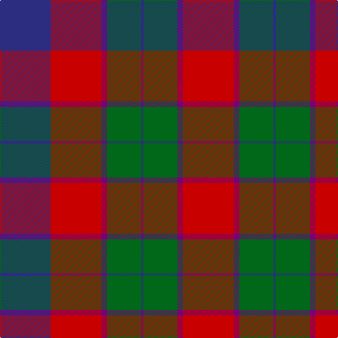

In pattern [BRBGBGBR](/patterns/brbgbgbr/).

This was sourced from register-of-tartans.  It is a [8 stripes tartan](/stripes/stripes8/).

Original link https://www.tartanregister.gov.uk/tartanDetails.aspx?ref=4787

## Register references

External register numbers recorded for this tartan.

- Scottish Register of Tartans: [4787](https://www.tartanregister.gov.uk/tartanDetails.aspx?ref=4787)
- Scottish Tartans Authority (ITI): 6058

## Thread count
DB/72 R72 P8 G48 DB4 G48 P8 R/72

## Palette
Each colour and its ΔE from the base-6 reference it is a variant of.

| Colour | Shade | Base | ΔE (OKLab) |
|---|---|---|---|
| DB | <code style="background-color:#2C2C80;">#2C2C80</code> `#2C2C80` | B <code style="background-color:#2A418A;">#2A418A</code> | 0.06 |
| G | <code style="background-color:#006818;">#006818</code> `#006818` | G <code style="background-color:#006100;">#006100</code> | 0.02 |
| P | <code style="background-color:#780078;">#780078</code> `#780078` | B <code style="background-color:#2A418A;">#2A418A</code> | 0.17 |
| R | <code style="background-color:#C80000;">#C80000</code> `#C80000` | R <code style="background-color:#CC0000;">#CC0000</code> | 0.01 |

# Sample pattern

## Nearest tartans

The nearest existing variants by ΔTartan distance.

1. [Skene, of Cromar](/setts/s8/k4r37b37r2b37g37r37k4~b304080-g008000-k000000-rc00000/) — ΔT 0.66
1. [Skene of Cromar - 1950 (Clan)](/setts/s8/k4r37b37r2b37g37r37k4~b2c2c80-g006818-k101010-rc80000~x2/) — ΔT 0.75
1. [MacKintosh Geddes](/setts/s7/b1r5g18r4b9r10w1~b2c4084-g005020-rdc0000-we0e0e0~x4/) — ΔT 0.77
1. [Geddes](/setts/s7/b1r5g15r3b9r10w1~b440044-g006818-rc80000-we0e0e0~x4/) — ΔT 0.80
1. [MacQuarrie #6](/setts/s7/r6g16r4b12r16ba1r2~b2c4084-ba3c82af-g005020-rdc0000~x2/) — ΔT 0.80
1. [MacQuarrie 2](/setts/s7/r6g16r4b12r16ba1r2~b304080-ba5480b0-g008000-rc00000~x2/) — ΔT 0.90
1. [MacNaughton Clan Tartan Tartan Number: 1066. Earliest known date: 1831 James Logan collected information for his book 'The Scottish Gael' between 1826 and 1831. The MacNaughton tartan is also recorded by William and Andrew Smith in their 'Authenticated Tartans of the Clans and Families of Scotland' (1850). Other works contain a commonly reproduced error. The tartan closely resembles the MacDuff, which may bear out the claim that the MacNaughtons were originally a Moray tribe transplanted by Malcolm IV. The MacNaughton tartan is worn by the 'Vale of Athol' pipe band. See products available Copyright © Blair Urquhart, Comrie, 2015](/setts/s9/k1b1r16g16k12b8r16b1k1~b2c2c80-g006818-k101010-rc80000~x2/) — ΔT 0.92
1. [MacBean/MacElvain](/setts/s7/k2r12b6r3g12r4b1~b2c4084-g005020-k101010-rdc0000~x2/) — ΔT 0.93
1. [MacEdward (Personal)](/setts/s10/r12y4r38g25b8g10b8g8b25r3~b2c2c80-g285800-rc80000-ye8c000/) — ΔT 0.93
1. [MacQuarrie LO](/setts/s7/r6g16r4b12r16ba1r2~b000052-ba4367ae-g11450d-raa0000~x2/) — ΔT 0.97

## Neighbour map

Every grey dot is one of 15726 variants placed by the first two principal components of the ΔTartan feature space (44% of its variance). Red is this tartan; blue dots are its nearest — click one to open its page.

<svg viewBox="0 0 640 380" role="img" style="max-width:100%;height:auto;border:1px solid #e0e0e0;border-radius:4px;display:block" xmlns="http://www.w3.org/2000/svg"><image href="/nn/cloud.v1.png" width="640" height="380"/><a href="/setts/s8/k4r37b37r2b37g37r37k4~b304080-g008000-k000000-rc00000/"><circle cx="227.2" cy="187.7" r="4" fill="#3465a4"><title>Skene, of Cromar</title></circle></a><a href="/setts/s8/k4r37b37r2b37g37r37k4~b2c2c80-g006818-k101010-rc80000~x2/"><circle cx="233.4" cy="189.4" r="4" fill="#3465a4"><title>Skene of Cromar - 1950 (Clan)</title></circle></a><a href="/setts/s7/b1r5g18r4b9r10w1~b2c4084-g005020-rdc0000-we0e0e0~x4/"><circle cx="248.5" cy="180.0" r="4" fill="#3465a4"><title>MacKintosh Geddes</title></circle></a><a href="/setts/s7/b1r5g15r3b9r10w1~b440044-g006818-rc80000-we0e0e0~x4/"><circle cx="242.6" cy="188.0" r="4" fill="#3465a4"><title>Geddes</title></circle></a><a href="/setts/s7/r6g16r4b12r16ba1r2~b2c4084-ba3c82af-g005020-rdc0000~x2/"><circle cx="284.7" cy="191.4" r="4" fill="#3465a4"><title>MacQuarrie #6</title></circle></a><a href="/setts/s7/r6g16r4b12r16ba1r2~b304080-ba5480b0-g008000-rc00000~x2/"><circle cx="288.0" cy="195.2" r="4" fill="#3465a4"><title>MacQuarrie 2</title></circle></a><a href="/setts/s9/k1b1r16g16k12b8r16b1k1~b2c2c80-g006818-k101010-rc80000~x2/"><circle cx="241.2" cy="169.1" r="4" fill="#3465a4"><title>MacNaughton Clan Tartan Tartan Number: 1066. Earliest known date: 1831 James Logan collected information for his book 'The Scottish Gael' between 1826 and 1831. The MacNaughton tartan is also recorded by William and Andrew Smith in their 'Authenticated Tartans of the Clans and Families of Scotland' (1850). Other works contain a commonly reproduced error. The tartan closely resembles the MacDuff, which may bear out the claim that the MacNaughtons were originally a Moray tribe transplanted by Malcolm IV. The MacNaughton tartan is worn by the 'Vale of Athol' pipe band. See products available Copyright © Blair Urquhart, Comrie, 2015</title></circle></a><a href="/setts/s7/k2r12b6r3g12r4b1~b2c4084-g005020-k101010-rdc0000~x2/"><circle cx="259.3" cy="199.4" r="4" fill="#3465a4"><title>MacBean/MacElvain</title></circle></a><a href="/setts/s10/r12y4r38g25b8g10b8g8b25r3~b2c2c80-g285800-rc80000-ye8c000/"><circle cx="214.0" cy="182.7" r="4" fill="#3465a4"><title>MacEdward (Personal)</title></circle></a><a href="/setts/s7/r6g16r4b12r16ba1r2~b000052-ba4367ae-g11450d-raa0000~x2/"><circle cx="288.6" cy="200.4" r="4" fill="#3465a4"><title>MacQuarrie LO</title></circle></a><circle cx="250.9" cy="187.8" r="5" fill="#c00000"/></svg>

ID: /setts/s8/b18r18ba2g12b1g12ba2r18~b2c2c80-ba780078-g006818-rc80000~x4/
