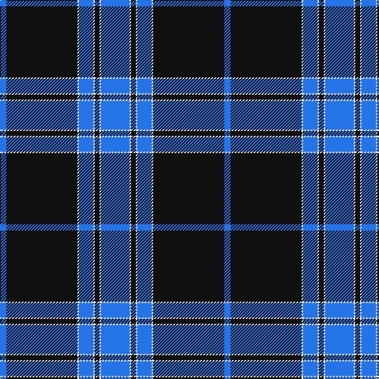

In pattern [BKWBWKWB](/patterns/bkwbwkwb/).

This was sourced from register-of-tartans.  It is a [8 stripes tartan](/stripes/stripes8/).

Original link https://www.tartanregister.gov.uk/tartanDetails.aspx?ref=2255

## Attestations

This cloth appears in 2 source records; the oldest owns this page.

- 01/01/2002 — Lynn (Personal) (register-of-tartans, [record](https://www.tartanregister.gov.uk/tartanDetails.aspx?ref=2255))
- 2002 — Lynn (Name) (tartans-authority, [record](http://www.tartansauthority.com/tartan-ferret/display/5933/))

## Thread count
B/8 K90 LN2 B18 LN2 K6 LN2 B/36

## Palette
Each colour and its ΔE from the base-6 reference it is a variant of.

| Colour | Shade | Base | ΔE (OKLab) |
|---|---|---|---|
| B | <code style="background-color:#2474E8;">#2474E8</code> `#2474E8` | B <code style="background-color:#2A418A;">#2A418A</code> | 0.19 |
| K | <code style="background-color:#101010;">#101010</code> `#101010` | K <code style="background-color:#000000;">#000000</code> | 0.17 |
| LN | <code style="background-color:#E0E0E0;">#E0E0E0</code> `#E0E0E0` | W <code style="background-color:#F7F7F7;">#F7F7F7</code> | 0.07 |

# Sample pattern

## Nearest tartans

The nearest existing variants by ΔTartan distance.

1. [Wcwm 4907-2](/setts/s7/b40k8y8b4y1b4ya8~b180064-k000000-yc89800-yab0b0b0~x4/) — ΔT 1.34
1. [Skye](/setts/s11/b45k10g2k2y2k2g10b5k1b5y1~b304080-g808080-k000000-yf0c000~x2/) — ΔT 1.37
1. [Ramsay Blue Hunting](/setts/s6/k4w2k28b30k1b3~b1474b4-k101010-wc0c0c0~x2/) — ΔT 1.48
1. [Roxburgh, Green (District)](/setts/s8/b23w1b1w1b8g22r1b3~b1c0070-g006818-rc80000-wf8f8f8~x4/) — ΔT 1.55
1. [Loevenstein Castle #3](/setts/s6/b40r1y4r2b8y24~b00008c-r8c0000-yb0b0b0~x2/) — ΔT 1.64
1. [Kang (Personal)](/setts/s11/b44k3b3k3b3k14y4k3w2k2w2~b38409c-k000000-we0e0e0-ye8dc14~x2/) — ΔT 1.68
1. [St Andrews, Earl of](/setts/s6/b52k28w5k3w2k10~b304080-k000030-we0e0e0/) — ΔT 1.69
1. [Baker](/setts/s8/b28r3w1r3b4w2ba1w5~b202060-ba780078-ra07c58-wf8f4d0~x4/) — ΔT 1.72
1. [Tyneside Blue, North Tyneside Pipe Band](/setts/s7/b62k22w3k2w2k3r1~b304080-k000030-rc00000-we0e0e0~x2/) — ΔT 1.72
1. [Baker (Name)](/setts/s8/b28y3w1y3b4w2ba1w5~b202060-ba780078-wf8f4d0-ya08858~x4/) — ΔT 1.72

## Neighbour map

Every grey dot is one of 15726 variants placed by the first two principal components of the ΔTartan feature space (44% of its variance). Red is this tartan; blue dots are its nearest — click one to open its page.

<svg viewBox="0 0 640 380" role="img" style="max-width:100%;height:auto;border:1px solid #e0e0e0;border-radius:4px;display:block" xmlns="http://www.w3.org/2000/svg"><image href="/nn/cloud.v1.png" width="640" height="380"/><a href="/setts/s7/b40k8y8b4y1b4ya8~b180064-k000000-yc89800-yab0b0b0~x4/"><circle cx="400.6" cy="134.9" r="4" fill="#3465a4"><title>Wcwm 4907-2</title></circle></a><a href="/setts/s11/b45k10g2k2y2k2g10b5k1b5y1~b304080-g808080-k000000-yf0c000~x2/"><circle cx="426.9" cy="97.1" r="4" fill="#3465a4"><title>Skye</title></circle></a><a href="/setts/s6/k4w2k28b30k1b3~b1474b4-k101010-wc0c0c0~x2/"><circle cx="362.8" cy="179.3" r="4" fill="#3465a4"><title>Ramsay Blue Hunting</title></circle></a><a href="/setts/s8/b23w1b1w1b8g22r1b3~b1c0070-g006818-rc80000-wf8f8f8~x4/"><circle cx="371.7" cy="158.1" r="4" fill="#3465a4"><title>Roxburgh, Green (District)</title></circle></a><a href="/setts/s6/b40r1y4r2b8y24~b00008c-r8c0000-yb0b0b0~x2/"><circle cx="400.6" cy="160.4" r="4" fill="#3465a4"><title>Loevenstein Castle #3</title></circle></a><a href="/setts/s11/b44k3b3k3b3k14y4k3w2k2w2~b38409c-k000000-we0e0e0-ye8dc14~x2/"><circle cx="358.9" cy="113.4" r="4" fill="#3465a4"><title>Kang (Personal)</title></circle></a><a href="/setts/s6/b52k28w5k3w2k10~b304080-k000030-we0e0e0/"><circle cx="365.8" cy="188.7" r="4" fill="#3465a4"><title>St Andrews, Earl of</title></circle></a><a href="/setts/s8/b28r3w1r3b4w2ba1w5~b202060-ba780078-ra07c58-wf8f4d0~x4/"><circle cx="412.2" cy="120.9" r="4" fill="#3465a4"><title>Baker</title></circle></a><a href="/setts/s7/b62k22w3k2w2k3r1~b304080-k000030-rc00000-we0e0e0~x2/"><circle cx="474.1" cy="126.1" r="4" fill="#3465a4"><title>Tyneside Blue, North Tyneside Pipe Band</title></circle></a><a href="/setts/s8/b28y3w1y3b4w2ba1w5~b202060-ba780078-wf8f4d0-ya08858~x4/"><circle cx="411.1" cy="120.7" r="4" fill="#3465a4"><title>Baker (Name)</title></circle></a><circle cx="412.2" cy="132.7" r="5" fill="#c00000"/></svg>

ID: /setts/s8/b18w1k3w1b9w1k45b4~b2474e8-k101010-we0e0e0~x2/
