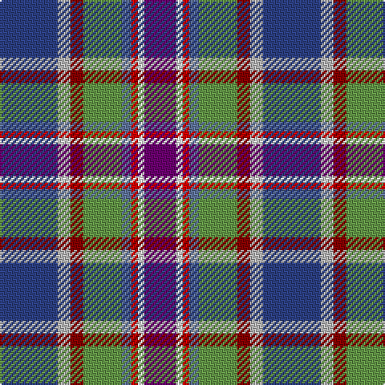

In pattern [BWRBGRYB](/patterns/bwrbgryb/).

This was sourced from register-of-tartans.  It is a [8 stripes tartan](/stripes/stripes8/).

Original link https://www.tartanregister.gov.uk/tartanDetails.aspx?ref=11233

## Thread count
B/36 N8 DR8 LG24 Ba6 R4 W4 P/20

## Palette
Each colour and its ΔE from the base-6 reference it is a variant of.

| Colour | Shade | Base | ΔE (OKLab) |
|---|---|---|---|
| B | <code style="background-color:#2C4084;">#2C4084</code> `#2C4084` | B <code style="background-color:#2A418A;">#2A418A</code> | 0.01 |
| Ba | <code style="background-color:#5F749C;">#5F749C</code> `#5F749C` | B <code style="background-color:#2A418A;">#2A418A</code> | 0.17 |
| DR | <code style="background-color:#880000;">#880000</code> `#880000` | R <code style="background-color:#CC0000;">#CC0000</code> | 0.15 |
| LG | <code style="background-color:#649848;">#649848</code> `#649848` | G <code style="background-color:#006100;">#006100</code> | 0.20 |
| N | <code style="background-color:#B8B8B8;">#B8B8B8</code> `#B8B8B8` | Y <code style="background-color:#F2BF00;">#F2BF00</code> | 0.17 |
| P | <code style="background-color:#6C0070;">#6C0070</code> `#6C0070` | B <code style="background-color:#2A418A;">#2A418A</code> | 0.16 |
| R | <code style="background-color:#DC0000;">#DC0000</code> `#DC0000` | R <code style="background-color:#CC0000;">#CC0000</code> | 0.03 |
| W | <code style="background-color:#FFFFFF;">#FFFFFF</code> `#FFFFFF` | W <code style="background-color:#F7F7F7;">#F7F7F7</code> | 0.02 |

# Sample pattern

## Nearest tartans

The nearest existing variants by ΔTartan distance.

1. [Serco Caledonian Sleeper](/setts/s8/b18r4ra4g12w3rb2wa2ba10~b2c2c80-ba780078-g289c18-r888888-raa00000-rbc80000-w98c8e8-wafcfcfc~x2/) — ΔT 0.45
1. [Silversea](/setts/s7/r3b20ba20g2y4ya17w3~b112f4b-ba213e66-g36924f-re91009-wffffff-yacad9f-yaa5afb8~x2/) — ΔT 1.27
1. [Hatcher (Personal)](/setts/s7/w33r7b9ba7g12ra3k29~b1c1c50-ba780078-g006818-k101010-r880000-rac80000-wc49cd8~x2/) — ΔT 1.47
1. [Isle of Jura](/setts/s8/w12y12b7wa1ba5r5ya2yb2~b202060-ba441800-r98481c-w98c8e8-wafcfcfc-y48a4c0-yad09800-ybfccc00~x2/) — ΔT 1.49
1. [Coats (New Zealand)](/setts/s9/k9y6b9ya2r3ya2g17b17w5~b2c2c80-g005020-k101010-rb07430-w98c8e8-yc89800-yab0b0b0~x2/) — ΔT 1.50
1. [Oregon American District Tartan Tartan Number: 5743. Earliest known date: 2002 The State of Oregon tartan was adopted at the 72nd Oregon Legislative Assembly by Senate Joint Resolution 31 in a letter from State Governor Theodore R Kulongoski dated April 12th 2003. Blue is from the Oregon flag and its rivers and ocean. Gold from the flag and represents agriculture. White for the snow-capped mountains. Taupe (light brown) is for the high desert and grasslands. Azure for the streams, and the skies. Black, the obsidian buttes. See products available Copyright © Blair Urquhart, Comrie, 2015](/setts/s11/y3b5g2b2g2w1g4ya12r2ba2k2~b202060-ba5c8ca8-g003820-k101010-r901c38-we0e0e0-ye8c000-yaa08858~x4/) — ΔT 1.52
1. [Manx National](/setts/s7/b2g6r1ga1ba3bb10w1~b800080-ba000050-bb8080d0-g008000-ga908000-rc00000-we0e0e0~x2/) — ΔT 1.55
1. [Manx National](/setts/s7/b5g9r2y2ba6bb14w3~b88609c-ba303094-bb608ca4-g005814-ra86c1c-we0e0e0-ye8c000~x4/) — ΔT 1.58
1. [RAF Leuchars](/setts/s10/y2g11r2g11k2b6ba13k2ba3ya2~b38409c-ba5064a0-g789484-k000000-rc80000-yb0b0b0-yae8c000~x4/) — ΔT 1.60
1. [Kildrummie (Name)](/setts/s7/b8y4w2ba25g25bb2r5~b003c64-ba1c0070-bb2c2c80-g604000-rc80000-we0e0e0-ye8c000~x2/) — ΔT 1.63

## Neighbour map

Every grey dot is one of 15726 variants placed by the first two principal components of the ΔTartan feature space (44% of its variance). Red is this tartan; blue dots are its nearest — click one to open its page.

<svg viewBox="0 0 640 380" role="img" style="max-width:100%;height:auto;border:1px solid #e0e0e0;border-radius:4px;display:block" xmlns="http://www.w3.org/2000/svg"><image href="/nn/cloud.v1.png" width="640" height="380"/><a href="/setts/s8/b18r4ra4g12w3rb2wa2ba10~b2c2c80-ba780078-g289c18-r888888-raa00000-rbc80000-w98c8e8-wafcfcfc~x2/"><circle cx="52.5" cy="126.8" r="4" fill="#3465a4"><title>Serco Caledonian Sleeper</title></circle></a><a href="/setts/s7/r3b20ba20g2y4ya17w3~b112f4b-ba213e66-g36924f-re91009-wffffff-yacad9f-yaa5afb8~x2/"><circle cx="73.6" cy="147.3" r="4" fill="#3465a4"><title>Silversea</title></circle></a><a href="/setts/s7/w33r7b9ba7g12ra3k29~b1c1c50-ba780078-g006818-k101010-r880000-rac80000-wc49cd8~x2/"><circle cx="77.6" cy="140.5" r="4" fill="#3465a4"><title>Hatcher (Personal)</title></circle></a><a href="/setts/s8/w12y12b7wa1ba5r5ya2yb2~b202060-ba441800-r98481c-w98c8e8-wafcfcfc-y48a4c0-yad09800-ybfccc00~x2/"><circle cx="14.0" cy="118.1" r="4" fill="#3465a4"><title>Isle of Jura</title></circle></a><a href="/setts/s9/k9y6b9ya2r3ya2g17b17w5~b2c2c80-g005020-k101010-rb07430-w98c8e8-yc89800-yab0b0b0~x2/"><circle cx="82.7" cy="157.4" r="4" fill="#3465a4"><title>Coats (New Zealand)</title></circle></a><a href="/setts/s11/y3b5g2b2g2w1g4ya12r2ba2k2~b202060-ba5c8ca8-g003820-k101010-r901c38-we0e0e0-ye8c000-yaa08858~x4/"><circle cx="61.3" cy="98.5" r="4" fill="#3465a4"><title>Oregon American District Tartan Tartan Number: 5743. Earliest known date: 2002 The State of Oregon tartan was adopted at the 72nd Oregon Legislative Assembly by Senate Joint Resolution 31 in a letter from State Governor Theodore R Kulongoski dated April 12th 2003. Blue is from the Oregon flag and its rivers and ocean. Gold from the flag and represents agriculture. White for the snow-capped mountains. Taupe (light brown) is for the high desert and grasslands. Azure for the streams, and the skies. Black, the obsidian buttes. See products available Copyright © Blair Urquhart, Comrie, 2015</title></circle></a><a href="/setts/s7/b2g6r1ga1ba3bb10w1~b800080-ba000050-bb8080d0-g008000-ga908000-rc00000-we0e0e0~x2/"><circle cx="135.3" cy="138.9" r="4" fill="#3465a4"><title>Manx National</title></circle></a><a href="/setts/s7/b5g9r2y2ba6bb14w3~b88609c-ba303094-bb608ca4-g005814-ra86c1c-we0e0e0-ye8c000~x4/"><circle cx="77.3" cy="177.6" r="4" fill="#3465a4"><title>Manx National</title></circle></a><a href="/setts/s10/y2g11r2g11k2b6ba13k2ba3ya2~b38409c-ba5064a0-g789484-k000000-rc80000-yb0b0b0-yae8c000~x4/"><circle cx="117.1" cy="155.7" r="4" fill="#3465a4"><title>RAF Leuchars</title></circle></a><a href="/setts/s7/b8y4w2ba25g25bb2r5~b003c64-ba1c0070-bb2c2c80-g604000-rc80000-we0e0e0-ye8c000~x2/"><circle cx="146.1" cy="138.6" r="4" fill="#3465a4"><title>Kildrummie (Name)</title></circle></a><circle cx="64.7" cy="130.7" r="5" fill="#c00000"/></svg>

ID: /setts/s8/b18y4r4g12ba3ra2w2bb10~b2c4084-ba5f749c-bb6c0070-g649848-r880000-radc0000-wffffff-yb8b8b8~x2/
