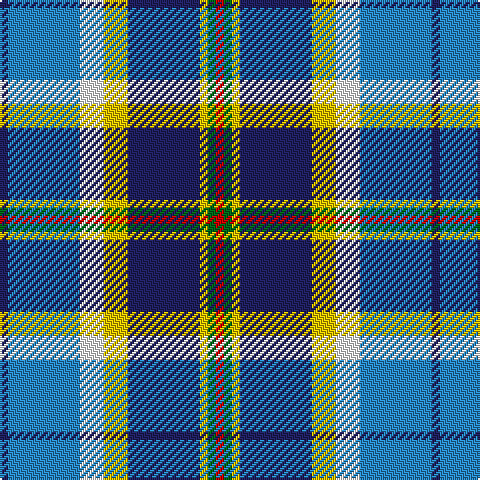

In pattern [BBWYBYGR](/patterns/bbwybygr/).

This was sourced from tartans-authority.  It is a [8 stripes tartan](/stripes/stripes8/).

Original link http://www.tartansauthority.com/tartan-ferret/display/10942/

## Thread count
DB/4 B36 W12 Y12 DB36 Y4 G4 R/4

## Palette
Each colour and its ΔE from the base-6 reference it is a variant of.

| Colour | Shade | Base | ΔE (OKLab) |
|---|---|---|---|
| B | <code style="background-color:#2888C4;">#2888C4</code> `#2888C4` | B <code style="background-color:#2A418A;">#2A418A</code> | 0.21 |
| DB | <code style="background-color:#202060;">#202060</code> `#202060` | B <code style="background-color:#2A418A;">#2A418A</code> | 0.11 |
| G | <code style="background-color:#006818;">#006818</code> `#006818` | G <code style="background-color:#006100;">#006100</code> | 0.02 |
| R | <code style="background-color:#C80000;">#C80000</code> `#C80000` | R <code style="background-color:#CC0000;">#CC0000</code> | 0.01 |
| W | <code style="background-color:#FCFCFC;">#FCFCFC</code> `#FCFCFC` | W <code style="background-color:#F7F7F7;">#F7F7F7</code> | 0.01 |
| Y | <code style="background-color:#E8C000;">#E8C000</code> `#E8C000` | Y <code style="background-color:#F2BF00;">#F2BF00</code> | 0.02 |

# Sample pattern

## Nearest tartans

The nearest existing variants by ΔTartan distance.

1. [Haymarket Dress Blue Trade Tartan Tartan Number: 713. Earliest known date: pre 1992 One of a number of dress tartans produced by Hugh Macpherson, a kiltmaker in Edinburgh, whose shop is a short walk from Haymarket railway station. See products available Copyright © Blair Urquhart, Comrie, 2015](/setts/s9/g5b22g6k10w24y2b2w2r2~b2c2c80-g006818-k101010-rc80000-we0e0e0-ye8c000~x2/) — ΔT 0.73
1. [Culloden Blue, Stirling](/setts/s8/r4g2b15y2k14w14k2w4~b0596fa-g503c14-k101010-rc82828-we0e0e0-ye8c000~x2/) — ΔT 0.86
1. [Haymarket, dress Blue](/setts/s9/g5b22g6k10w24y2b2w2r2~b304080-g008000-k000000-rc00000-we0e0e0-yf0c000~x2/) — ΔT 0.95
1. [Madras College (Corporate)](/setts/s7/r3b25k6w20y2w2wa3~b003c64-k101010-rc80000-w74b4e0-wae0e0e0-ye8c000~x2/) — ΔT 0.97
1. [Minnesota Dress](/setts/s9/b4k2w3k2ba30g9k4w20y3~b780078-ba2c2c80-g289c18-k101010-we0e0e0-ye8c000~x2/) — ΔT 1.01
1. [Elora (District)](/setts/s8/b2g2b11r2w8ba12y2ba2~b003c64-ba5c8ca8-g006818-r888888-wfcfcfc-yfccc00~x2/) — ΔT 1.02
1. [Sound of Iona](/setts/s9/w30b4ba6bb4ba6g6ba12g13wa4~b2888c4-ba202060-bb780078-g0098a0-wfcfcfc-wa98c8e8~x2/) — ΔT 1.02
1. [Manchester City Football Club "Blue](/setts/s11/b4ba13r2b2k2b2w5b2y2b2ba2~b202060-ba1870a4-k101010-ra00000-wfcfcfc-yfccc00~x2/) — ΔT 1.03
1. [Arran (Pendleton)](/setts/s8/b12k1b1k1b1ba8w9g2~b3c82af-ba080848-g808080-k101010-we0e0e0~x4/) — ΔT 1.08
1. [Christian Dress (Personal)](/setts/s7/r3w2b27k19w27ba2y3~b2c2c80-ba780078-k101010-rc80000-wf8f8f8-ye8c000~x2/) — ΔT 1.09

## Neighbour map

Every grey dot is one of 15726 variants placed by the first two principal components of the ΔTartan feature space (44% of its variance). Red is this tartan; blue dots are its nearest — click one to open its page.

<svg viewBox="0 0 640 380" role="img" style="max-width:100%;height:auto;border:1px solid #e0e0e0;border-radius:4px;display:block" xmlns="http://www.w3.org/2000/svg"><image href="/nn/cloud.v1.png" width="640" height="380"/><a href="/setts/s9/g5b22g6k10w24y2b2w2r2~b2c2c80-g006818-k101010-rc80000-we0e0e0-ye8c000~x2/"><circle cx="106.9" cy="119.7" r="4" fill="#3465a4"><title>Haymarket Dress Blue Trade Tartan Tartan Number: 713. Earliest known date: pre 1992 One of a number of dress tartans produced by Hugh Macpherson, a kiltmaker in Edinburgh, whose shop is a short walk from Haymarket railway station. See products available Copyright © Blair Urquhart, Comrie, 2015</title></circle></a><a href="/setts/s8/r4g2b15y2k14w14k2w4~b0596fa-g503c14-k101010-rc82828-we0e0e0-ye8c000~x2/"><circle cx="60.2" cy="153.1" r="4" fill="#3465a4"><title>Culloden Blue, Stirling</title></circle></a><a href="/setts/s9/g5b22g6k10w24y2b2w2r2~b304080-g008000-k000000-rc00000-we0e0e0-yf0c000~x2/"><circle cx="101.7" cy="118.5" r="4" fill="#3465a4"><title>Haymarket, dress Blue</title></circle></a><a href="/setts/s7/r3b25k6w20y2w2wa3~b003c64-k101010-rc80000-w74b4e0-wae0e0e0-ye8c000~x2/"><circle cx="168.4" cy="139.3" r="4" fill="#3465a4"><title>Madras College (Corporate)</title></circle></a><a href="/setts/s9/b4k2w3k2ba30g9k4w20y3~b780078-ba2c2c80-g289c18-k101010-we0e0e0-ye8c000~x2/"><circle cx="139.3" cy="106.4" r="4" fill="#3465a4"><title>Minnesota Dress</title></circle></a><a href="/setts/s8/b2g2b11r2w8ba12y2ba2~b003c64-ba5c8ca8-g006818-r888888-wfcfcfc-yfccc00~x2/"><circle cx="78.9" cy="168.6" r="4" fill="#3465a4"><title>Elora (District)</title></circle></a><a href="/setts/s9/w30b4ba6bb4ba6g6ba12g13wa4~b2888c4-ba202060-bb780078-g0098a0-wfcfcfc-wa98c8e8~x2/"><circle cx="73.9" cy="143.3" r="4" fill="#3465a4"><title>Sound of Iona</title></circle></a><a href="/setts/s11/b4ba13r2b2k2b2w5b2y2b2ba2~b202060-ba1870a4-k101010-ra00000-wfcfcfc-yfccc00~x2/"><circle cx="108.5" cy="147.1" r="4" fill="#3465a4"><title>Manchester City Football Club &quot;Blue</title></circle></a><a href="/setts/s8/b12k1b1k1b1ba8w9g2~b3c82af-ba080848-g808080-k101010-we0e0e0~x4/"><circle cx="154.7" cy="148.3" r="4" fill="#3465a4"><title>Arran (Pendleton)</title></circle></a><a href="/setts/s7/r3w2b27k19w27ba2y3~b2c2c80-ba780078-k101010-rc80000-wf8f8f8-ye8c000~x2/"><circle cx="116.3" cy="126.4" r="4" fill="#3465a4"><title>Christian Dress (Personal)</title></circle></a><circle cx="105.7" cy="143.1" r="5" fill="#c00000"/></svg>

ID: /setts/s8/b1ba9w3y3b9y1g1r1~b202060-ba2888c4-g006818-rc80000-wfcfcfc-ye8c000~x4/
