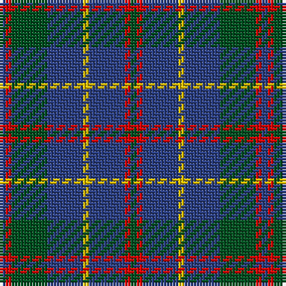

In pattern [BRGBYBRG](/patterns/brgbybrg/).

This was sourced from register-of-tartans.  It is a [8 stripes tartan](/stripes/stripes8/).

Original link https://www.tartanregister.gov.uk/tartanDetails.aspx?ref=2466

## Thread count
B/2 R2 G12 B12 Y2 B12 R2 G/2

## Palette
Each colour and its ΔE from the base-6 reference it is a variant of.

| Colour | Shade | Base | ΔE (OKLab) |
|---|---|---|---|
| B | <code style="background-color:#2C4084;">#2C4084</code> `#2C4084` | B <code style="background-color:#2A418A;">#2A418A</code> | 0.01 |
| G | <code style="background-color:#005020;">#005020</code> `#005020` | G <code style="background-color:#006100;">#006100</code> | 0.07 |
| R | <code style="background-color:#DC0000;">#DC0000</code> `#DC0000` | R <code style="background-color:#CC0000;">#CC0000</code> | 0.03 |
| Y | <code style="background-color:#E8C000;">#E8C000</code> `#E8C000` | Y <code style="background-color:#F2BF00;">#F2BF00</code> | 0.02 |

# Sample pattern

## Nearest tartans

The nearest existing variants by ΔTartan distance.

1. [MacHardy](/setts/s8/b1r1g6b6y1b6r1g1x2~b304080-g008000-rc00000-yf0c000/) — ΔT 0.86
1. [MacHardy, Blue](/setts/s8/b6r3g26b26w4b26r5g5x2~b2c2c80-g006818-rc80000-wfcfcfc/) — ΔT 1.11
1. [Glen Nevis #1 (Fashion)](/setts/s8/g8r2g2r3g8b12g2y2x2~b1c0070-g003820-r880000-ye8c000/) — ΔT 1.14
1. [Bruce (Personal)](/setts/s11/w1b8g2b2g6b1g6b2g2b8y1x4~b2c2c80-g006818-we0e0e0-ye8c000/) — ΔT 1.24
1. [Cameron Hunting](/setts/s6/b15r5b30ba32b4y3x2~b4c3428-ba1474b4-rc80000-yd09800/) — ΔT 1.27
1. [Davidson, Half](/setts/s6/k3g22b3g3b19r3x2~b2c2c80-g006818-k101010-rc80000/) — ΔT 1.28
1. [HMS Duncan (Military)](/setts/s6/b3r15ba15ra2ba15y3x2~b780078-ba003c64-r888888-rac80000-ycca800/) — ΔT 1.31
1. [Connaught Green](/setts/s6/r1b12g5b2g4w1x2~b202060-g5c6428-ra00000-wc0c0c0/) — ΔT 1.34
1. [Bean Hunting Clan Tartan Tartan Number: 106. Earliest known date: 1987 The weaving and wearing of this tartan is 'Restricted'. This is not a legal definition and is applied by the Scottish Tartans Society irrespective of Design Patent or Copyright, in the spirit of a gentlemans agreement. Interested parties should contact the person listed under 'Source:' in this document. See products available Copyright © Blair Urquhart, Comrie, 2015](/setts/s7/b6g41ba20r15g41r15ba6~b1c0070-ba202060-g003820-rc8002c/) — ΔT 1.34
1. [Thorburn (Lochcarron)](/setts/s6/b3ba14b3r16b34ra3x2~b003c64-ba5c8ca8-r888888-rac80000/) — ΔT 1.37

## Neighbour map

Every grey dot is one of 15726 variants placed by the first two principal components of the ΔTartan feature space (44% of its variance). Red is this tartan; blue dots are its nearest — click one to open its page.

<svg viewBox="0 0 640 380" role="img" style="max-width:100%;height:auto;border:1px solid #e0e0e0;border-radius:4px;display:block" xmlns="http://www.w3.org/2000/svg"><image href="/nn/cloud.v1.png" width="640" height="380"/><a href="/setts/s8/b1r1g6b6y1b6r1g1x2~b304080-g008000-rc00000-yf0c000/"><circle cx="289.1" cy="227.3" r="4" fill="#3465a4"><title>MacHardy</title></circle></a><a href="/setts/s8/b6r3g26b26w4b26r5g5x2~b2c2c80-g006818-rc80000-wfcfcfc/"><circle cx="300.9" cy="214.6" r="4" fill="#3465a4"><title>MacHardy, Blue</title></circle></a><a href="/setts/s8/g8r2g2r3g8b12g2y2x2~b1c0070-g003820-r880000-ye8c000/"><circle cx="261.3" cy="242.6" r="4" fill="#3465a4"><title>Glen Nevis #1 (Fashion)</title></circle></a><a href="/setts/s11/w1b8g2b2g6b1g6b2g2b8y1x4~b2c2c80-g006818-we0e0e0-ye8c000/"><circle cx="292.9" cy="217.0" r="4" fill="#3465a4"><title>Bruce (Personal)</title></circle></a><a href="/setts/s6/b15r5b30ba32b4y3x2~b4c3428-ba1474b4-rc80000-yd09800/"><circle cx="347.4" cy="231.0" r="4" fill="#3465a4"><title>Cameron Hunting</title></circle></a><a href="/setts/s6/k3g22b3g3b19r3x2~b2c2c80-g006818-k101010-rc80000/"><circle cx="289.0" cy="234.9" r="4" fill="#3465a4"><title>Davidson, Half</title></circle></a><a href="/setts/s6/b3r15ba15ra2ba15y3x2~b780078-ba003c64-r888888-rac80000-ycca800/"><circle cx="277.1" cy="229.4" r="4" fill="#3465a4"><title>HMS Duncan (Military)</title></circle></a><a href="/setts/s6/r1b12g5b2g4w1x2~b202060-g5c6428-ra00000-wc0c0c0/"><circle cx="351.5" cy="217.6" r="4" fill="#3465a4"><title>Connaught Green</title></circle></a><a href="/setts/s7/b6g41ba20r15g41r15ba6~b1c0070-ba202060-g003820-rc8002c/"><circle cx="304.7" cy="255.0" r="4" fill="#3465a4"><title>Bean Hunting Clan Tartan Tartan Number: 106. Earliest known date: 1987 The weaving and wearing of this tartan is 'Restricted'. This is not a legal definition and is applied by the Scottish Tartans Society irrespective of Design Patent or Copyright, in the spirit of a gentlemans agreement. Interested parties should contact the person listed under 'Source:' in this document. See products available Copyright © Blair Urquhart, Comrie, 2015</title></circle></a><a href="/setts/s6/b3ba14b3r16b34ra3x2~b003c64-ba5c8ca8-r888888-rac80000/"><circle cx="330.6" cy="220.5" r="4" fill="#3465a4"><title>Thorburn (Lochcarron)</title></circle></a><circle cx="307.7" cy="235.5" r="5" fill="#c00000"/></svg>

ID: /setts/s8/b1r1g6b6y1b6r1g1x2~b2c4084-g005020-rdc0000-ye8c000/
